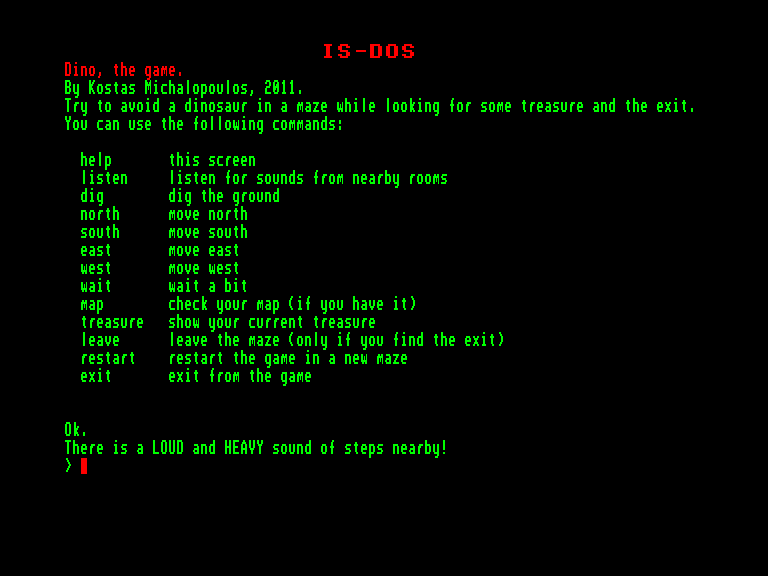
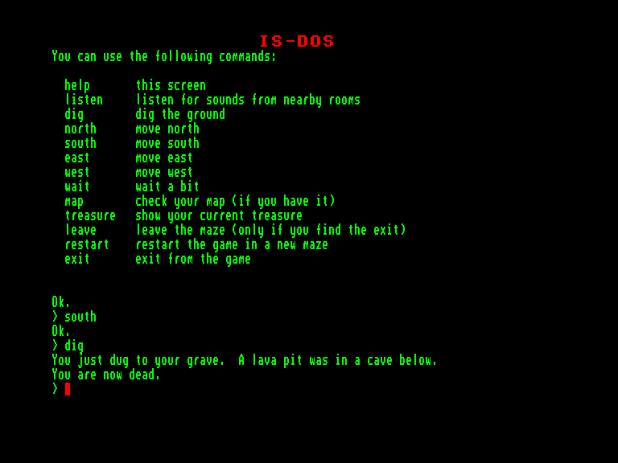

[0-9](../0/games-0.md) - [A](../a/games-a.md) - [B](../b/games-b.md) - [C](../c/games-c.md) - [D](../d/games-d.md) - [E](../e/games-e.md) - [F](../f/games-f.md) - [G](../g/games-g.md) - [H](../h/games-h.md) - [I](../i/games-i.md) - [J](../j/games-j.md) - [K](../k/games-k.md) - [L](../l/games-l.md) - [M](../m/games-m.md) - [N](../n/games-n.md) - [O](../o/games-o.md) - [P](../p/games-p.md) - [Q](../q/games-q.md) - [R](../r/games-r.md) - [S](../s/games-s.md) - [T](../t/games-t.md) - [U](../u/games-u.md) - [V](../v/games-v.md) - [W](../w/games-w.md) - [X](../x/games-x.md) - [Y](../y/games-y.md) - [Z](../z/games-z.md)

Ігри для [Enterprise 64k](../games-ep64.md) - [Enterprise 128k+RAMexp](../games-epramexp.md)

Ігри для систем [IS-DOS](../games-is-dos.md) - [SymbOS](../games-symbos.md) - [EDC Windows](../games-edcw.md)

Ігри для емуляторів [ZX Spectrum 48k/128k](../zxemu/games-zxemu.md) - [Amstrad CPC](../cpcemu/games-cpc.md) - [Sinclair ZX81](../zx81emu/games-zx81.md) - [Videoton TVC](../tvcemu/games-tvc.md) - [Commodore VIC-20](../vic20emu/games-vic20.md)

----------

# Dino, the Game

**ID:** dino-the-game-isdos

**Жанри:** Текстова пригода

## Скріншоти

## Опис

(temporary description generated by AI [ChatGPT])

**Опис гри:**
У грі "Dino" ви потрапляєте в підземелля, де ваше завдання полягає в зборі скарбів і втечі від небезпечного динозавра. Підземелля розміром 10x10 кімнат, в яких вам потрібно бути обережними, адже небезпеки чекають на кожному кроці. Ви можете знаходити скарби, які лежать на підлозі, або викопувати їх, але будьте обережні — під землею можуть ховатися лави! Гра має прості команди для навігації та взаємодії з оточенням.

**Правила гри:**
1. Ваше завдання — зібрати якомога більше скарбів і знайти вихід з підземелля.
2. Ви можете переміщатися по кімнатах на північ, південь, захід та схід.
3. Використовуйте команду "LISTEN" для прослуховування звуків, щоб уникнути небезпек.
4. Команда "DIG" дозволяє вам шукати закопані скарби, але будьте обережні з лавою.
5. Чекайте, якщо поблизу динозавр, але знайте, що він не буде чекати на вас!
6. Використовуйте команду "MAP" для перегляду карти підземелля.
7. Гра закінчується, якщо ви знайдете вихід або загинете.
8. Команда "RESTART" дозволяє почати гру заново, а "EXIT" — вийти з гри.

Гра генерує підземелля випадковим чином для кожної гри, тож кожен раз ви отримуєте новий досвід!

## Основна інформація
- **Мови:** Англійська
### Загальні системні вимоги
- **Апаратні:** EXDOS
- **Програмні:** IS-DOS
### Геймплей
- **Керування:** Keyboard
- **Кількість гравців:** 1 player
- **Додаткові теги:** Text80 mode
### Розробка
- **Рік випуску:** 2011
- **Автор:** Kostas Michalopoulos

## Посилання
- [Опис гри на ep128.hu (угорською)](http://www.ep128.hu/Ep_Games/Leiras/Dino.htm)
- [Завантажити гру](http://www.ep128.hu/Ep_Games/Prg/Dino.rar)

