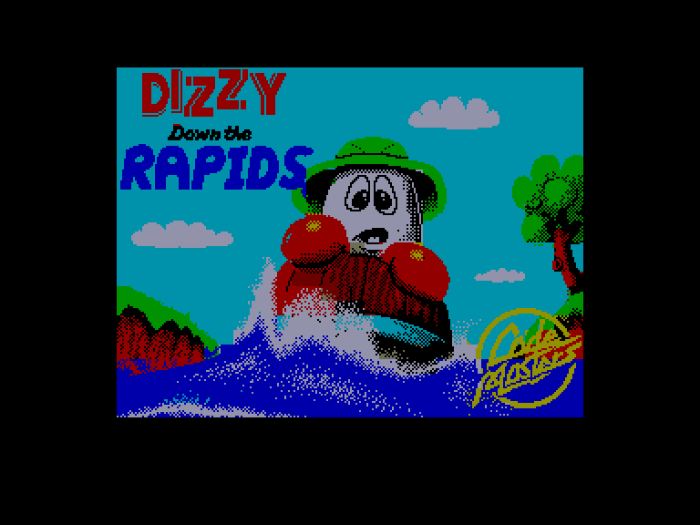
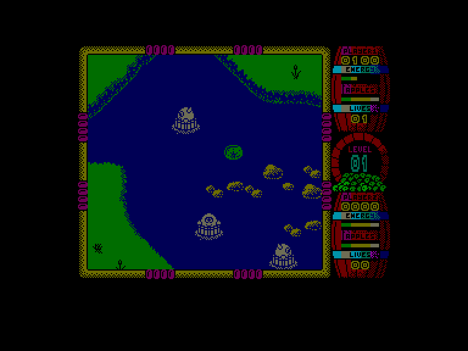
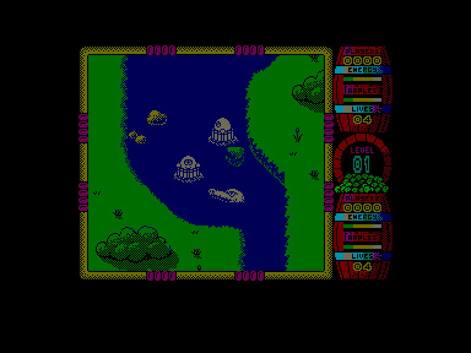
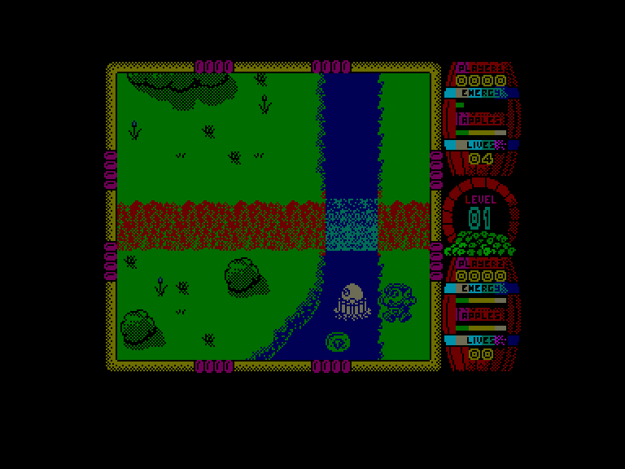

[0-9](../0/games-0.md) - [A](../a/games-a.md) - [B](../b/games-b.md) - [C](../c/games-c.md) - [D](../d/games-d.md) - [E](../e/games-e.md) - [F](../f/games-f.md) - [G](../g/games-g.md) - [H](../h/games-h.md) - [I](../i/games-i.md) - [J](../j/games-j.md) - [K](../k/games-k.md) - [L](../l/games-l.md) - [M](../m/games-m.md) - [N](../n/games-n.md) - [O](../o/games-o.md) - [P](../p/games-p.md) - [Q](../q/games-q.md) - [R](../r/games-r.md) - [S](../s/games-s.md) - [T](../t/games-t.md) - [U](../u/games-u.md) - [V](../v/games-v.md) - [W](../w/games-w.md) - [X](../x/games-x.md) - [Y](../y/games-y.md) - [Z](../z/games-z.md)

Ігри для [Enterprise 64k](../games-ep64.md) - [Enterprise 128k+RAMexp](../games-epramexp.md)

Ігри для систем [IS-DOS](../games-is-dos.md) - [SymbOS](../games-symbos.md) - [EDC Windows](../games-edcw.md)

Ігри для емуляторів [ZX Spectrum 48k/128k](../zxemu/games-zxemu.md) - [Amstrad CPC](../cpcemu/games-cpc.md) - [Sinclair ZX81](../zx81emu/games-zx81.md) - [Videoton TVC](../tvcemu/games-tvc.md) - [Commodore VIC-20](../vic20emu/games-vic20.md)

----------

# Dizzy Down the Rapids

**ID:** dizzy-down-the-rapids-zx

## Скріншоти

## Опис

(temporary description generated by AI [ChatGPT])

**Опис гри: "Dizzy Down the Rapids"**

"Dizzy Down the Rapids" — це захоплююча аркадна гра, в якій ви граєте за персонажа на ім'я Діззі, який вирушив у подорож на диких водах, подорожуючи в бочці замість звичайної човна. Гравці повинні уникати небезпечних ворогів, таких як крокодили, ворожі Діззі та величезні комарі, використовуючи обмежений запас яблук для самооборони. Гра підтримує режим для двох гравців, де обидва можуть змагатися одночасно. Збирайте яблука та бонуси, щоб відновити енергію, і намагайтеся не втратити всі життя!

**Правила гри:**
1. Гравці контролюють Діззі, уникаючи ворогів та перешкод на воді.
2. Використовуйте яблука для атаки на ворогів, але пам'ятайте, що їх кількість обмежена.
3. Збирайте бонуси для відновлення енергії та отримання додаткових очок.
4. Якщо Діззі стикається з ворогом, енергія зменшується, але не втрачається життя одразу.
5. При втраті життя, ви можете вибрати, з якого місця почати гру знову.
6. Гравці можуть обирати керування через клавіатуру або джойстик.

Насолоджуйтесь веселими пригодами на воді з "Dizzy Down the Rapids"!

## Основна інформація
- **Оригінальна платформа:** ZX Spectrum

## Посилання
- [Домашня сторінка гри](https://yolkfolk.com/games/dizzy-down-the-rapids/)
- [Опис гри на ep128.hu (угорською)](http://www.ep128.hu/Games/Dizzy_Down_the_Rapids.htm)
- [Інформація про оригінальну версію](https://spectrumcomputing.co.uk/entry/9340/ZX-Spectrum/Dizzy_Down_the_Rapids)
- [Завантажити гру](http://www.ep128.hu/Ep_Games/Prg/Dizzy_Down_the_Rapids.rar)

**Дата генерації:** 29.07.2026

