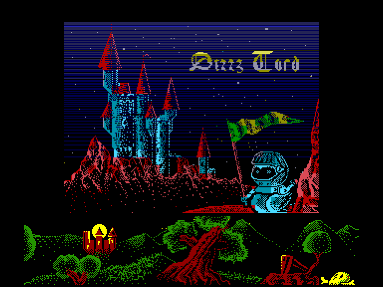
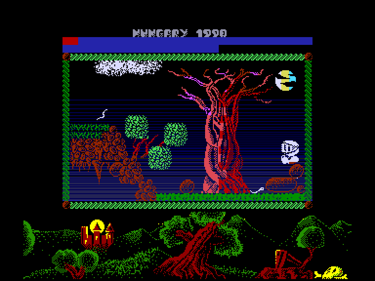
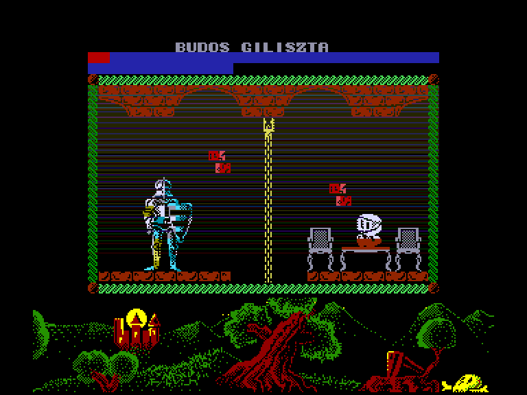
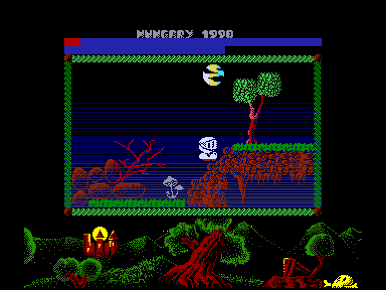

[0-9](../0/games-0.md) - [A](../a/games-a.md) - [B](../b/games-b.md) - [C](../c/games-c.md) - [D](../d/games-d.md) - [E](../e/games-e.md) - [F](../f/games-f.md) - [G](../g/games-g.md) - [H](../h/games-h.md) - [I](../i/games-i.md) - [J](../j/games-j.md) - [K](../k/games-k.md) - [L](../l/games-l.md) - [M](../m/games-m.md) - [N](../n/games-n.md) - [O](../o/games-o.md) - [P](../p/games-p.md) - [Q](../q/games-q.md) - [R](../r/games-r.md) - [S](../s/games-s.md) - [T](../t/games-t.md) - [U](../u/games-u.md) - [V](../v/games-v.md) - [W](../w/games-w.md) - [X](../x/games-x.md) - [Y](../y/games-y.md) - [Z](../z/games-z.md)

Ігри для [Enterprise 64k](../games-ep64.md) - [Enterprise 128k+RAMexp](../games-epramexp.md)

Ігри для систем [IS-DOS](../games-is-dos.md) - [SymbOS](../games-symbos.md) - [EDC Windows](../games-edcw.md)

Ігри для емуляторів [ZX Spectrum 48k/128k](../zxemu/games-zxemu.md) - [Amstrad CPC](../cpcemu/games-cpc.md) - [Sinclair ZX81](../zx81emu/games-zx81.md) - [Videoton TVC](../tvcemu/games-tvc.md) - [Commodore VIC-20](../vic20emu/games-vic20.md)

----------

# Dizzy Lord

**ID:** dizzy-lord-zx

## Скріншоти

## Опис

(temporary description generated by AI [Assistant])

**Опис гри: Dizzy Lord**

Dizzy Lord — це гра, створена Ласлом Кёнцолом для ZX Spectrum, а згодом адаптована для EP128. Гравець бере на себе роль знаменитого авантюриста Дізі Лорда, якому потрібно врятувати королеву, викрадену драконою. Гра складається з 70 рівнів, на яких потрібно збирати предмети та вирішувати головоломки, щоб просунутися далі. Гравець повинен бути обережним, оскільки деякі об'єкти, як-от отруйні рослини та води, можуть призвести до миттєвої загибелі персонажа.

**Правила гри:**
1. Гравець повинен збирати предмети та використовувати їх у певних місцях для просування в грі.
2. Уникайте контакту з отруйними рослинами та водою, оскільки це призведе до загибелі персонажа.
3. Деякі вороги можуть знижувати ваш енергетичний рівень, тому слідкуйте за ним.
4. Використовуйте знайдені предмети, щоб вирішувати головоломки та проходити рівні.
5. Гра має високий рівень складності, тому для успішного проходження може знадобитися безкінечна енергія або збереження гри.

Розпочніть свою пригоду і допоможіть Дізі Лорду врятувати королеву!

## Основна інформація
- **Оригінальна платформа:** ZX Spectrum

## Посилання
- [Опис гри на ep128.hu (угорською)](http://www.ep128.hu/Games/Dizzy_Lord.htm)
- [Інформація про оригінальну версію](https://spectrumcomputing.co.uk/entry/17623/ZX-Spectrum/Dizzy_Lord)
- [Завантажити гру](http://www.ep128.hu/Ep_Games/Prg/Dizzy_Lord.rar)

**Дата генерації:** 29.07.2026

