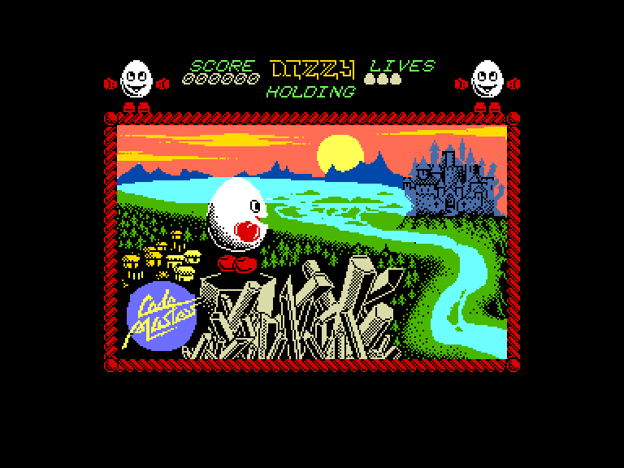
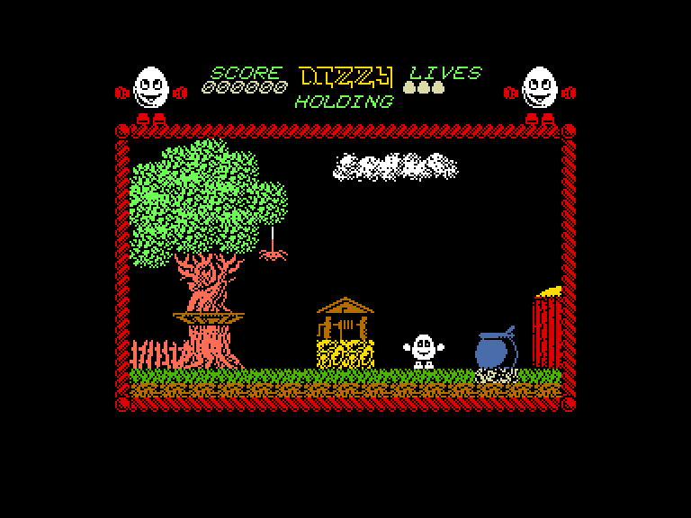
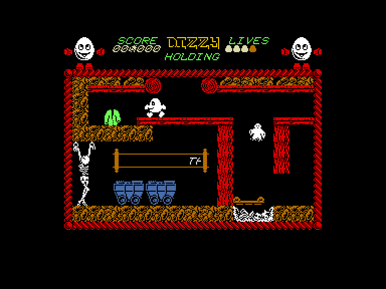
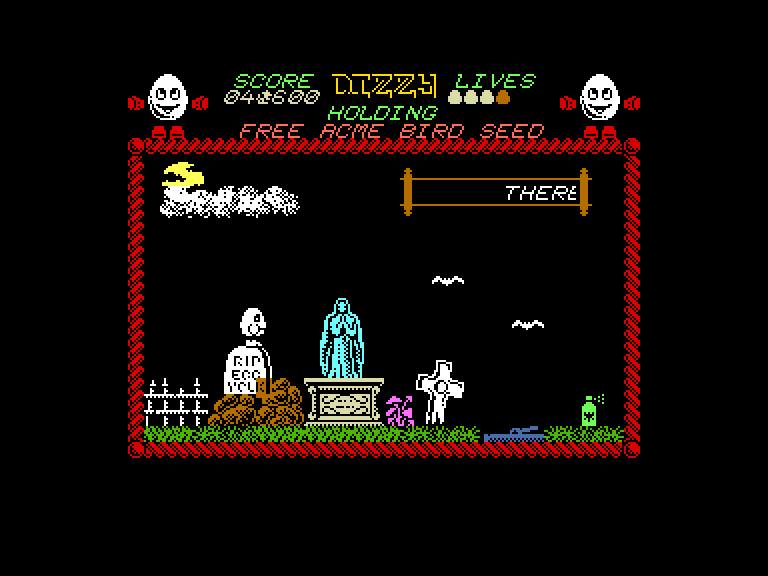

[0-9](../0/games-0.md) - [A](../a/games-a.md) - [B](../b/games-b.md) - [C](../c/games-c.md) - [D](../d/games-d.md) - [E](../e/games-e.md) - [F](../f/games-f.md) - [G](../g/games-g.md) - [H](../h/games-h.md) - [I](../i/games-i.md) - [J](../j/games-j.md) - [K](../k/games-k.md) - [L](../l/games-l.md) - [M](../m/games-m.md) - [N](../n/games-n.md) - [O](../o/games-o.md) - [P](../p/games-p.md) - [Q](../q/games-q.md) - [R](../r/games-r.md) - [S](../s/games-s.md) - [T](../t/games-t.md) - [U](../u/games-u.md) - [V](../v/games-v.md) - [W](../w/games-w.md) - [X](../x/games-x.md) - [Y](../y/games-y.md) - [Z](../z/games-z.md)

Ігри для [Enterprise 64k](../games-ep64.md) - [Enterprise 128k+RAMexp](../games-epramexp.md) - [2dfx](games-2dfx.md)

Ігри для систем [IS-DOS](../games-is-dos.md) - [SymbOS](../games-symbos.md) - [EDC Windows](../games-edcw.md)

Ігри для емуляторів [ZX Spectrum 48k/128k](../zxemu/games-zxemu.md) - [Amstrad CPC](../cpcemu/games-cpc.md) - [Sinclair ZX81](../zx81emu/games-zx81.md) - [Videoton TVC](../tvcemu/games-tvc.md) - [Commodore VIC-20](../vic20emu/games-vic20.md)

----------

# Dizzy: The Ultimate Cartoon Adventure

**ID:** dizzy1-zx

**Жанри:** Пригодницька, Платформер

## Скріншоти

## Опис

(temp description)

Dizzy: The Ultimate Cartoon Adventure — це пригодницька гра-платформер 1987 року від студії Code Masters, створена братами Ендрю та Філіпом Оліверами. Завдяки високоякісному звуковому супроводу, відмінній графіці та яскравим кольорам, гра стала проривом. Вона містить близько 50 добре опрацьованих ігрових зон, а її головний герой — мутант-яйце на ім’я Діззі. Мета гри — допомогти жителям міста Катманду, захопленого злим чарівником Заксом.

### Ігровий процес
Діззі повинен досліджувати світ, збирати предмети та використовувати їх для вирішення головоломок.

## Основна інформація
- **Мови:** Англійська
- **Оригінальна платформа:** ZX Spectrum
### Загальні системні вимоги
- **Апаратні:** EP128
### Геймплей
- **Керування:** Internal Joy, External Joy 1
- **Кількість гравців:** 1 player
- **Додаткові теги:** Attribute mode
### Розробка
- **Рік випуску:** 1987
- **Автор:** The Oliver Twins, Jon Paul Eldridge

## Посилання
- [Домашня сторінка](https://yolkfolk.com/games/dizzy-tuca/)
- [Опис на ep128.hu (угорською)](http://www.ep128.hu/Games/Dizzy.htm)
- [Інформація про оригінальну версію](https://spectrumcomputing.co.uk/entry/9332/ZX-Spectrum/Dizzy)
- [Завантажити](http://www.ep128.hu/Ep_Games/Prg/Dizzy.rar)

## [Керування](../controllers.md)

### Старт гри:

`K`: грати за допомогою зовнішнього або вбудованого джойстиків.  
`Space`: грати за допомогою вбудованого джойстиків.

### Керування:

**Internal Joystick**: `Space` (стрибок), `Enter` (взяти/використати/покласти).  
**External Joystick 1**: `Fire` (стрибок), `↓` (взяти/використати/покласти).  

`Hold/Pause`: пауза.  
`Stop`: вихід на стартовий екран.

