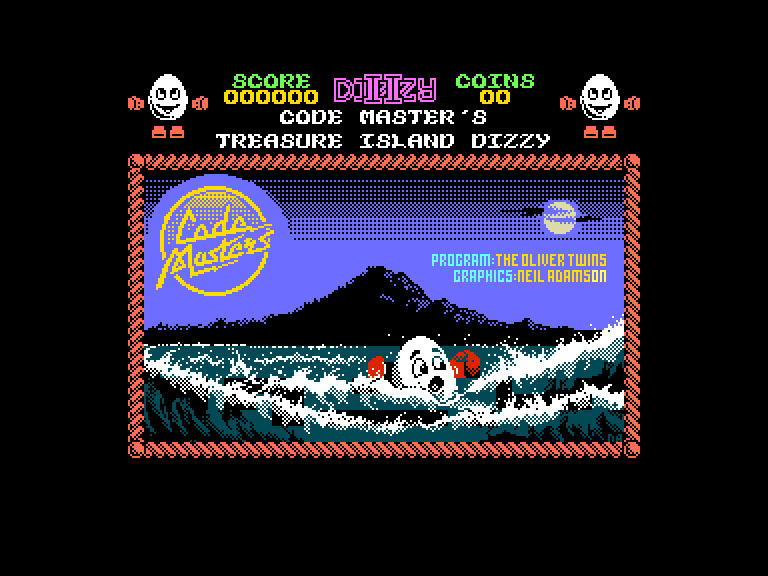
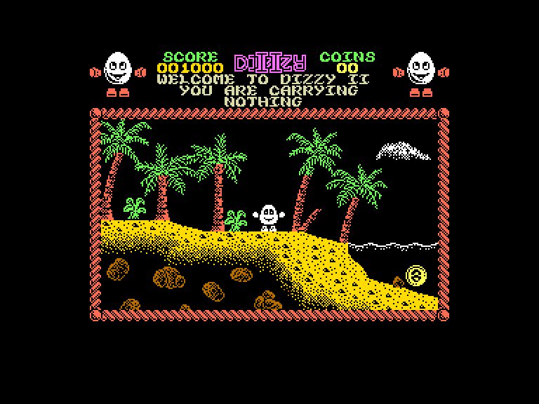
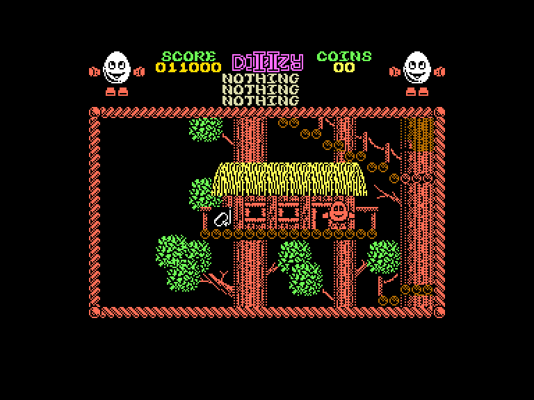
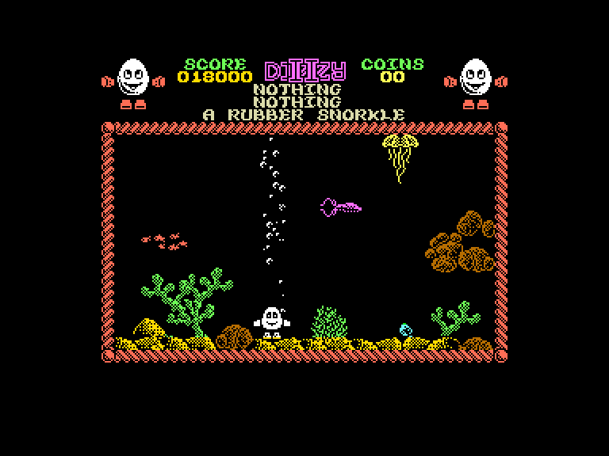

[0-9](../0/games-0.md) - [A](../a/games-a.md) - [B](../b/games-b.md) - [C](../c/games-c.md) - [D](../d/games-d.md) - [E](../e/games-e.md) - [F](../f/games-f.md) - [G](../g/games-g.md) - [H](../h/games-h.md) - [I](../i/games-i.md) - [J](../j/games-j.md) - [K](../k/games-k.md) - [L](../l/games-l.md) - [M](../m/games-m.md) - [N](../n/games-n.md) - [O](../o/games-o.md) - [P](../p/games-p.md) - [Q](../q/games-q.md) - [R](../r/games-r.md) - [S](../s/games-s.md) - [T](../t/games-t.md) - [U](../u/games-u.md) - [V](../v/games-v.md) - [W](../w/games-w.md) - [X](../x/games-x.md) - [Y](../y/games-y.md) - [Z](../z/games-z.md)

Ігри для [Enterprise 64k](../games-ep64.md) - [Enterprise 128k+RAMexp](../games-epramexp.md)

Ігри для систем [IS-DOS](../games-is-dos.md) - [SymbOS](../games-symbos.md) - [EDC Windows](../games-edcw.md)

Ігри для емуляторів [ZX Spectrum 48k/128k](../zxemu/games-zxemu.md) - [Amstrad CPC](../cpcemu/games-cpc.md) - [Sinclair ZX81](../zx81emu/games-zx81.md) - [Videoton TVC](../tvcemu/games-tvc.md) - [Commodore VIC-20](../vic20emu/games-vic20.md)

----------

# Treasure Island Dizzy

**Альтернативні назви:**
 - Dizzy 2

**ID:** dizzy2-zx

## Скріншоти

## Опис

(temporary description generated by AI [ChatGPT])

**Опис гри: Dizzy 2**

Dizzy 2 - це захоплююча пригодницька гра, в якій ви граєте за персонажа на ім'я Діззі, який намагається втекти з небезпечного острова, повного скарбів та пасток. Гравець повинен збирати монети, вирішувати головоломки та взаємодіяти з оточенням, щоб знайти частини човна, необхідні для втечі. Гра вимагає логічного мислення та швидкості, адже у вас є лише одне життя!

**Правила гри:**

1. **Керування:** Використовуйте джойстик або клавіатуру для переміщення Діззі. Для стрибка натискайте клавішу "вгору" (SPACE на клавіатурі).
2. **Збір предметів:** Ви можете підбирати предмети, натискаючи кнопку "вогонь" (ENTER). У вас може бути не більше трьох предметів одночасно.
3. **Взаємодія з персонажами:** Щоб поговорити з іншими персонажами, підійдіть до них і натисніть кнопку "вогонь", коли у вас немає предметів у першому слоті.
4. **Головоломки:** Розв'язуйте головоломки, щоб отримати доступ до нових областей та предметів.
5. **Монети:** Збирайте 30 монет, які часто заховані в різних місцях на острові.
6. **Життя:** У вас лише одне життя, тому будьте обережні, щоб не потрапити в пастки або не втопитися.
7. **Підказки:** Читайте рукописи, щоб отримати корисні підказки про гру.

Готові до пригоди на кривавому острові? Удачі!

## Основна інформація
- **Оригінальна платформа:** ZX Spectrum

## Посилання
- [Домашня сторінка гри](https://yolkfolk.com/games/treasure-island-dizzy/)
- [Опис гри на ep128.hu (угорською)](http://www.ep128.hu/Games/Dizzy_2.htm)
- [Інформація про оригінальну версію](https://spectrumcomputing.co.uk/entry/9333/ZX-Spectrum/Treasure_Island_Dizzy)
- [Завантажити гру](http://www.ep128.hu/Ep_Games/Prg/Dizzy2.rar)

**Дата генерації:** 28.07.2026

