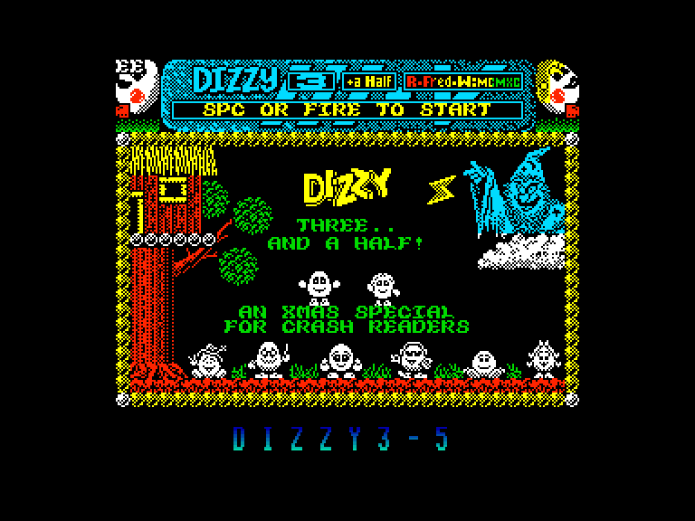
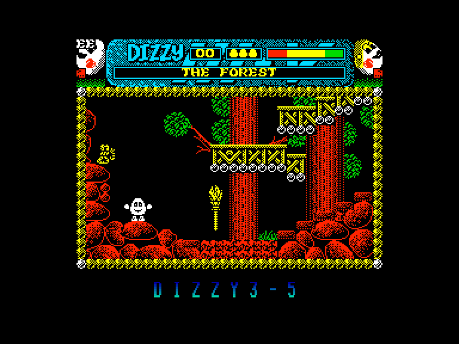
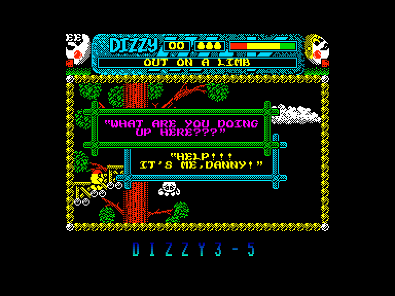
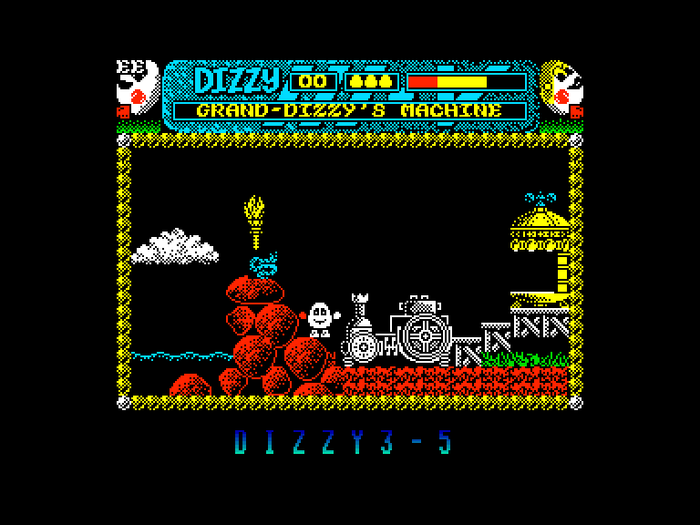

[0-9](../0/games-0.md) - [A](../a/games-a.md) - [B](../b/games-b.md) - [C](../c/games-c.md) - [D](../d/games-d.md) - [E](../e/games-e.md) - [F](../f/games-f.md) - [G](../g/games-g.md) - [H](../h/games-h.md) - [I](../i/games-i.md) - [J](../j/games-j.md) - [K](../k/games-k.md) - [L](../l/games-l.md) - [M](../m/games-m.md) - [N](../n/games-n.md) - [O](../o/games-o.md) - [P](../p/games-p.md) - [Q](../q/games-q.md) - [R](../r/games-r.md) - [S](../s/games-s.md) - [T](../t/games-t.md) - [U](../u/games-u.md) - [V](../v/games-v.md) - [W](../w/games-w.md) - [X](../x/games-x.md) - [Y](../y/games-y.md) - [Z](../z/games-z.md)

Ігри для [Enterprise 64k](../games-ep64.md) - [Enterprise 128k+RAMexp](../games-epramexp.md)

Ігри для систем [IS-DOS](../games-is-dos.md) - [SymbOS](../games-symbos.md) - [EDC Windows](../games-edcw.md)

Ігри для емуляторів [ZX Spectrum 48k/128k](../zxemu/games-zxemu.md) - [Amstrad CPC](../cpcemu/games-cpc.md) - [Sinclair ZX81](../zx81emu/games-zx81.md) - [Videoton TVC](../tvcemu/games-tvc.md) - [Commodore VIC-20](../vic20emu/games-vic20.md)

----------

# Dizzy 3 and a Half

**Альтернативні назви:**
 - Dizzy 3.5

**ID:** dizzy35-zx

## Скріншоти

## Опис

(temporary description generated by AI [Assistant])

**Опис гри: Dizzy 3 і пів**  
Dizzy 3 і пів — це захоплююча пригодницька гра, у якій ви граєте за персонажа на ім'я Діззі. Після того, як він врятував свою подругу Дейзі, Діззі відправляється у подорож, щоб врятувати всіх жителів Яєчної країни, яких викрав злий чаклун Закс. Гравцеві потрібно знайти шлях до Чарівної країни, використовуючи свої навички та розуміння, щоб подолати різні перешкоди.

**Правила гри:**  
1. Досліджуйте світ, переміщаючись праворуч, стрибаючи на платформи та піднімаючись по сходах.
2. Збирайте предмети, такі як довгі та короткі мотузки, щоб допомогти вам у вашій подорожі.
3. Взаємодійте з іншими персонажами, такими як Денні, щоб отримати підказки та допомогу.
4. Уникайте ворогів і небезпечних об'єктів, оскільки у вас є обмежена енергія, а не життя.
5. Використовуйте знайдені предмети для розв'язання головоломок і проходження через різні рівні.
6. Досягніть Чарівної країни, щоб врятувати всіх жителів і продовжити свою пригоду в наступній частині гри.

Готові до пригод? Удачі!

## Основна інформація
- **Оригінальна платформа:** ZX Spectrum

## Посилання
- [Домашня сторінка гри](https://yolkfolk.com/games/dizzy-3-and-a-half-into-magicland/)
- [Опис гри на ep128.hu (угорською)](http://www.ep128.hu/Games/Dizzy_35.htm)
- [Інформація про оригінальну версію](https://spectrumcomputing.co.uk/entry/9334/ZX-Spectrum/Dizzy_3_and_a_Half)
- [Завантажити гру](http://www.ep128.hu/Ep_Games/Prg/Dizzy3_and_Half.rar)

