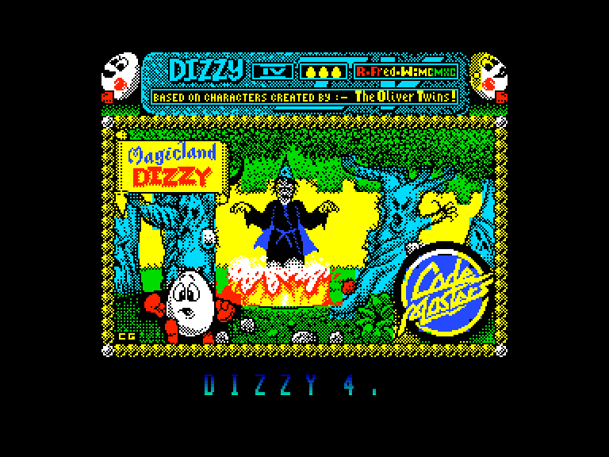
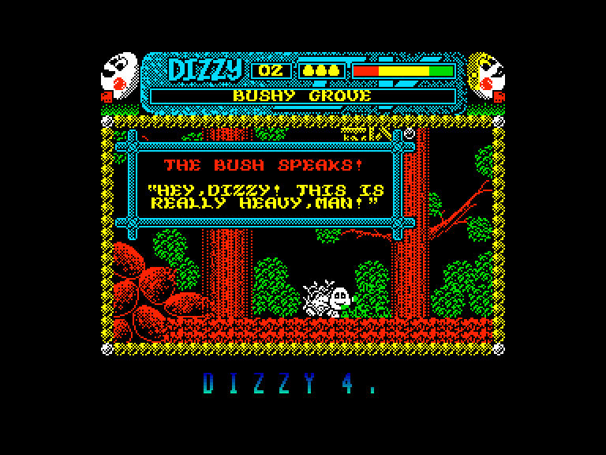
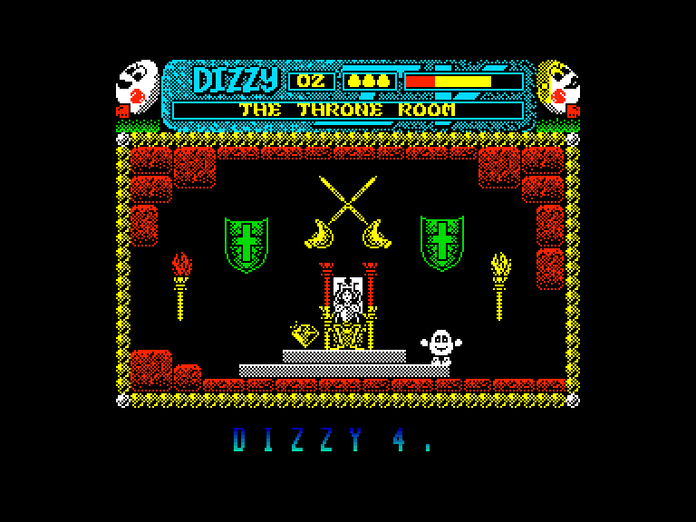
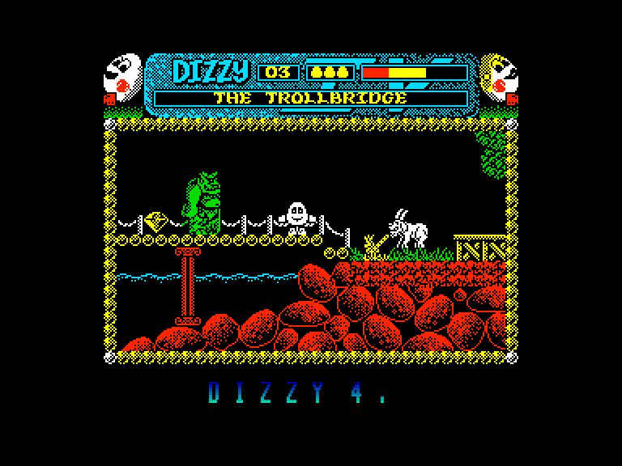

[0-9](../0/games-0.md) - [A](../a/games-a.md) - [B](../b/games-b.md) - [C](../c/games-c.md) - [D](../d/games-d.md) - [E](../e/games-e.md) - [F](../f/games-f.md) - [G](../g/games-g.md) - [H](../h/games-h.md) - [I](../i/games-i.md) - [J](../j/games-j.md) - [K](../k/games-k.md) - [L](../l/games-l.md) - [M](../m/games-m.md) - [N](../n/games-n.md) - [O](../o/games-o.md) - [P](../p/games-p.md) - [Q](../q/games-q.md) - [R](../r/games-r.md) - [S](../s/games-s.md) - [T](../t/games-t.md) - [U](../u/games-u.md) - [V](../v/games-v.md) - [W](../w/games-w.md) - [X](../x/games-x.md) - [Y](../y/games-y.md) - [Z](../z/games-z.md)

Ігри для [Enterprise 64k](../games-ep64.md) - [Enterprise 128k+RAMexp](../games-epramexp.md)

Ігри для систем [IS-DOS](../games-is-dos.md) - [SymbOS](../games-symbos.md) - [EDC Windows](../games-edcw.md)

Ігри для емуляторів [ZX Spectrum 48k/128k](../zxemu/games-zxemu.md) - [Amstrad CPC](../cpcemu/games-cpc.md) - [Sinclair ZX81](../zx81emu/games-zx81.md) - [Videoton TVC](../tvcemu/games-tvc.md) - [Commodore VIC-20](../vic20emu/games-vic20.md)

----------

# Magicland Dizzy

**Альтернативні назви:**
 - Dizzy 4

**ID:** dizzy4-zx

## Скріншоти

## Опис

(temporary description generated by AI [your name])

**Dizzy 4** - це захоплююча гра, в якій ви берете на себе роль Dizzy, яйця-героя, що вирушає на пошуки своїх друзів, викрадених злим чаклуном Заксом. Гравець повинен збирати різні предмети, вирішувати головоломки та уникати ворогів, щоб звільнити своїх товаришів і перемогти чаклуна.

**Правила гри:**
1. Використовуйте джойстик або клавіатуру для управління Dizzy: 
   - Z - вліво
   - X - вправо
   - SPACE - атака
   - ENTER - взяти/викинути/використати предмет
2. Збирайте предмети, які можуть бути використані для вирішення головоломок.
3. Уникайте ворогів, оскільки контакт з ними зменшує вашу енергію. Якщо впадете у воду, ви програєте.
4. Збирайте 30 діамантів, які розкидані по карті, деякі з них приховані.
5. Використовуйте зібрані предмети в потрібних місцях для прогресу в грі.
6. Звільняйте друзів Dizzy, щоб завершити гру і перемогти злого чаклуна Закса.

Гра забезпечує захоплюючий досвід з чудовою графікою та цікавими головоломками, які тримають вас у напрузі на протязі всієї гри.

## Основна інформація
- **Оригінальна платформа:** ZX Spectrum

## Посилання
- [Домашня сторінка гри](https://yolkfolk.com/games/magicland-dizzy/)
- [Опис гри на ep128.hu (угорською)](http://www.ep128.hu/Games/Dizzy_4.htm)
- [Інформація про оригінальну версію](https://spectrumcomputing.co.uk/entry/9336/ZX-Spectrum/Magicland_Dizzy)
- [Завантажити гру](http://www.ep128.hu/Ep_Games/Prg/Dizzy4.rar)

