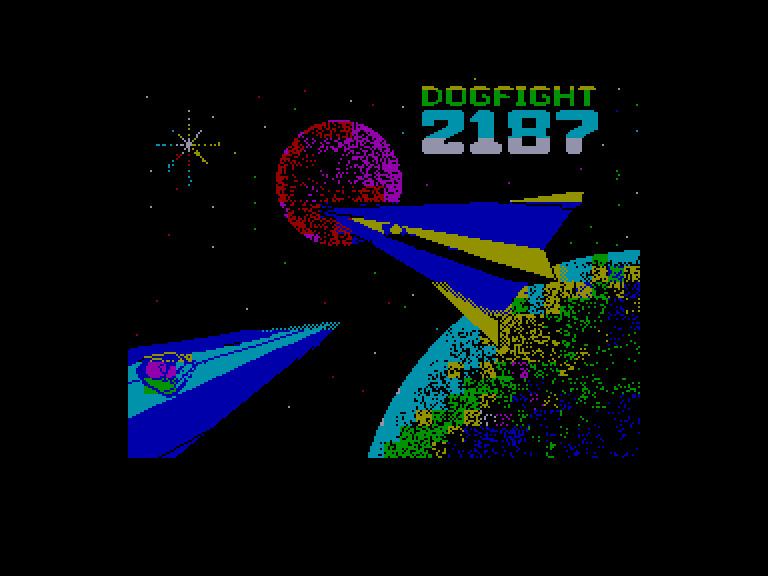
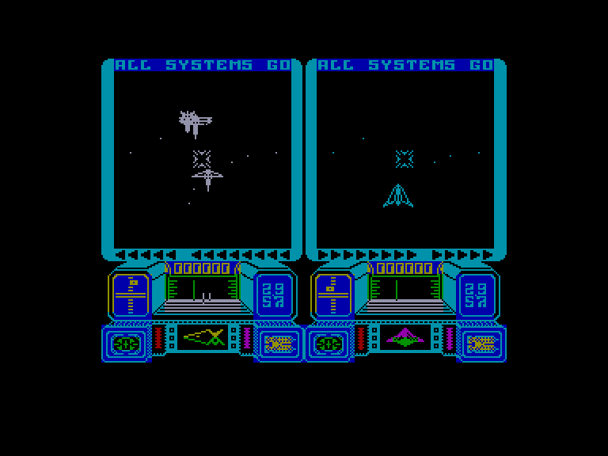
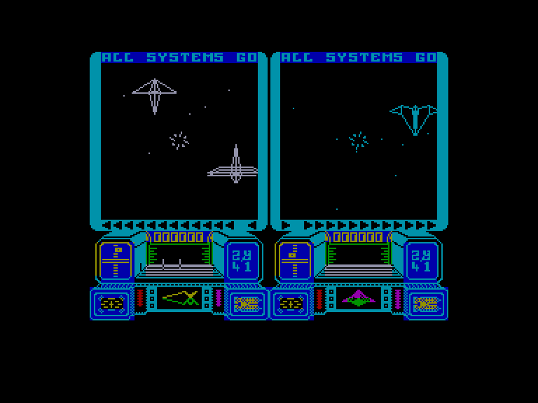
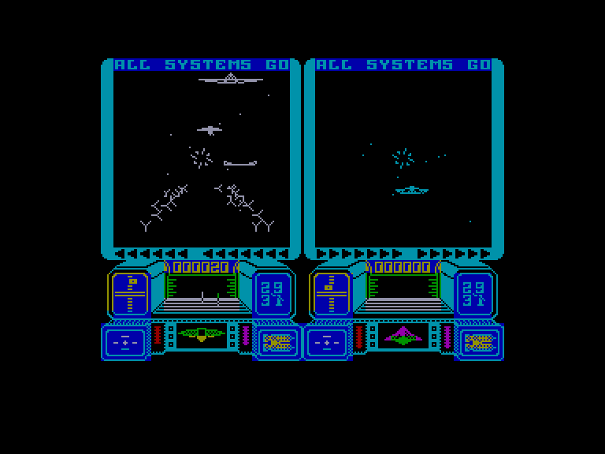

[0-9](../0/games-0.md) - [A](../a/games-a.md) - [B](../b/games-b.md) - [C](../c/games-c.md) - [D](../d/games-d.md) - [E](../e/games-e.md) - [F](../f/games-f.md) - [G](../g/games-g.md) - [H](../h/games-h.md) - [I](../i/games-i.md) - [J](../j/games-j.md) - [K](../k/games-k.md) - [L](../l/games-l.md) - [M](../m/games-m.md) - [N](../n/games-n.md) - [O](../o/games-o.md) - [P](../p/games-p.md) - [Q](../q/games-q.md) - [R](../r/games-r.md) - [S](../s/games-s.md) - [T](../t/games-t.md) - [U](../u/games-u.md) - [V](../v/games-v.md) - [W](../w/games-w.md) - [X](../x/games-x.md) - [Y](../y/games-y.md) - [Z](../z/games-z.md)

Ігри для [Enterprise 64k](../games-ep64.md) - [Enterprise 128k+RAMexp](../games-epramexp.md)

Ігри для систем [IS-DOS](../games-is-dos.md) - [SymbOS](../games-symbos.md) - [EDC Windows](../games-edcw.md)

Ігри для емуляторів [ZX Spectrum 48k/128k](../zxemu/games-zxemu.md) - [Amstrad CPC](../cpcemu/games-cpc.md) - [Sinclair ZX81](../zx81emu/games-zx81.md) - [Videoton TVC](../tvcemu/games-tvc.md) - [Commodore VIC-20](../vic20emu/games-vic20.md)

----------

# Dogfight: 2187

**Альтернативні назви:**
 - Dogfight 2187

**ID:** dogfight2187-zx

## Скріншоти

## Опис

(temporary description generated by AI [Assistant])

**Опис гри: Dogfight 2187**

У грі "Dogfight 2187" ви берете на себе роль Ретта Декстера, вірного прихильника стародавніх пророцтв, які передбачали велику інвазію з іншого виміру в секторі Альфа Центавра. Щоб запобігти цій інвазії, було розділено генератор варп-поля на 100 частин, які розкидані по космосу. Ваше завдання — знайти дев'ять частин генератора, щоб закрити часовий континуум і врятувати людство.

**Правила гри:**

1. **Перспектива:** Гра ведеться з першої особи з вашої кабіни, де ви маєте приладову панель з важливими даними.
2. **Гравці:** Гра підтримує 1-2 гравців, які можуть грати на розділеному екрані, змагаючись один з одним або співпрацюючи проти комп'ютера.
3. **Мета:** Збирайте частини генератора та доставляйте їх до місця в часовому континуумі, уникаючи атак ворогів.
4. **Бойові дії:** Знищуйте ворожі кораблі за допомогою лазерів, збирайте частини генератора, які можуть випадати з знищених ворогів.
5. **Ресурси:** Слідкуйте за паливом та щитами; якщо вони закінчаться, гра закінчиться.
6. **Карта:** Використовуйте галактичну карту та радар для відстеження об'єктів і ворогів у космосі.

Гра пропонує захоплюючий космічний бойовик у науково-фантастичному сеттингу, де вам потрібно проявити стратегічне мислення та швидкість реакції, щоб досягти успіху.

## Основна інформація
- **Оригінальна платформа:** ZX Spectrum

## Посилання
- [Інформація про оригінальну версію](https://spectrumcomputing.co.uk/entry/1421/ZX-Spectrum/Dogfight_2187)
- [Завантажити гру](http://www.ep128.hu/Ep_Games/Prg/Dogfight_2187.rar)

**Дата генерації:** 29.07.2026

