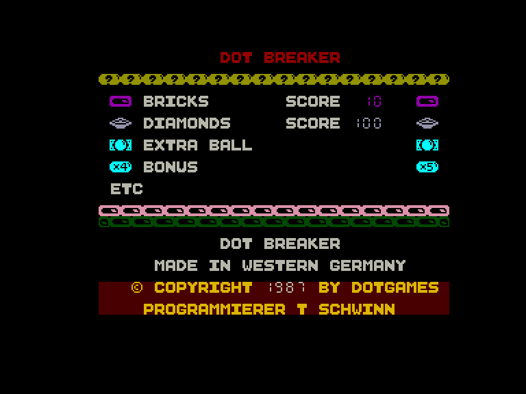
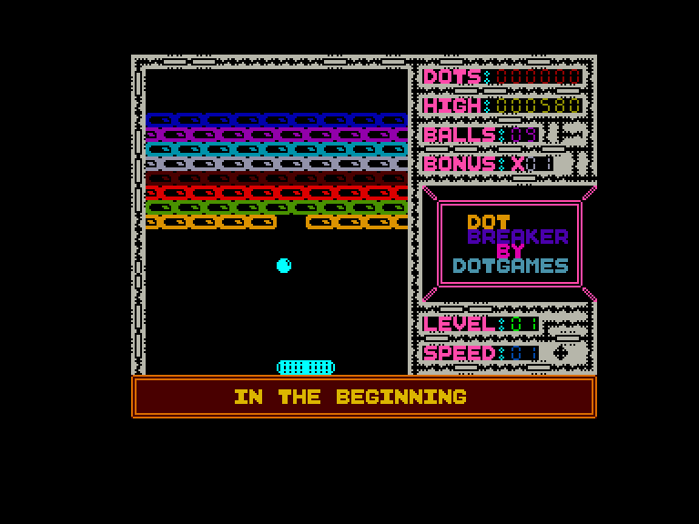
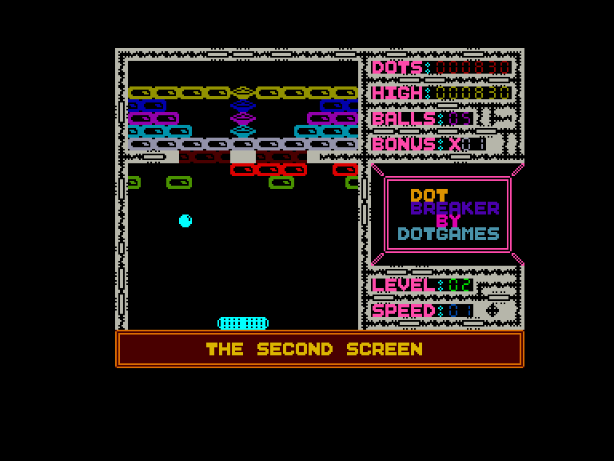
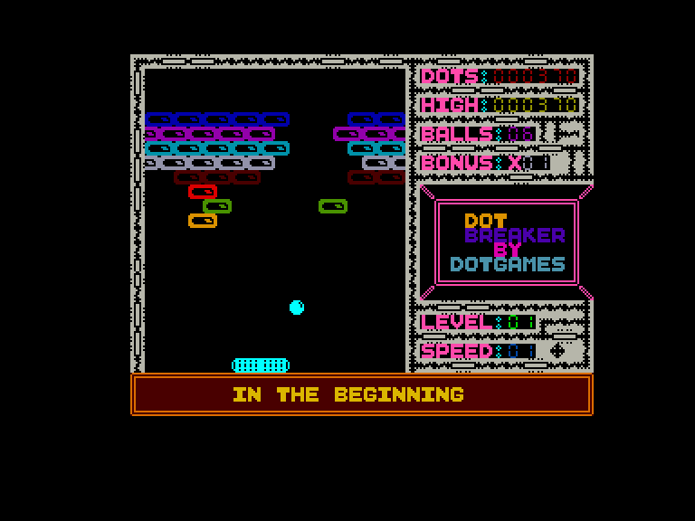

[0-9](../0/games-0.md) - [A](../a/games-a.md) - [B](../b/games-b.md) - [C](../c/games-c.md) - [D](../d/games-d.md) - [E](../e/games-e.md) - [F](../f/games-f.md) - [G](../g/games-g.md) - [H](../h/games-h.md) - [I](../i/games-i.md) - [J](../j/games-j.md) - [K](../k/games-k.md) - [L](../l/games-l.md) - [M](../m/games-m.md) - [N](../n/games-n.md) - [O](../o/games-o.md) - [P](../p/games-p.md) - [Q](../q/games-q.md) - [R](../r/games-r.md) - [S](../s/games-s.md) - [T](../t/games-t.md) - [U](../u/games-u.md) - [V](../v/games-v.md) - [W](../w/games-w.md) - [X](../x/games-x.md) - [Y](../y/games-y.md) - [Z](../z/games-z.md)

Ігри для [Enterprise 64k](../games-ep64.md) - [Enterprise 128k+RAMexp](../games-epramexp.md) - [2dfx](games-2dfx.md)

Ігри для систем [IS-DOS](../games-is-dos.md) - [SymbOS](../games-symbos.md) - [EDC Windows](../games-edcw.md)

Ігри для емуляторів [ZX Spectrum 48k/128k](../zxemu/games-zxemu.md) - [Amstrad CPC](../cpcemu/games-cpc.md) - [Sinclair ZX81](../zx81emu/games-zx81.md) - [Videoton TVC](../tvcemu/games-tvc.md) - [Commodore VIC-20](../vic20emu/games-vic20.md)

----------

# Dot Breaker

**ID:** dot-breaker

**Жанри:** Арканоідо-подібна

## Примітка

ℹ Офіційний реліз.

## Скріншоти

## Опис

Простий клон Арканоіда.

## Основна інформація
- **Мови:** Англійська
- **Оригінальна платформа:** Enterprise
### Загальні системні вимоги
- **Апаратні:** EP64, EP128
- **Програмні:** EXOS 2.1
### Геймплей
- **Керування:** Internal Joy, External Joy 1*
- **Кількість гравців:** 1 player
- **Додаткові теги:** Text40 mode
### Розробка
- **Рік випуску:** 1987
- **Автор:** Thilo Schwinn
- **Компанія:** Dot Games

## Посилання
- [Опис на ep128.hu (угорською)](http://www.ep128.hu/Ep_Games/Leiras/Dot_Games.htm)
- [Завантажити](http://www.ep128.hu/Ep_Games/Prg/Dot_Games.rar)
- [Easy Load&Play](https://t.me/EP128k_Load_n_Play/266) *(Telegram-канал Vibrant Waves)*

## [Керування](../controllers.md)

`Internal Joystick`  
`External Joystick 1` (окрема версія гри з модифікованим керуванням)

## Детальна інформація

### Системні вимоги  

#### Мінімальні системні вимоги  

Оперативна пам'ять: **64 КБ** (потрібна версія EXOS 2.1 або вище)  
Оперативна пам'ять: **128 КБ (або більше)**  

### Геймплей  

Розбийте усі блоки для переходу на наступний рівень.  
У грі 9 різних рівней. Якщо ви успішно подолаєте останній, гра почнеться знову з першого рівня, але вже на більшій швидкості.  

За кожен розбитий блок нараховується 10 очок, а за діамант - 100.  
Блок **DEC** зменшує биту, а **INC** - збільшує.  
Блоки **FUEL**/**LOSS** - впливають на швидкість м'яча (швидше/повільніше).  
Блок з м'ячем - додає бонусну спробу.  
Блоки **X4** та **X5** є модифікаторами нарахування очок.  

Якщо зробити так, що м'яч буде рухатись по однаковій траекторії, то через деякий час гра дозволить перейти на наступний рівень (з'являться блоки **END**).   

### Чіти  

Існує модифікована версія гри з незкінченним життям.  

### Історія розробки  

Одна з перших комерційних ігор програміста [Thilo Schwinn](http://www.duesi.de/thilo/ARBEIT.HTM) для **Düsi Software**.