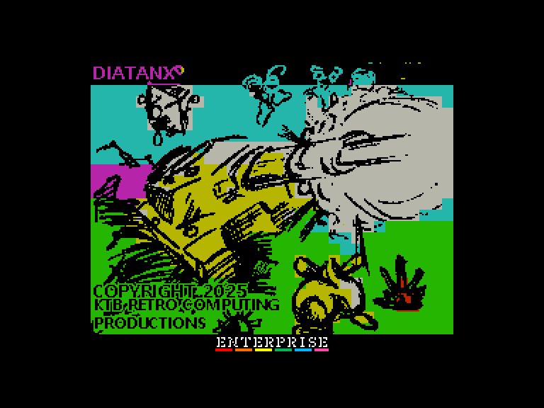
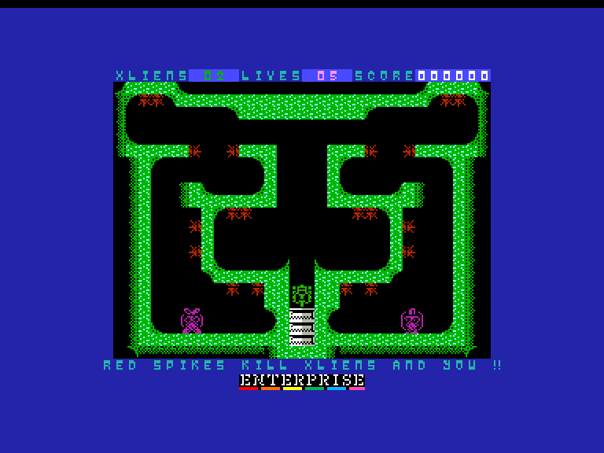
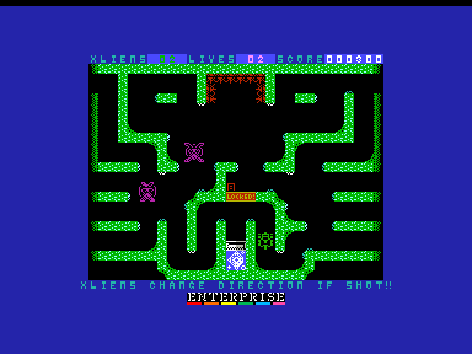
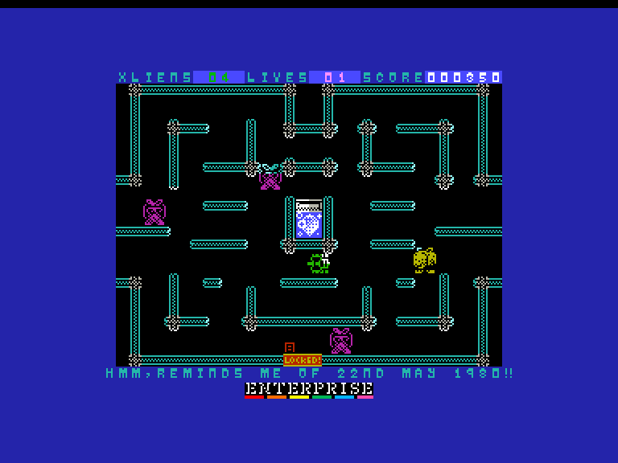

# DIA TanX!!

| | | | |
| --- | --- | --- | --- |
|||||

Жанр: аркада  
Кількість гравців: 1  
Мова гри: англійська  

## Опис

Вторгнення Xlien досягли успіху. Їхні невпинні флоти лінкорів та авіаносців висадилися на планеті, і тепер вони всюди! Вони в супермаркетах! Вони на вулицях! Вони навіть у магазині WH Smiths, перш ніж його перейменують!!

Але Захист Землі не збирається з цим миритися, поки у них є зручні крісла та вишукані коктейлі! Вони спланували все заздалегідь, і мільярди доларів-фунтів грошей платників податків були вкладені у вражаючу армаду танків.

Танки, які могли не тільки рухатися ліворуч, праворуч, вгору та вниз; але й повністю контролювали діагональні варіації. Так! Вгору та ліворуч, вгору та праворуч, вниз та ліворуч, вниз та праворуч; все це тепер було доступно хитрим командирам танків всюди!

Навіть якщо їх звати не Джо!

Гроші витрачені, сказали вони. Багатьох поплескали по спинах.

І ось, ці "Dia TanX" були замовлені, але через помилку в бухгалтерії в оборонному бюджеті вистачило грошей лише на п'ять таких танків!

Але цього має бути більш ніж достатньо, щоб позбутися цих Xlien! Принаймні, так стверджували ці політики. Побачимо.

Звичайно, лише одні модні танки не впораються з шаленими загарбниками. Потрібен цілий ряд передових технологій та систем озброєння, щоб знищити цих передових істот з-за зірок.

То що ж дали цим танкам лічильники монет?
Повітряну гармату. Гармату, яка стріляє повітрям.

Ви жартуєте? Повітря? Ми в більшому знедолі, ніж шматок скандинавських меблів!

Що повітря зробить проти цих істот? Хіба у нас немає бомб, куль, ракет, дронів і...

... о. Мабуть, у нас їх немає. Весь бюджет пішов на танки.

Але це потужна повітряна гармата. Найпотужніша в усій країні.

Ну як це подобається Xlien? Я читав «Війну світів»! Усі ці віруси, що передаються повітрям, об’єднаються з нами, і перш ніж ви це усвідомите, вони стануть лише падлом для воронячої їжі.

Ні. Джордж Орвелл помилявся. Наша звичайна застуда нам тут не допоможе. То що ж тепер? О, Захист Землі знайшов кілька колючих мін. Якщо ми стріляємо по Xlien нашим «повітрям», ми можемо заштовхати їх у них і покласти край їхньому правлінню терору?

Здається набагато складнішим, ніж потрібно. Але я кусатимуся.

І це ще не все. Після танків вони знайшли достатньо бюджету, щоб витратити його на автономні дрони ромбоподібної форми, які будуть літати навколо, знищуючи все на своєму шляху.

Я повірю в це, коли побачу це...

## Системні вимоги

|Мінімальні системні вимоги:|Рекомендовані системні вимоги:|
|---------------------------|------------------------------|
|Оперативна пам'ять: **64 КБ**|Оперативна пам'ять: **128 КБ (або більше)**|  

## Керування та тонкощі запуску
### Основні [елементи керування](../../controllers.md):
⌨ Клавіатура (`Q`, `A`, `O`, `P`, `M`)  
🕹 Вбудований джойстик  
🎮 Зовнішній джойстик 1/2

## Посилання

▶ [Easy Load&Play](https://t.me/EP128k_Load_n_Play/939) *(Telegram-канал Vibrant Waves)*  
💾 [Завантажити гру](https://www.ep128.hu/Ep_Games/Prg/DiaTanX.rar)  
📃 [Опис гри]() (угорська)  
🏡 [Домашня сторінка гри](https://ktbproductions.itch.io/enterprise-games)

## Автори
👨‍💻 Автор: Mas (KTB Retrocomputing Productions)  
📅 Рік релізу: 2025  