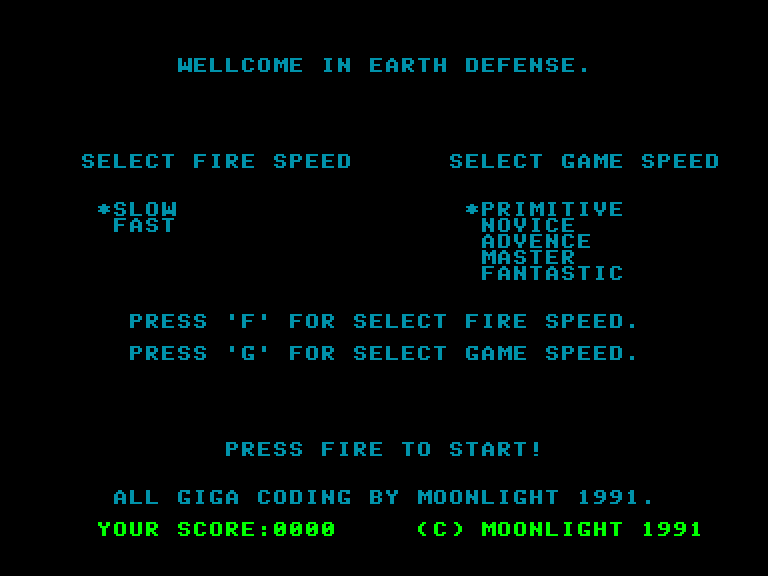
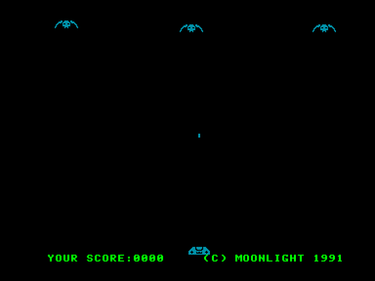
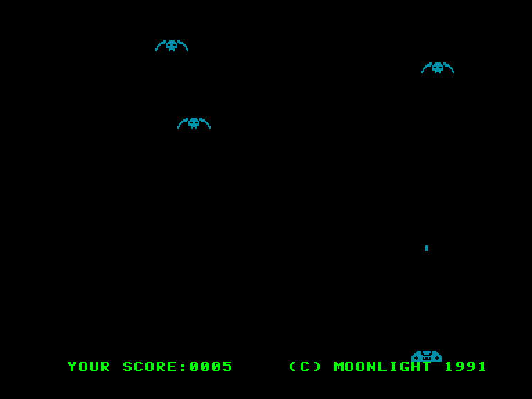
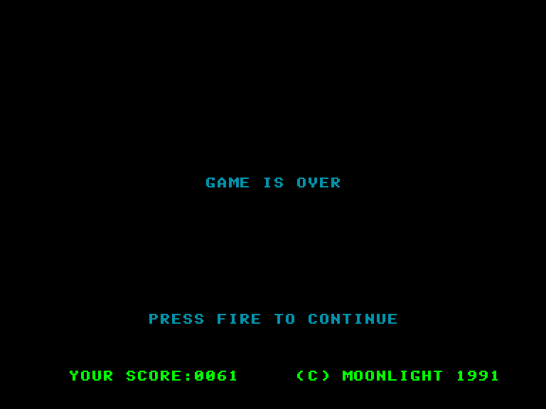

[0-9](../0/games-0.md) - [A](../a/games-a.md) - [B](../b/games-b.md) - [C](../c/games-c.md) - [D](../d/games-d.md) - [E](../e/games-e.md) - [F](../f/games-f.md) - [G](../g/games-g.md) - [H](../h/games-h.md) - [I](../i/games-i.md) - [J](../j/games-j.md) - [K](../k/games-k.md) - [L](../l/games-l.md) - [M](../m/games-m.md) - [N](../n/games-n.md) - [O](../o/games-o.md) - [P](../p/games-p.md) - [Q](../q/games-q.md) - [R](../r/games-r.md) - [S](../s/games-s.md) - [T](../t/games-t.md) - [U](../u/games-u.md) - [V](../v/games-v.md) - [W](../w/games-w.md) - [X](../x/games-x.md) - [Y](../y/games-y.md) - [Z](../z/games-z.md)

Ігри для [Enterprise 64k](../games-ep64.md) - [Enterprise 128k+RAMexp](../games-epramexp.md)

Ігри для систем [IS-DOS](../games-is-dos.md) - [SymbOS](../games-symbos.md) - [EDC Windows](../games-edcw.md)

Ігри для емуляторів [ZX Spectrum 48k/128k](../zxemu/games-zxemu.md) - [Amstrad CPC](../cpcemu/games-cpc.md) - [Sinclair ZX81](../zx81emu/games-zx81.md) - [Videoton TVC](../tvcemu/games-tvc.md) - [Commodore VIC-20](../vic20emu/games-vic20.md)

----------

# Earth Defense

**ID:** earth-defense

## Скріншоти

## Опис

(temporary description generated by AI [ChatGPT])

# Опис та правила гри "Захист Землі"

## Загальний опис
"Захист Землі" — це унікальна реалізація гри, натхненної класичними аркадними іграми, такими як "Galaxians". У цій грі гравець виступає в ролі останньої лінії оборони людства, яке зазнає нападу зловмисних прибульців. Ваше завдання — знищити ворогів, які наближаються до Землі. Якщо прибульці досягнуть нижньої частини екрану, вони атакують нашу планету, що призведе до негайного закінчення гри.

## Правила гри
1. **Мета гри**: Знищити всіх прибульців, які наближаються до вашої позиції. 
2. **Управління**: Гравець може стріляти в прибульців, але може випустити лише один снаряд одночасно. Поки попередній снаряд на екрані, новий снаряд випустити не вдасться.
3. **Закінчення гри**: Якщо прибульці досягнуть нижньої частини екрану, з'явиться повідомлення "GAME IS OVER", і гра закінчиться.
4. **Налаштування**: Перед початком гри ви можете натиснути клавішу 'F', щоб вибрати швидкість снарядів (повільно/швидко), а клавіша 'G' дозволяє налаштувати швидкість гри (в п'яти рівнях).
5. **Графіка та звук**: Гра має просту, але приємну графіку та музику, знайому багатьом з ігор на платформі Spectrum. 
6. **Джерельний код**: Для тих, хто цікавиться програмуванням, гра постачається з джерельним кодом, що може бути корисним для вивчення машинного коду.

Гра "Захист Землі" є простою, але захоплюючою, ідеально підходить для тих, хто любить класичні аркадні ігри. Випробуйте свої навички та спробуйте врятувати Землю від знищення!

## Посилання
- [Опис гри на ep128.hu (угорською)](http://www.ep128.hu/Ep_Games/Leiras/Earth_Defense.htm)
- [Завантажити гру](http://www.ep128.hu/Ep_Games/Prg/Earth_Defense.rar)

