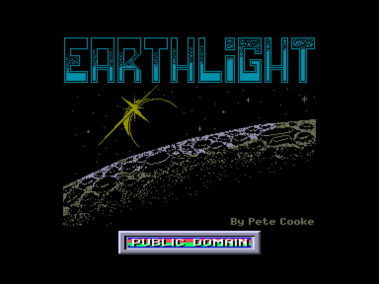
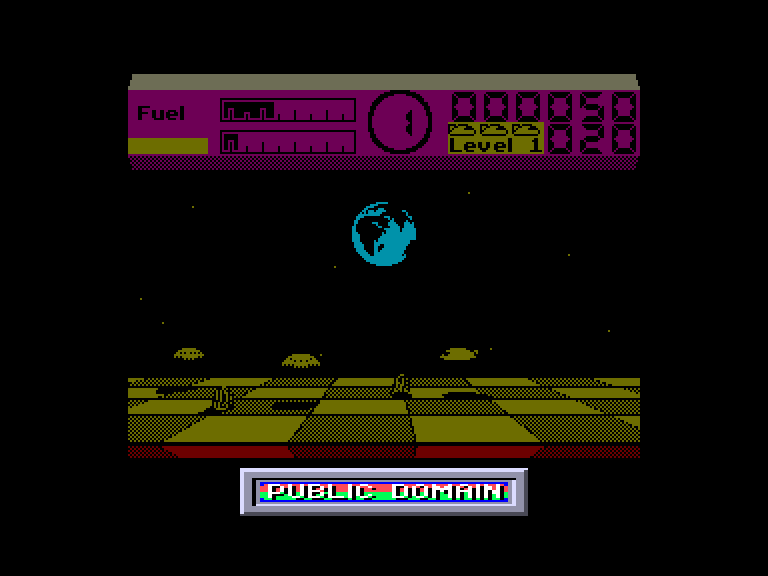
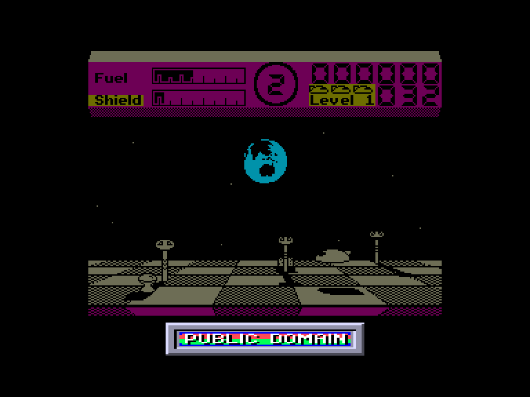
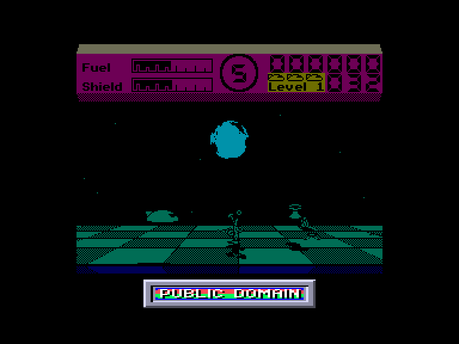

[0-9](../0/games-0.md) - [A](../a/games-a.md) - [B](../b/games-b.md) - [C](../c/games-c.md) - [D](../d/games-d.md) - [E](../e/games-e.md) - [F](../f/games-f.md) - [G](../g/games-g.md) - [H](../h/games-h.md) - [I](../i/games-i.md) - [J](../j/games-j.md) - [K](../k/games-k.md) - [L](../l/games-l.md) - [M](../m/games-m.md) - [N](../n/games-n.md) - [O](../o/games-o.md) - [P](../p/games-p.md) - [Q](../q/games-q.md) - [R](../r/games-r.md) - [S](../s/games-s.md) - [T](../t/games-t.md) - [U](../u/games-u.md) - [V](../v/games-v.md) - [W](../w/games-w.md) - [X](../x/games-x.md) - [Y](../y/games-y.md) - [Z](../z/games-z.md)

Ігри для [Enterprise 64k](../games-ep64.md) - [Enterprise 128k+RAMexp](../games-epramexp.md) - [2dfx](games-2dfx.md)

Ігри для систем [IS-DOS](../games-is-dos.md) - [SymbOS](../games-symbos.md) - [EDC Windows](../games-edcw.md)

Ігри для емуляторів [ZX Spectrum 48k/128k](../zxemu/games-zxemu.md) - [Amstrad CPC](../cpcemu/games-cpc.md) - [Sinclair ZX81](../zx81emu/games-zx81.md) - [Videoton TVC](../tvcemu/games-tvc.md) - [Commodore VIC-20](../vic20emu/games-vic20.md)

----------

# Earthlight

**ID:** earthlight-zx

## Скріншоти

## Опис

(temporary description generated by AI [Assistant])

**Опис гри EarthLight**

Ви граєте за Слаатна, пілота-розвідника з інопланетної цивілізації на планеті Арктур. Під час свого подорожі він досяг Землі, але його корабель був змушений приземлитися на поверхні через сильний тяговий промінь, що виходить з її супутника. Єдиний шанс Слаатна на втечу — нейтралізувати передавачі, які підтримують цей енергетичний промінь. Передавачі розміщені по всій поверхні супутника, і вам потрібно їх знайти, а потім повернутися на базу.

Висота польоту обмежена через вплив тягового променя, тому слід бути обережним, щоб не врізатися у високі будівлі. Крім того, на поверхні літають автоматизовані захисні роботи, які можуть створити серйозні проблеми. Деякі з них автоматично націлюються на ваш космічний корабель, в той час як інші рухаються за заданими маршрутами.

Гра має високоякісну графіку, а звукове оформлення в 128K версії на високому рівні. Геймплей захоплюючий та розважальний, а меню виконано в зручному «іконковому» стилі, що дозволяє легко переміщатися між пунктами за допомогою курсора.

**Правила гри**

1. **Меню гри**
   - **PLAY GAME** - почати гру.
   - **HIGH SCORES** - перегляд таблиці рекордів.
   - **VIEW / SELECT KEYS** - перегляд/налаштування управління:
     - ALTER KEYS - переналаштування клавіатури.
     - KEMPSTON JOYSTICK - управління через джойстик Kempston.
     - SINCLAIR JOYSTICK - управління через джойстик Sinclair.
     - PROTEK JOYSTICK - управління через джойстик Protek.
     - SELECTION COMPLETE - повернення до головного меню.
   - **CONFIGURE GAME** - налаштування параметрів гри:
     - COLOUR / MONO - кольоровий або чорно-білий режим.
     - SOUND ON / OFF - вмикання/вимикання звуку.
     - BORDER FX ON/OFF - невідоме налаштування.
     - 3/4 VIEW ON / OFF - налаштування виду.
     - PANEL COLOUR - зміна кольору інформаційної панелі.

2. **Вибір секторів**
   Після початку гри вам потрібно вибрати один з восьми секторів для виконання місії. Кожен сектор містить різну кількість передавачів, які потрібно зібрати:
   - 1-й сектор: 2 передавачі
   - 2-й сектор: 3 передавачі
   - 3-й сектор: 3 передавачі
   - 4-й сектор: 3 передавачі
   - 5-й сектор: 3 передавачі
   - 6-й сектор: 6 передавачів
   - 7-й сектор: 3 передавачі
   - 8-й сектор: 4 передавачі

3. **Управління космічним кораблем**
   - Для управління кораблем використовуйте клавіші: 'Q' для підйому, 'W' для спуску. 
   - Для навігації вліво та вправо використовуйте стрілки.
   - Ви можете змінювати швидкість руху корабля.
   - Гра має тривимірну графіку, що дозволяє чітко бачити глибину поля.

4. **Інформаційна панель**
   На інформаційній панелі відображається:
   - **FUEL** - рівень пального. Якщо воно закінчиться, ви впадете.
   - **SHIELD** - енергія щита. Кожне зіткнення зменшує його. Якщо щит закінчиться, ваш корабель буде знищений.
   - Номер зони, в якій ви знаходитесь.
   - Ваш поточний рахунок та кількість життів.

5. **Завершення місії**
   Після збору всіх передавачів у секторі, ви повинні повернутися на базу. Якщо ви втрачаєте життя, всі зібрані передавачі повернуться на свої місця.

**Поради**
- Уникайте зіткнень з перешкодами та роботами.
- Збирайте паливо та ракети, оскільки їх кількість обмежена.
- Використовуйте автоматичне приземлення, щоб полегшити посадку.

Удачі в грі!

## Основна інформація
- **Оригінальна платформа:** ZX Spectrum

## Посилання
- [Опис на ep128.hu (угорською)](http://www.ep128.hu/Games/EarthLight.htm)
- [Інформація про оригінальну версію](https://spectrumcomputing.co.uk/entry/1565/ZX-Spectrum/Earthlight)
- [Завантажити](http://www.ep128.hu/Ep_Games/Prg/EarthLight.rar)

