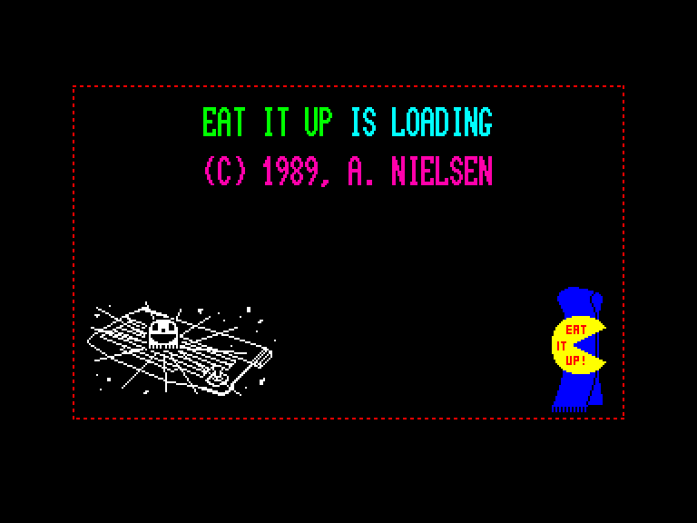
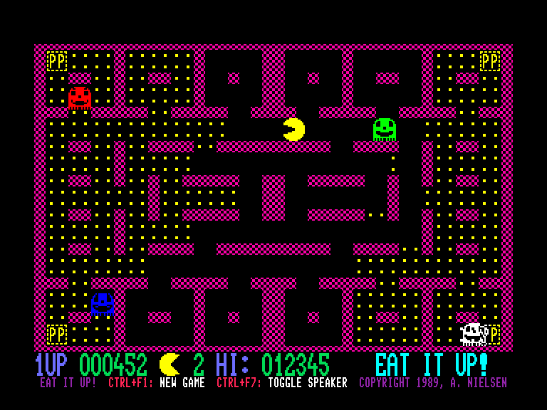
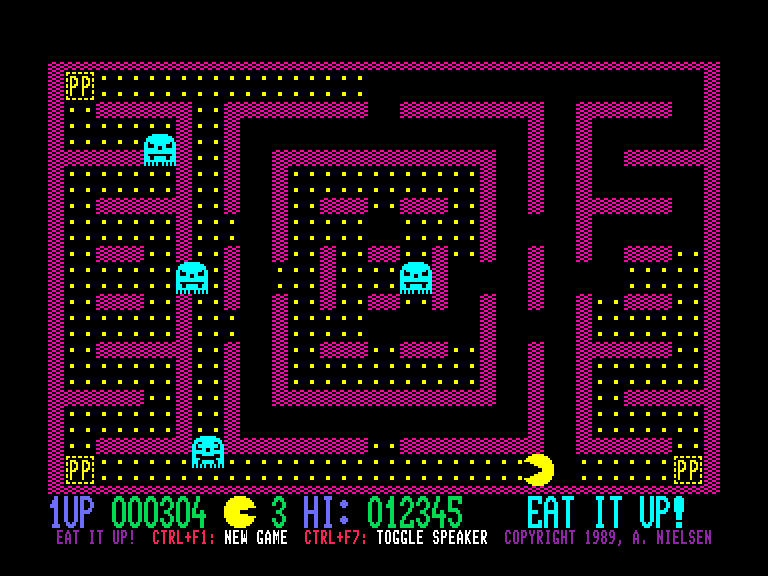
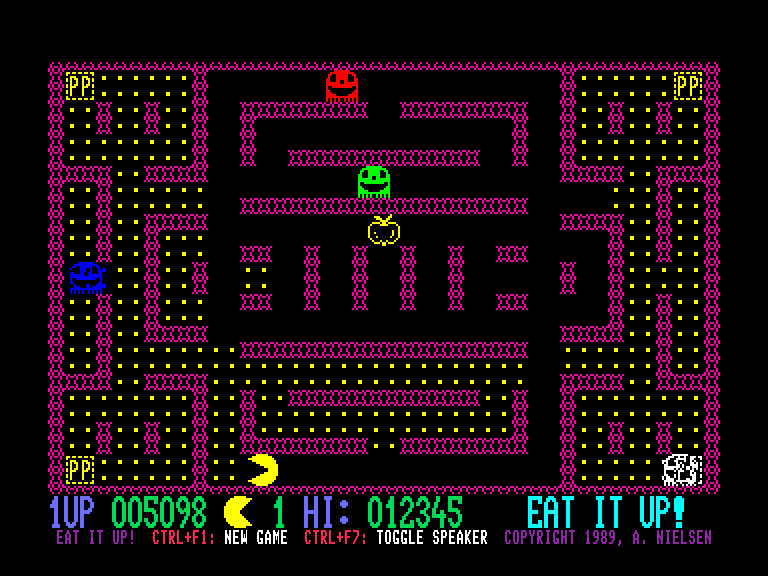

[0-9](../0/games-0.md) - [A](../a/games-a.md) - [B](../b/games-b.md) - [C](../c/games-c.md) - [D](../d/games-d.md) - [E](../e/games-e.md) - [F](../f/games-f.md) - [G](../g/games-g.md) - [H](../h/games-h.md) - [I](../i/games-i.md) - [J](../j/games-j.md) - [K](../k/games-k.md) - [L](../l/games-l.md) - [M](../m/games-m.md) - [N](../n/games-n.md) - [O](../o/games-o.md) - [P](../p/games-p.md) - [Q](../q/games-q.md) - [R](../r/games-r.md) - [S](../s/games-s.md) - [T](../t/games-t.md) - [U](../u/games-u.md) - [V](../v/games-v.md) - [W](../w/games-w.md) - [X](../x/games-x.md) - [Y](../y/games-y.md) - [Z](../z/games-z.md)

Ігри для [Enterprise 64k](../games-ep64.md) - [Enterprise 128k+RAMexp](../games-epramexp.md)

Ігри для систем [IS-DOS](../games-is-dos.md) - [SymbOS](../games-symbos.md) - [EDC Windows](../games-edcw.md)

Ігри для емуляторів [ZX Spectrum 48k/128k](../zxemu/games-zxemu.md) - [Amstrad CPC](../cpcemu/games-cpc.md) - [Sinclair ZX81](../zx81emu/games-zx81.md) - [Videoton TVC](../tvcemu/games-tvc.md) - [Commodore VIC-20](../vic20emu/games-vic20.md)

----------

# Eat it Up

**ID:** eat-it-up

## Скріншоти

## Опис

(temporary description generated by AI [Assistant])

# Опис гри "Eat it Up"

## Загальний опис
"Eat it Up" — це аркадна гра, випущена в 1989 році компанією A. Nielsen, яка належить до жанру "увійди та їж". Гра є натхненною класичними іграми, такими як Pac-Man, і пропонує просту, але захоплюючу механіку гри. Гравці керують персонажем, який повинен збирати предмети, уникаючи при цьому ворогів.

## Правила гри
1. **Кількість гравців**: Гра підтримує 1 або 2 гравців. Перед початком гри необхідно вибрати кількість гравців у меню.
   
2. **Управління**: Гравці можуть використовувати будь-який джойстик для управління персонажем. Додатково, гра підтримує клавіші на клавіатурі для виконання певних дій.
   
3. **Початок гри**: Гру можна розпочати, натиснувши кнопку "вогонь" на джойстику. 

4. **Перезавантаження гри**: Гравці можуть почати нову гру в будь-який момент, натиснувши комбінацію клавіш CTRL + F1.

5. **Вимкнення звуку**: Для вимкнення або увімкнення вбудованого динаміка комп’ютера (не звуку гри) використовуйте комбінацію клавіш CTRL + F7.

6. **Пауза**: Гру можна призупинити, натиснувши клавішу PAUSE (HOLD).

7. **Голосовий супровід**: Якщо у вас є підключений синтезатор мови Speakeasy, гра може спілкуватися з вами. Для цього потрібно відповісти "так" на запитання про Speakeasy після завантаження гри.

## Графіка та атмосфера
Графіка гри проста, але добре передає атмосферу класичної аркадної гри. Хоча візуальні ефекти не є надто вражаючими, гра вміло відтворює відчуття, яке було характерно для ігор типу Pac-Man.

## Висновок
"Eat it Up" — це чудова гра для фанатів класичних аркадних ігор, яка пропонує простий, але захоплюючий ігровий процес. З можливістю гри вдвох, вона стане відмінним способом провести час з друзями.

(temporary description generated by AI [Assistant])

## Основна інформація
### Загальні системні вимоги
- **Апаратні:** EP64, EP128

## Посилання
- [Опис гри на ep128.hu (угорською)](http://www.ep128.hu/Ep_Games/Leiras/Eat_it_Up.htm)
- [Завантажити гру](http://www.ep128.hu/Ep_Games/Prg/Eat_it_Up.rar)
- [Easy Load&Play](https://t.me/EP128k_Load_n_Play/277) *(Telegram-канал Vibrant Waves)*

## Відео

<iframe src="https://www.youtube.com/embed/6aflb3wK5qw"  
style="width:75%; aspect-ratio:16/9;" allowfullscreen></iframe>

- [Відео](https://www.youtube.com/watch?v=bsF7jBFTfaY)

