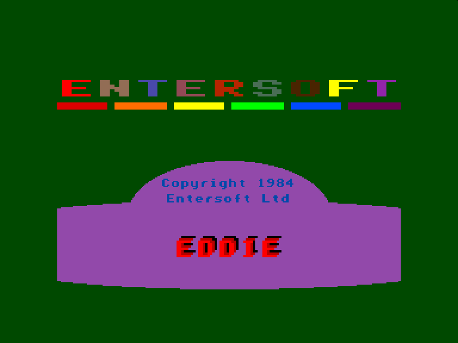
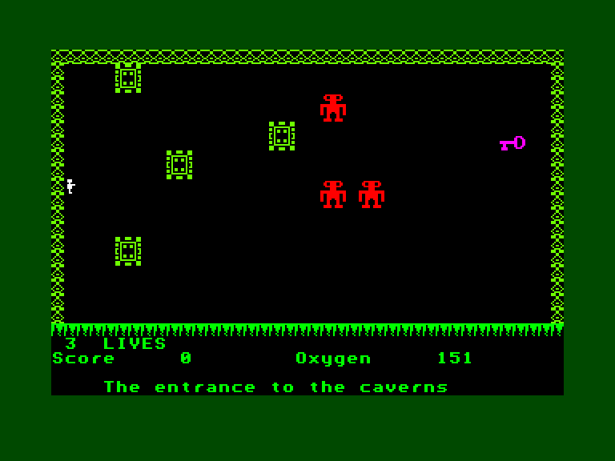
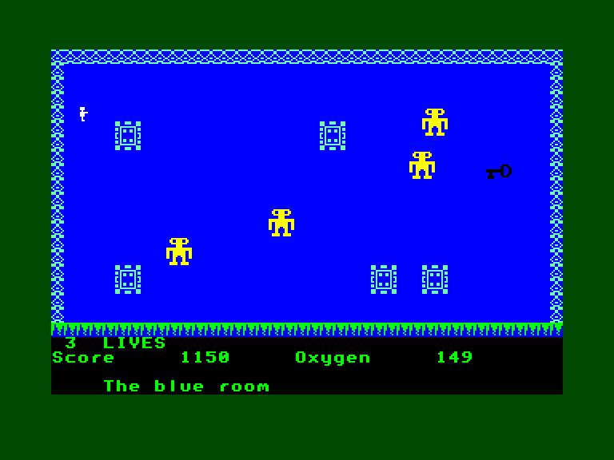
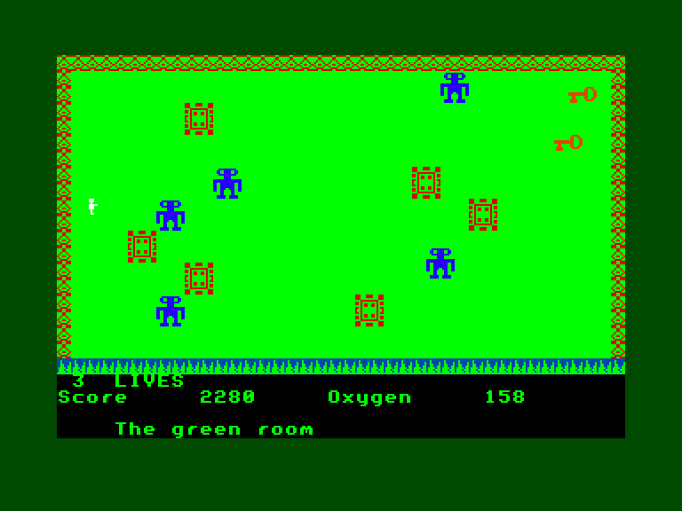

[0-9](../0/games-0.md) - [A](../a/games-a.md) - [B](../b/games-b.md) - [C](../c/games-c.md) - [D](../d/games-d.md) - [E](../e/games-e.md) - [F](../f/games-f.md) - [G](../g/games-g.md) - [H](../h/games-h.md) - [I](../i/games-i.md) - [J](../j/games-j.md) - [K](../k/games-k.md) - [L](../l/games-l.md) - [M](../m/games-m.md) - [N](../n/games-n.md) - [O](../o/games-o.md) - [P](../p/games-p.md) - [Q](../q/games-q.md) - [R](../r/games-r.md) - [S](../s/games-s.md) - [T](../t/games-t.md) - [U](../u/games-u.md) - [V](../v/games-v.md) - [W](../w/games-w.md) - [X](../x/games-x.md) - [Y](../y/games-y.md) - [Z](../z/games-z.md)

Ігри для [Enterprise 64k](../games-ep64.md) - [Enterprise 128k+RAMexp](../games-epramexp.md)

Ігри для систем [IS-DOS](../games-is-dos.md) - [SymbOS](../games-symbos.md) - [EDC Windows](../games-edcw.md)

Ігри для емуляторів [ZX Spectrum 48k/128k](../zxemu/games-zxemu.md) - [Amstrad CPC](../cpcemu/games-cpc.md) - [Sinclair ZX81](../zx81emu/games-zx81.md) - [Videoton TVC](../tvcemu/games-tvc.md) - [Commodore VIC-20](../vic20emu/games-vic20.md)

----------

# Eddie the Exterminator

**ID:** eddie-the-exterminator-bas

## Скріншоти

## Опис

(temporary description generated by AI [your name])

**Опис гри: Eddie the Exterminator**

Eddie the Exterminator — це аркадна гра, випущена компанією Entersoft Ltd у 1984 році. У цій грі гравець управляє персонажем на ім'я Едді, який опинився в небезпечній ситуації. Він застряг у кімнаті, оточеній електричними стінами, з мінами та величезними охоронними роботами. Дотик до стін або мін є смертельним, так само як і обійми переслідувальних роботів.

**Мета гри:**
Гравець повинен знайти великий фіолетовий ключ у кімнаті, щоб відкрити двері, які ведуть до наступної кімнати. У наступних кімнатах, ймовірно, буде менше повітря, але більше мін і роботів. Гравець повинен уникати роботів, які намагаються наблизитися до нього, і може використовувати хитрість, щоб заманити роботів на міни, за що отримує бали. 

**Правила гри:**
1. Гравець може вибрати вбудований або зовнішній джойстик для управління.
2. Гра може бути призупинена натисканням клавіші H.
3. Гравець повинен уникати дотику до стін і мін, оскільки це призводить до поразки.
4. У грі є можливість знаходити два ключі на більш складних рівнях, але один з них може бути пасткою, що викликає появу нових роботів.
5. Гравець повинен швидко діяти, оскільки рівень повітря (час) обмежений.

**Загальна інформація:**
Гра Eddie the Exterminator є частиною пакету Games Pack 1, що вийшов у 1984 році, коли на ринку з'явилися перші 64K комп'ютери. Незважаючи на те, що гра не має значної розважальної цінності і працює повільно, її можна модифікувати для покращення продуктивності.

Гравці повинні бути готові до викликів та небезпек, які чекають на них у цій класичній аркадній грі.

## Основна інформація
### Загальні системні вимоги
- **Апаратні:** EP64, EP128
- **Програмні:** IS-Basic
### Розробка
- **Рік випуску:** 1984
- **Компанія:** Entersoft

## Посилання
- [Опис гри на ep128.hu (угорською)](http://www.ep128.hu/Ep_Games/Leiras/Eddie_the_Exterminator.htm)
- [Завантажити гру](http://www.ep128.hu/Ep_Games/Prg/Eddie_the_Exterminator.rar)

