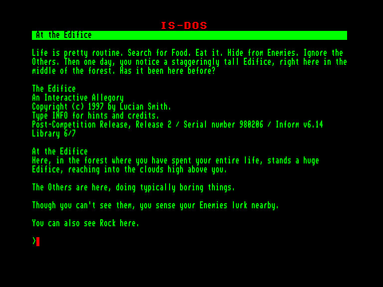
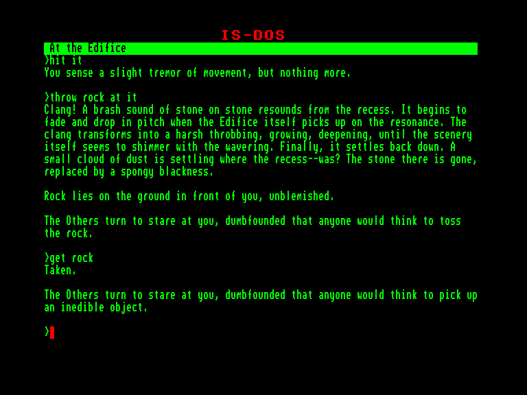
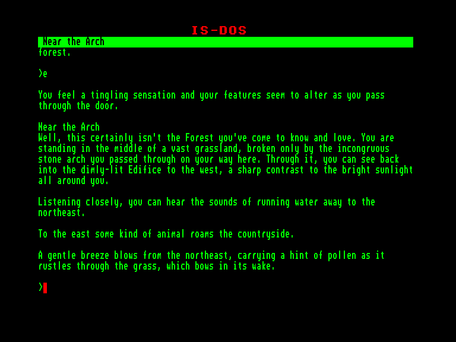
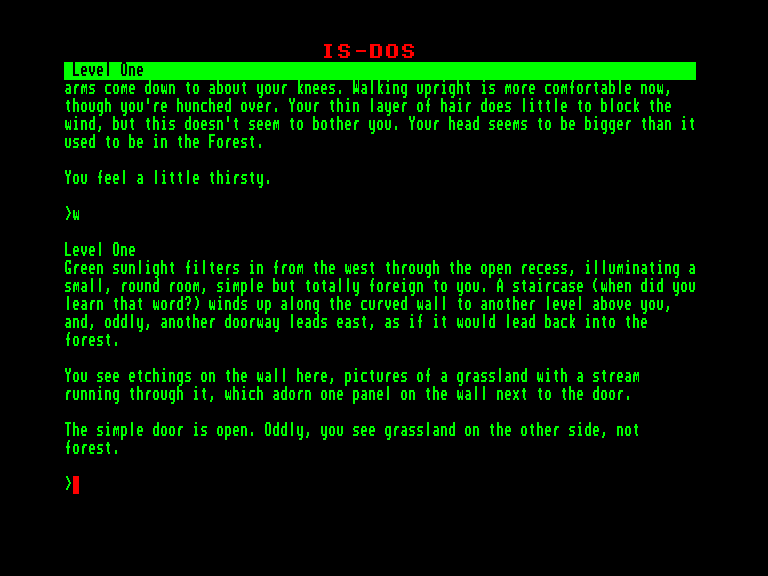

[0-9](../0/games-0.md) - [A](../a/games-a.md) - [B](../b/games-b.md) - [C](../c/games-c.md) - [D](../d/games-d.md) - [E](../e/games-e.md) - [F](../f/games-f.md) - [G](../g/games-g.md) - [H](../h/games-h.md) - [I](../i/games-i.md) - [J](../j/games-j.md) - [K](../k/games-k.md) - [L](../l/games-l.md) - [M](../m/games-m.md) - [N](../n/games-n.md) - [O](../o/games-o.md) - [P](../p/games-p.md) - [Q](../q/games-q.md) - [R](../r/games-r.md) - [S](../s/games-s.md) - [T](../t/games-t.md) - [U](../u/games-u.md) - [V](../v/games-v.md) - [W](../w/games-w.md) - [X](../x/games-x.md) - [Y](../y/games-y.md) - [Z](../z/games-z.md)

Ігри для [Enterprise 64k](../games-ep64.md) - [Enterprise 128k+RAMexp](../games-epramexp.md)

Ігри для систем [IS-DOS](../games-is-dos.md) - [SymbOS](../games-symbos.md) - [EDC Windows](../games-edcw.md)

Ігри для емуляторів [ZX Spectrum 48k/128k](../zxemu/games-zxemu.md) - [Amstrad CPC](../cpcemu/games-cpc.md) - [Sinclair ZX81](../zx81emu/games-zx81.md) - [Videoton TVC](../tvcemu/games-tvc.md) - [Commodore VIC-20](../vic20emu/games-vic20.md)

----------

# The Edifice

**ID:** edifice-zcode

**Жанри:** Текстова пригода

## Скріншоти

## Опис

Ваші довгі руки та ноги дозволяють вам легко лазити та гойдатися на деревах. Ваше хутро допомагає вам легше переносити холодні ночі. Інші, здається, вважають, що ваші протилежні великі пальці роблять вас смішним, тому ви проводите так багато часу на самоті.

Життя досить рутинне. Ви шукаєте їжу, їсте її, ховаєтеся від ворогів та ігноруєте інших. Потім, одного разу, ви помічаєте високу будівлю прямо тут, посеред лісу. Що це? Чому вона тут? Звідки вона взялася? Чи є в ній їжа?

## Основна інформація
- **Мови:** Англійська
### Системні вимоги
- **Апаратні:** EXDOS
- **Програмні:** IS-DOS
### Геймплей
- **Керування:** Keyboard
- **Кількість гравців:** 1 player
- **Додаткові теги:** Z-code
### Розробка
- **Рік випуску:** 1997
- **Автор:** Lucian Paul Smith

## Посилання
- [Інформація про гру (SolutionArchive.com)](https://solutionarchive.com/game/id%2C4039/Edifice%2C+The.html)

**Дата генерації:** 29.07.2026

