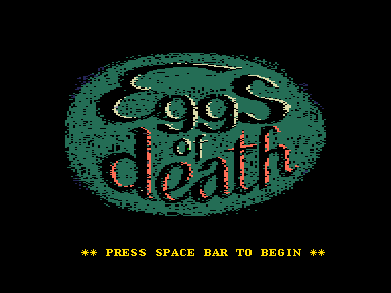
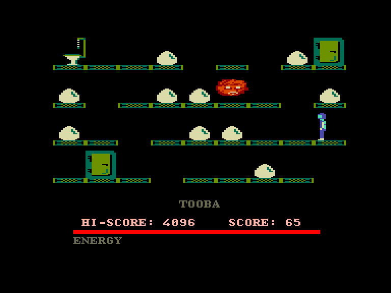
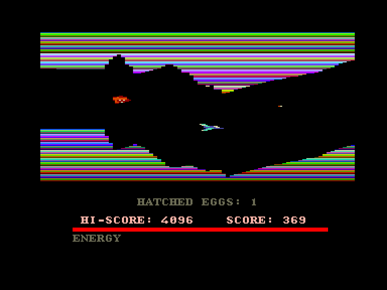
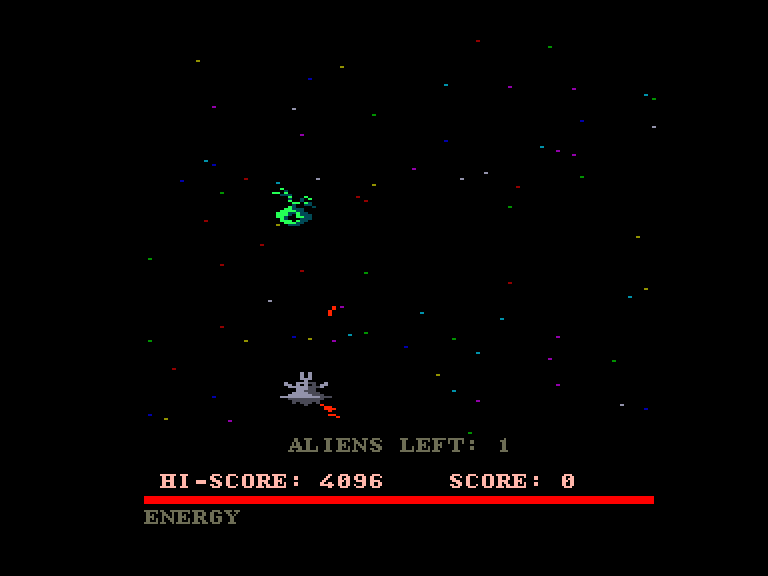

[0-9](../0/games-0.md) - [A](../a/games-a.md) - [B](../b/games-b.md) - [C](../c/games-c.md) - [D](../d/games-d.md) - [E](../e/games-e.md) - [F](../f/games-f.md) - [G](../g/games-g.md) - [H](../h/games-h.md) - [I](../i/games-i.md) - [J](../j/games-j.md) - [K](../k/games-k.md) - [L](../l/games-l.md) - [M](../m/games-m.md) - [N](../n/games-n.md) - [O](../o/games-o.md) - [P](../p/games-p.md) - [Q](../q/games-q.md) - [R](../r/games-r.md) - [S](../s/games-s.md) - [T](../t/games-t.md) - [U](../u/games-u.md) - [V](../v/games-v.md) - [W](../w/games-w.md) - [X](../x/games-x.md) - [Y](../y/games-y.md) - [Z](../z/games-z.md)

Ігри для [Enterprise 64k](../games-ep64.md) - [Enterprise 128k+RAMexp](../games-epramexp.md) - [2dfx](../games-2dfx.md)

Ігри для систем [IS-DOS](../games-is-dos.md) - [SymbOS](../games-symbos.md) - [EDC Windows](../games-edcw.md)

Ігри для емуляторів [ZX Spectrum 48k/128k](../zxemu/games-zxemu.md) - [Amstrad CPC](../cpcemu/games-cpc.md) - [Sinclair ZX81](../zx81emu/games-zx81.md) - [Videoton TVC](../tvcemu/games-tvc.md) - [Commodore VIC-20](../vic20emu/games-vic20.md)

----------

# Eggs of Death

**ID:** eggs-of-death

## Скріншоти

## Опис

(temporary description generated by AI [your name])

# Яйця Смерті (Eggs of Death)

**Опис гри:**
"Яйця Смерті" — це кумедна космічна гра, яка була випущена компанією Enterprise. Гра є продовженням гри "Stareggs", розробленої Andromeda Software для C64 у 1984 році, але має значно більш детальну графіку та ігровий процес. У грі вам потрібно пройти через "Лабіринт Смерті", розбити яйця та знищити чудовиськ, які можуть вилупитися з них, поки ви намагаєтеся вибратися.

**Правила гри:**

1. **Старт гри:** Гра починається після натискання клавіші SPACE. Управління здійснюється за допомогою вбудованого джойстика.

2. **Рівні гри:** Гра складається з трьох частин, кожна з яких має свої завдання:
   - **Перша частина:** Ваш космічний корабель наближається до печери. Вам потрібно знищити ворогів, які атакують вас. Вороги з'являються на короткий час і рухаються за певними шаблонами. Кількість ворогів зростає з кожним восьмим рівнем.
   - **Друга частина:** Вам потрібно розбити яйця, які починають рухатися. Ваш персонаж може переміщатися вліво-вправо та падати, але будьте обережні, щоб не впасти з платформи, інакше ви втратите всі бали. Яйця розбиваються автоматично, якщо ви до них підійдете.
   - **Третя частина:** Вам потрібно знищити вилуплених чудовиськ, які спочатку будуть полювати на вас. Вам потрібно обійти їх і вистрілити, перш ніж вони встигнуть втекти.

3. **Енергія:** У вас є обмежена кількість енергії, яка зменшується при контакті з ворогами. Ви можете відновити енергію, проходячи повз зелені сейфи.

4. **Телепорти:** Використовуйте червоні телепорти для швидкого переміщення між частинами рівня.

5. **Зупинка гри:** Гру можна зупинити, підійшовши до туалету і натиснувши SPACE, що дозволить вам відновити частину втраченої енергії.

6. **Кінцева мета:** Ваша мета — розбити всі яйця, знищити всіх ворогів і вийти з лабіринту. Гра має 32 різних кімнати, які повторюються, що забезпечує тривалу розвагу.

"Яйця Смерті" — це виклик для найсміливіших гравців, які готові пройти всі рівні і вийти переможцями!

## Основна інформація
### Загальні системні вимоги
- **Апаратні:** EP64, EP128

## Посилання
- [Опис на ep128.hu (угорською)](http://www.ep128.hu/Ep_Games/Leiras/Eggs_of_Death.htm)
- [Завантажити](http://www.ep128.hu/Ep_Games/Prg/Eggs_of_Death.rar)

## Відео

<iframe src="https://www.youtube.com/embed/N9C0ao_f1_g"  
style="width:75%; aspect-ratio:16/9;" allowfullscreen></iframe>

