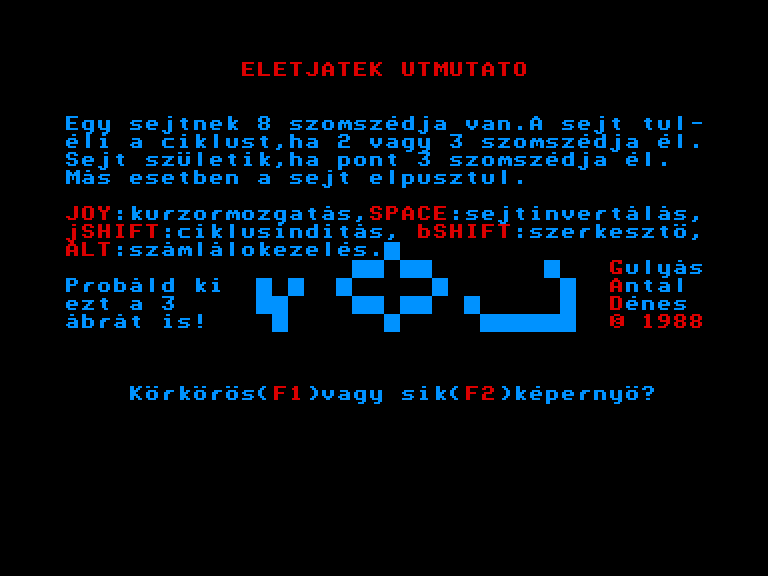
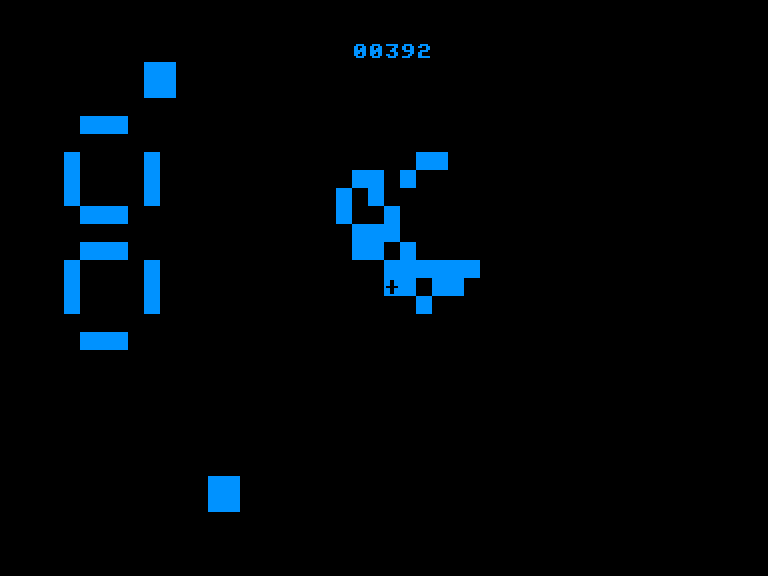
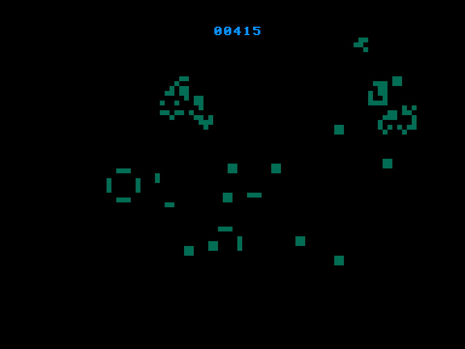
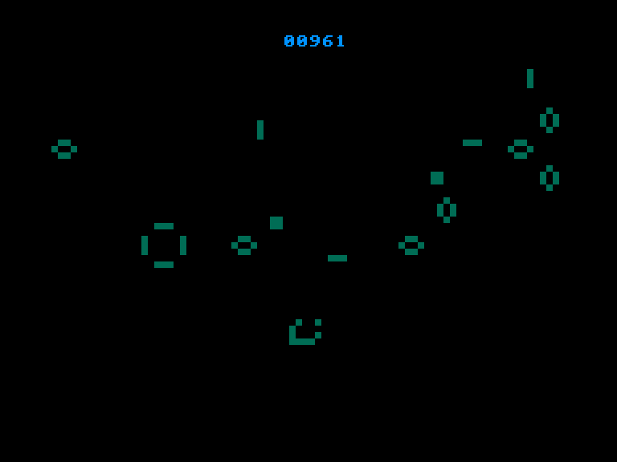

[0-9](../0/games-0.md) - [A](../a/games-a.md) - [B](../b/games-b.md) - [C](../c/games-c.md) - [D](../d/games-d.md) - [E](../e/games-e.md) - [F](../f/games-f.md) - [G](../g/games-g.md) - [H](../h/games-h.md) - [I](../i/games-i.md) - [J](../j/games-j.md) - [K](../k/games-k.md) - [L](../l/games-l.md) - [M](../m/games-m.md) - [N](../n/games-n.md) - [O](../o/games-o.md) - [P](../p/games-p.md) - [Q](../q/games-q.md) - [R](../r/games-r.md) - [S](../s/games-s.md) - [T](../t/games-t.md) - [U](../u/games-u.md) - [V](../v/games-v.md) - [W](../w/games-w.md) - [X](../x/games-x.md) - [Y](../y/games-y.md) - [Z](../z/games-z.md)

Ігри для [Enterprise 64k](../games-ep64.md) - [Enterprise 128k+RAMexp](../games-epramexp.md) - [2dfx](../games-2dfx.md)

Ігри для систем [IS-DOS](../games-is-dos.md) - [SymbOS](../games-symbos.md) - [EDC Windows](../games-edcw.md)

Ігри для емуляторів [ZX Spectrum 48k/128k](../zxemu/games-zxemu.md) - [Amstrad CPC](../cpcemu/games-cpc.md) - [Sinclair ZX81](../zx81emu/games-zx81.md) - [Videoton TVC](../tvcemu/games-tvc.md) - [Commodore VIC-20](../vic20emu/games-vic20.md)

----------

# Életjáték

**ID:** eletjatek

## Скріншоти

## Опис

(temporary description generated by AI [Assistant])

**Опис гри "Гра життя"**

"Гра життя" (англ. The Game of Life) була розроблена математиком Джоном Конвеєм з Кембриджського університету. Назва "гра" може бути дещо оманливою, оскільки роль "гравця" полягає лише в тому, щоб задати початкову конфігурацію, а потім спостерігати за результатом. Результати кожного кроку гри обчислює комп'ютер. З математичної точки зору, гра належить до категорії клітинних автоматів. У роки після її відкриття "гра" стала популярним захопленням у США, і виявилось, що вона має серйозні математичні та філософські аспекти.

**Правила гри:**

1. Поля квадратної сітки називаються клітинами, а диски – клітинками.
2. Оточення клітини складається з восьми найближчих полів (включаючи діагональні сусіди).
3. Сусідами клітини є клітинки, які знаходяться в її оточенні.
4. Гра розділена на раунди. На початку гри гравець може розмістити клітинки в будь-якій кількості (одну або більше) в клітинах.
5. Після цього гравець не має впливу на хід гри. У кожному раунді з однією клітинкою можуть відбуватися такі три події:
   - Клітинка виживає, якщо має двох або трьох сусідів.
   - Клітинка гине, якщо має менше двох (ізоляція) або більше трьох (перенаселення) сусідів.
   - Нова клітинка з'являється в кожній клітині, де є точно три сусіди.

Важливо, що зміни відбуваються лише в кінці раунду. Програма не має меню, на екрані з заголовком спочатку потрібно налаштувати чотири параметри:

1. Гра може проходити на круговому або плоскому екрані. Це визначає, що відбувається з клітинками на краю екрану.
2. Час очікування між раундами (0-9). Більше значення призводить до повільнішої анімації. (Бажане значення можна налаштувати за допомогою вбудованого джойстика, нахиляючи його вправо-вліво, а для переходу до наступного етапу потрібно натиснути вгору.)
3. Розмір екрана: 40x25 або 80x50.

Після цього ви потрапляєте в режим редагування, де спочатку бачите лише один курсор на екрані. Курсор можна переміщати за допомогою джойстика, а натискаючи SPACE, ви можете розмістити або забрати клітинку з заданої позиції. Інші клавіші:

- Натискаючи правий SHIFT, ви можете запустити анімацію.
- Натискаючи лівий SHIFT, ви можете зупинити анімацію і повернутися в режим редагування.
- Натискаючи ALT, ви можете увімкнути або вимкнути лічильник, який відстежує фази.
- Натискаючи RESET, ви повертаєтеся на початковий екран. З цього моменту RESET дійсно служить для виходу з гри.

**Гра "Гра життя" є унікальним поєднанням математики та філософії, що дозволяє досліджувати концепції життя та смерті в абстрактному світі клітин.**

## Посилання
- [Опис на ep128.hu (угорською)](http://www.ep128.hu/Ep_Games/Leiras/Eletjatek.htm)
- [Завантажити](http://www.ep128.hu/Ep_Games/Prg/Eletjatek.rar)

