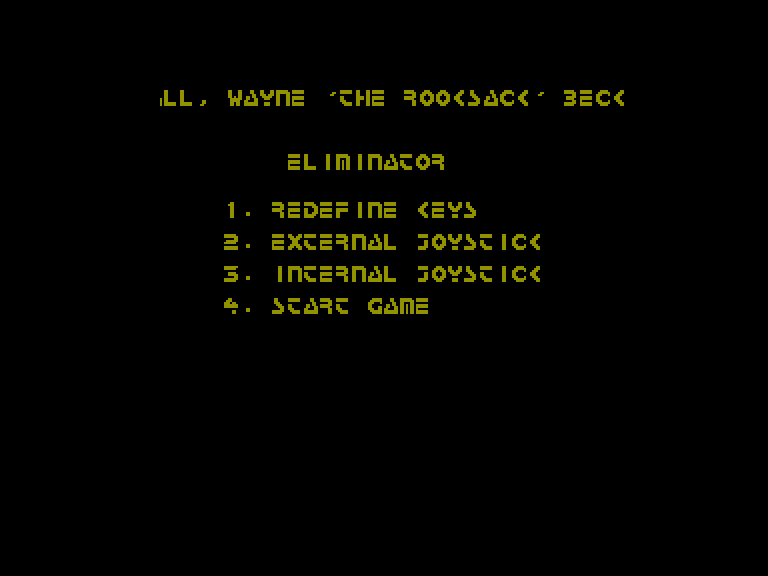
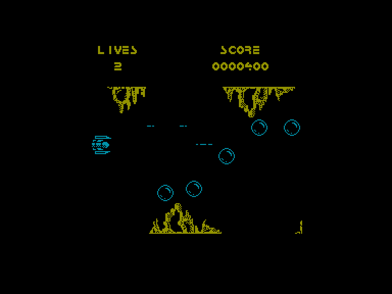
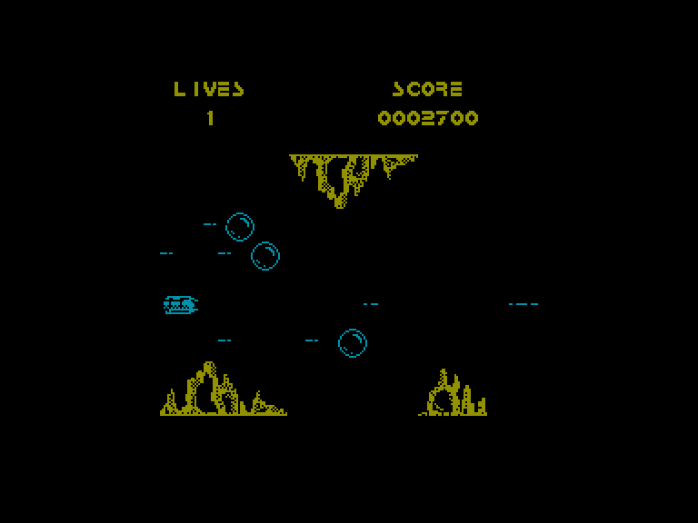
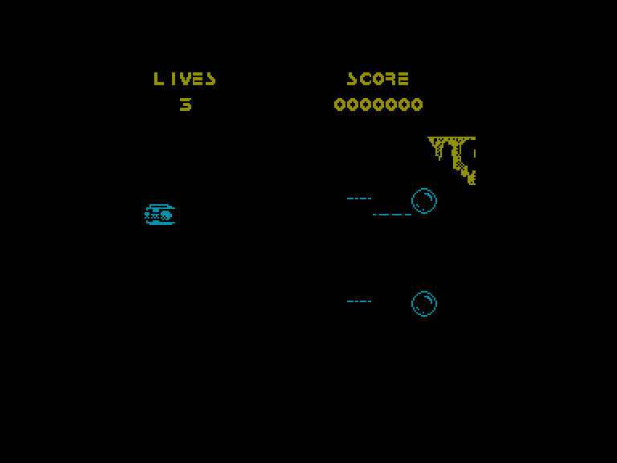

[0-9](../0/games-0.md) - [A](../a/games-a.md) - [B](../b/games-b.md) - [C](../c/games-c.md) - [D](../d/games-d.md) - [E](../e/games-e.md) - [F](../f/games-f.md) - [G](../g/games-g.md) - [H](../h/games-h.md) - [I](../i/games-i.md) - [J](../j/games-j.md) - [K](../k/games-k.md) - [L](../l/games-l.md) - [M](../m/games-m.md) - [N](../n/games-n.md) - [O](../o/games-o.md) - [P](../p/games-p.md) - [Q](../q/games-q.md) - [R](../r/games-r.md) - [S](../s/games-s.md) - [T](../t/games-t.md) - [U](../u/games-u.md) - [V](../v/games-v.md) - [W](../w/games-w.md) - [X](../x/games-x.md) - [Y](../y/games-y.md) - [Z](../z/games-z.md)

Ігри для [Enterprise 64k](../games-ep64.md) - [Enterprise 128k+RAMexp](../games-epramexp.md)

Ігри для систем [IS-DOS](../games-is-dos.md) - [SymbOS](../games-symbos.md) - [EDC Windows](../games-edcw.md)

Ігри для емуляторів [ZX Spectrum 48k/128k](../zxemu/games-zxemu.md) - [Amstrad CPC](../cpcemu/games-cpc.md) - [Sinclair ZX81](../zx81emu/games-zx81.md) - [Videoton TVC](../tvcemu/games-tvc.md) - [Commodore VIC-20](../vic20emu/games-vic20.md)

----------

# Eliminator

**ID:** eliminator-zx

## Скріншоти

## Опис

(temporary description generated by AI [Assistant])

### Опис гри "Eliminator"

"Eliminator" — це аркадна гра в жанрі shoot 'em up, випущена в 1988 році компанією Alternative Software для платформи Spectrum (48k). Гравець бере на себе роль пілота космічного корабля, який повинен захистити світ від вторгнення злих інопланетян. Гра має простий і неоригінальний сюжет, що зводиться до звичної теми "врятуй світ від злого ворога".

### Правила гри

1. **Управління**: Гравець може керувати космічним кораблем за допомогою джойстика Kemspton або клавіатури. Клавіші управління можна налаштувати на свій розсуд.

2. **Мета гри**: Основна мета гри полягає в знищенні ворогів, які атакують ваш корабель. Вороги з'являються у різних формаціях, але їхнє зовнішнє вигляд та поведінка не змінюються.

3. **Вороги**: Гра не пропонує різноманітності ворогів — вони завжди атакують однаковими способами. З часом гра може повідомити, що ви стикаєтеся з новим типом ворога, але їхня механіка залишається незмінною.

4. **Життя**: Гравець має три життя, які можуть швидко закінчитися, оскільки гра не пропонує особливих бонусів або підсилень для збільшення тривалості гри.

5. **Перемога**: Після тривалої стрільби гра може оголосити "YOU WIN", і ви повернетеся до головного меню. Однак гра не має жодної мотивації для тривалої гри, і немає рівнів складності.

6. **Звукові ефекти**: Розробники не включили звукові ефекти, що робить гру ще менш привабливою.

7. **Чити**: 
   - Для безсмертя: POKE 35179,17
   - Для вічного життя: POKE 35962,183

### Загальні зауваження

Гра "Eliminator" відзначається простотою та відсутністю різноманітності, що робить її менш цікавою для тривалої гри. Вона може бути цікавою лише для любителів ретро-ігор або тих, хто хоче згадати старі часи аркадних автоматів.

## Основна інформація
- **Оригінальна платформа:** ZX Spectrum

## Посилання
- [Опис гри на ep128.hu (угорською)](http://www.ep128.hu/Games/Eliminator.htm)
- [Інформація про оригінальну версію](https://spectrumcomputing.co.uk/entry/1599/ZX-Spectrum/Eliminator)
- [Завантажити гру](http://www.ep128.hu/Ep_Games/Prg/Eliminator.rar)

