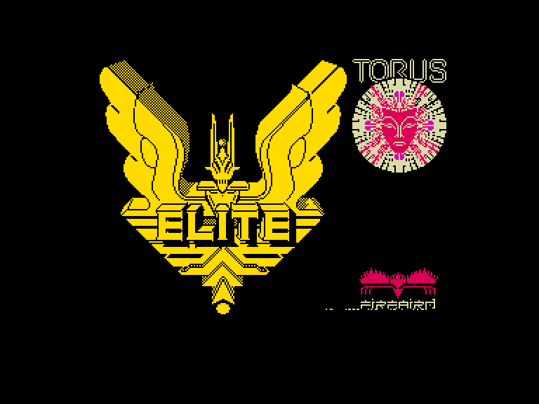
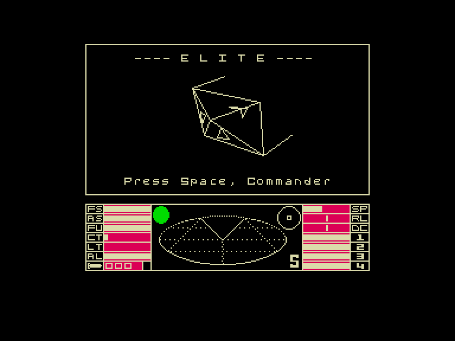
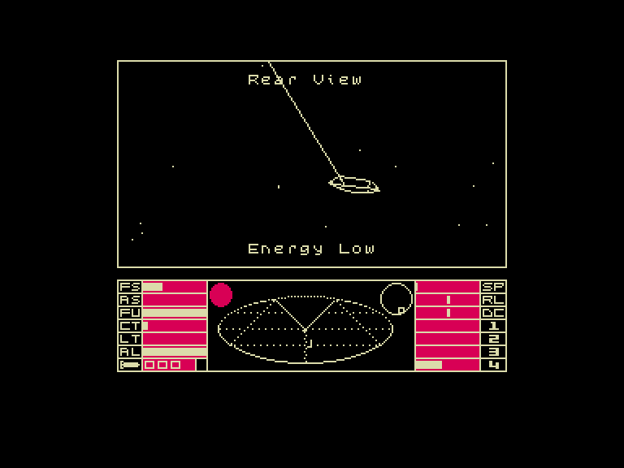
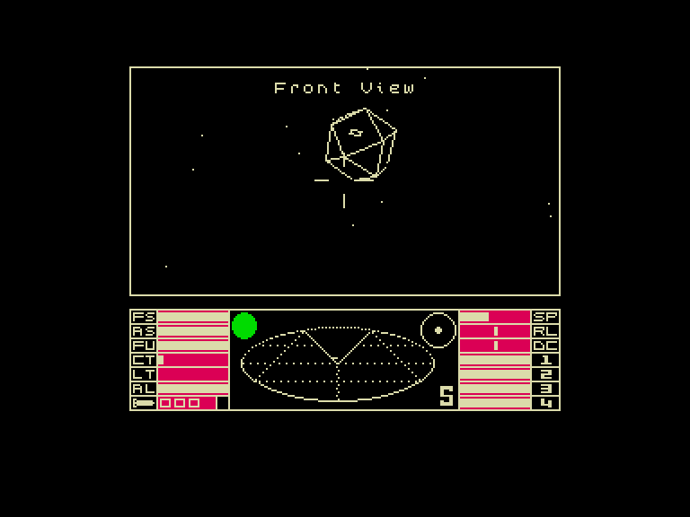

[0-9](../0/games-0.md) - [A](../a/games-a.md) - [B](../b/games-b.md) - [C](../c/games-c.md) - [D](../d/games-d.md) - [E](../e/games-e.md) - [F](../f/games-f.md) - [G](../g/games-g.md) - [H](../h/games-h.md) - [I](../i/games-i.md) - [J](../j/games-j.md) - [K](../k/games-k.md) - [L](../l/games-l.md) - [M](../m/games-m.md) - [N](../n/games-n.md) - [O](../o/games-o.md) - [P](../p/games-p.md) - [Q](../q/games-q.md) - [R](../r/games-r.md) - [S](../s/games-s.md) - [T](../t/games-t.md) - [U](../u/games-u.md) - [V](../v/games-v.md) - [W](../w/games-w.md) - [X](../x/games-x.md) - [Y](../y/games-y.md) - [Z](../z/games-z.md)

Ігри для [Enterprise 64k](../games-ep64.md) - [Enterprise 128k+RAMexp](../games-epramexp.md)

Ігри для систем [IS-DOS](../games-is-dos.md) - [SymbOS](../games-symbos.md) - [EDC Windows](../games-edcw.md)

Ігри для емуляторів [ZX Spectrum 48k/128k](../zxemu/games-zxemu.md) - [Amstrad CPC](../cpcemu/games-cpc.md) - [Sinclair ZX81](../zx81emu/games-zx81.md) - [Videoton TVC](../tvcemu/games-tvc.md) - [Commodore VIC-20](../vic20emu/games-vic20.md)

----------

# Elite

**ID:** elite-zx

## Скріншоти

## Опис

(temporary description generated by AI [Assistant])

**Опис гри: Elite**

Гра "Elite" - це класичний космічний симулятор, що поєднує елементи торгівлі, бою та дослідження у величезному відкритому всесвіті. Гравець виступає в ролі капітана космічного корабля, який подорожує між різними планетами, торгує товарами, виконує місії та бореться з ворогами, такими як пірати та інопланетяни.

**Основні правила гри:**

1. **Створення персонажа:**
   - Гравець починає гру з вибору капітана та завантаження його даних.
   - Можна зберігати та завантажувати прогрес у грі.

2. **Космічні подорожі:**
   - Гравець може подорожувати між різними системами, використовуючи гіперпросторові стрибки.
   - Для стрибків необхідно мати достатню кількість пального.

3. **Торгівля:**
   - Гравець може купувати та продавати товари на різних планетах, враховуючи попит і пропозицію.
   - В деяких системах заборонено торгувати певними товарами (наприклад, наркотиками або зброєю), що може призвести до юридичних проблем.

4. **Бої:**
   - Гравець може вступати в бій з піратами, інопланетянами та іншими ворогами.
   - Для боїв доступні різні види зброї, такі як лазери та ракети.
   - Гравець повинен управляти енергією свого корабля, щоб підтримувати щити та зброю.

5. **Місії:**
   - Гравець отримує місії від Галактичної Федерації, які можуть включати рятування людей, знищення ворогів або отримання особливих предметів.
   - Виконання місій підвищує рейтинг гравця.

6. **Рейтинг:**
   - Гравець отримує рейтинг на основі своїх дій, таких як кількість знищених ворогів та успішно виконаних місій.
   - Рейтинг впливає на репутацію гравця у всесвіті та можливість отримувати нові місії.

7. **Управління кораблем:**
   - Гравець управляє своїм кораблем з пульта, де відображаються всі необхідні дані (пальне, енергія, стан щитів тощо).
   - Гравець може модернізувати свій корабель, купуючи нові модулі та зброю.

8. **Безпечні зони:**
   - Коріолісні космічні станції є безпечними зонами, де гравець може відновити ресурси, торгувати та отримувати нові місії.
   - Гравець повинен дотримуватись правил, щоб уникнути конфліктів з поліцією.

9. **Поради:**
   - Рекомендується зберігати прогрес після успішних місій.
   - Важливо управляти ресурсами, щоб уникнути небезпечних ситуацій у бою.

Ця гра пропонує безмежні можливості для дослідження та пригод у величезному космічному всесвіті, де кожен вибір може вплинути на подальший розвиток подій.

## Основна інформація
- **Оригінальна платформа:** ZX Spectrum

## Посилання
- [Опис гри на ep128.hu (угорською)](http://www.ep128.hu/Games/Elite.htm)
- [Інформація про оригінальну версію](https://spectrumcomputing.co.uk/entry/1601/ZX-Spectrum/Elite)
- [Завантажити гру](http://www.ep128.hu/Ep_Games/Prg/Elite.rar)
- [Easy Load&Play](https://t.me/EP128k_Load_n_Play/426) *(Telegram-канал Vibrant Waves)*

**Дата генерації:** 28.07.2026

