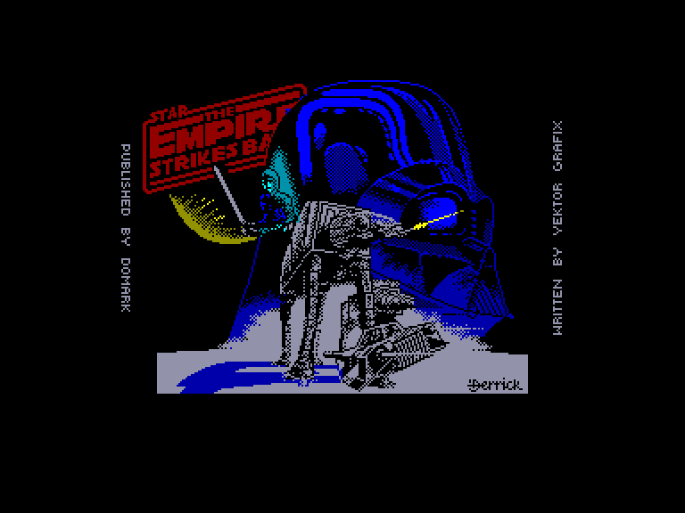
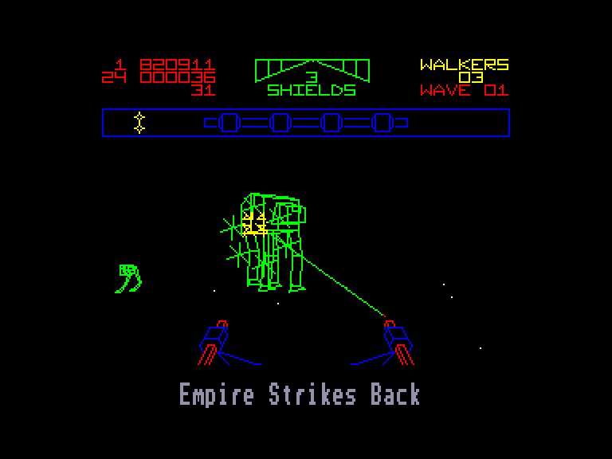
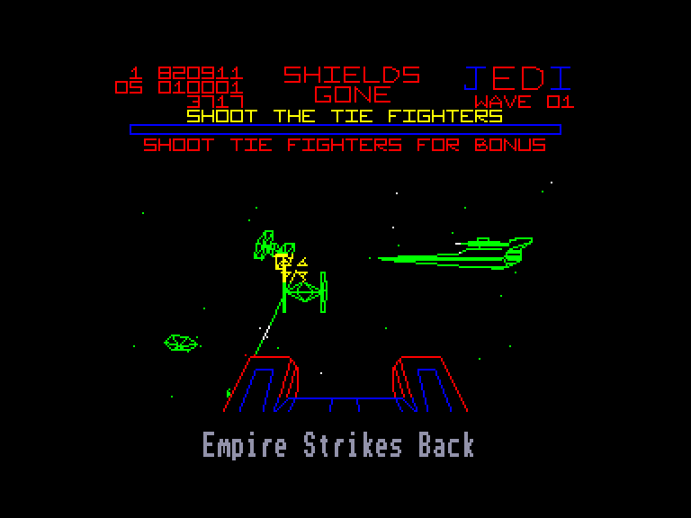
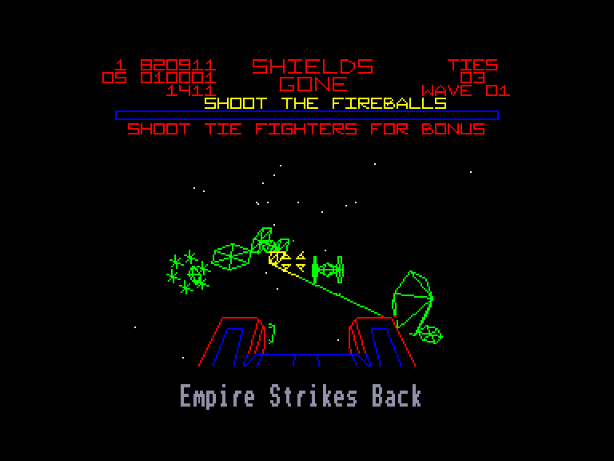

[0-9](../0/games-0.md) - [A](../a/games-a.md) - [B](../b/games-b.md) - [C](../c/games-c.md) - [D](../d/games-d.md) - [E](../e/games-e.md) - [F](../f/games-f.md) - [G](../g/games-g.md) - [H](../h/games-h.md) - [I](../i/games-i.md) - [J](../j/games-j.md) - [K](../k/games-k.md) - [L](../l/games-l.md) - [M](../m/games-m.md) - [N](../n/games-n.md) - [O](../o/games-o.md) - [P](../p/games-p.md) - [Q](../q/games-q.md) - [R](../r/games-r.md) - [S](../s/games-s.md) - [T](../t/games-t.md) - [U](../u/games-u.md) - [V](../v/games-v.md) - [W](../w/games-w.md) - [X](../x/games-x.md) - [Y](../y/games-y.md) - [Z](../z/games-z.md)

Ігри для [Enterprise 64k](../games-ep64.md) - [Enterprise 128k+RAMexp](../games-epramexp.md)

Ігри для систем [IS-DOS](../games-is-dos.md) - [SymbOS](../games-symbos.md) - [EDC Windows](../games-edcw.md)

Ігри для емуляторів [ZX Spectrum 48k/128k](../zxemu/games-zxemu.md) - [Amstrad CPC](../cpcemu/games-cpc.md) - [Sinclair ZX81](../zx81emu/games-zx81.md) - [Videoton TVC](../tvcemu/games-tvc.md) - [Commodore VIC-20](../vic20emu/games-vic20.md)

----------

# The Empire Strikes Back

**Альтернативні назви:**
 - Star Wars: The Empire Strikes Back

**ID:** empire-strikes-back-zx

## Скріншоти

## Опис

(temporary description generated by AI [your name])

**Опис гри: Star Wars: The Empire Strikes Back**

Після знищення Зірки Смерті, положення повстанців стало досить критичним. Як відомо, імператор не такий поблажливий, як великий Дарта Вейдер, тому він відправляє весь свій флот на розвідку повстанців. Повстанців знаходять на крижаній планеті Хот, і їм знову доводиться втікати. Гра, заснована на фільмі "Імперія завдає удару у відповідь", технічно не містить нічого нового в порівнянні з попередньою частиною гри "Star Wars". Вона використовує той же графічний "движок", який вважається незвичним для Spectrum, а також музику і меню залишилися такими ж. Тому вибір управління не викликатиме труднощів, і не дивно, що на початку гри ми можемо вибрати один з трьох рівнів складності. Кожен рівень складності складається з чотирьох частин. Ми станемо свідками найзахопливіших моментів фільму: битви на поверхні планети Хот.

**Правила гри:**
1. **Рівні складності:** На початку гри гравець має можливість вибрати один з трьох рівнів складності. Кожен рівень містить чотири частини.
2. **Перша частина:** Гравець керує сніговим спідером (снігоходом) і повинен знищити імперських дроїдів-розвідників, які стріляють вогняними кулями в бік гравця. На верхній частині екрана відображається енергія щита, а праворуч – індикатор WAVE, що показує рівень складності.
3. **Друга частина:** Гравець бореться проти AT-ST і AT-AT механізмів. Великі чотирилапі AT-AT можуть бути знищені тільки в голову, тоді як менші AT-ST потрібно атакувати в тіло. Якщо гравець не може знищити AT-AT, він може отримати бонусні очки, пролетівши між його ногами, уникаючи вогняних куль.
4. **Третя частина:** Битва відбувається в космосі, де гравець повинен знищити ворожі TIE-літаки. Кількість TIE-літаків, які потрібно знищити для отримання бонусних очок, відображається над індикатором WAVE.
5. **Четверта частина:** Гравець повинен навігувати через астероїдне поле, намагаючись залишитися в живих, уникаючи каменів, що летять у бік. 
6. **Нагорода за успіх:** Якщо гравець успішно завершує частину, він отримує одну букву з слова JEDI. Коли всі чотири букви отримані в кінці рівня складності, гравець отримує бонусні очки.

**Додаткові можливості:**
- Безмежна енергія: POKE 43624,0

Гра пропонує захоплюючий досвід, занурюючи гравця у всесвіт "Зоряних війн", де він може відчути себе героєм епічної битви на Хот.

## Основна інформація
- **Оригінальна платформа:** ZX Spectrum

## Посилання
- [Опис гри на ep128.hu (угорською)](http://www.ep128.hu/Games/StarWars2.htm)
- [Інформація про оригінальну версію](https://spectrumcomputing.co.uk/entry/4846/ZX-Spectrum/The_Empire_Strikes_Back)
- [Завантажити гру](http://www.ep128.hu/Ep_Games/Prg/Empire_Strikes_Back.rar)

