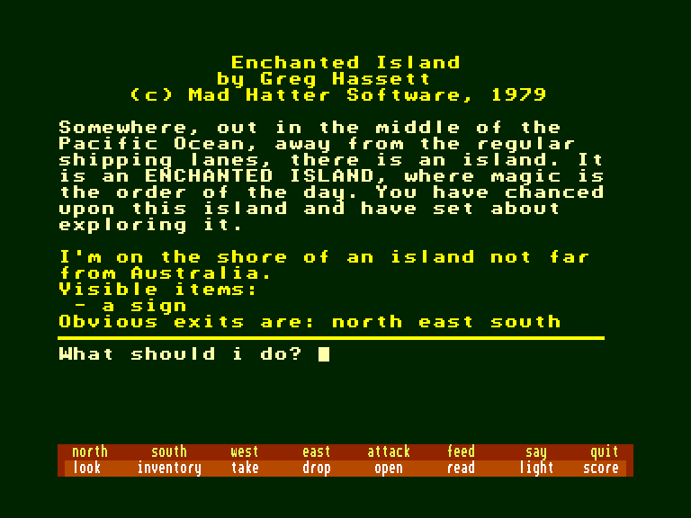
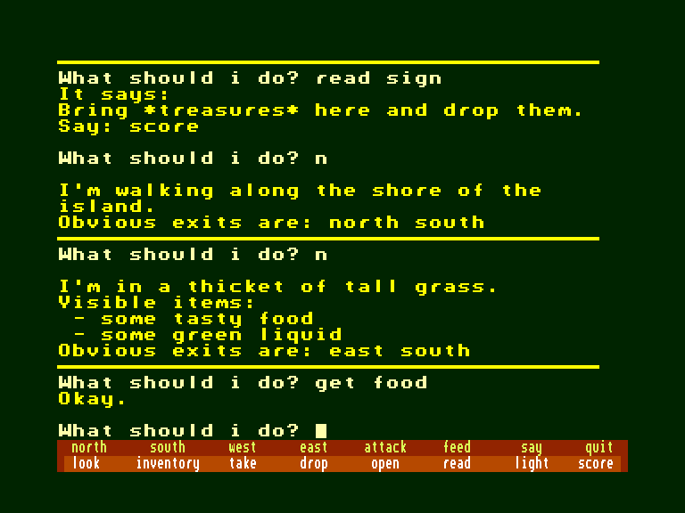
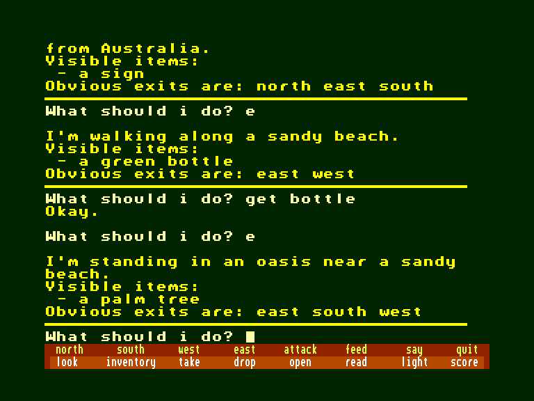

[0-9](../0/games-0.md) - [A](../a/games-a.md) - [B](../b/games-b.md) - [C](../c/games-c.md) - [D](../d/games-d.md) - [E](../e/games-e.md) - [F](../f/games-f.md) - [G](../g/games-g.md) - [H](../h/games-h.md) - [I](../i/games-i.md) - [J](../j/games-j.md) - [K](../k/games-k.md) - [L](../l/games-l.md) - [M](../m/games-m.md) - [N](../n/games-n.md) - [O](../o/games-o.md) - [P](../p/games-p.md) - [Q](../q/games-q.md) - [R](../r/games-r.md) - [S](../s/games-s.md) - [T](../t/games-t.md) - [U](../u/games-u.md) - [V](../v/games-v.md) - [W](../w/games-w.md) - [X](../x/games-x.md) - [Y](../y/games-y.md) - [Z](../z/games-z.md)

Ігри для [Enterprise 64k](../games-ep64.md) - [Enterprise 128k+RAMexp](../games-epramexp.md)

Ігри для систем [IS-DOS](../games-is-dos.md) - [SymbOS](../games-symbos.md) - [EDC Windows](../games-edcw.md)

Ігри для емуляторів [ZX Spectrum 48k/128k](../zxemu/games-zxemu.md) - [Amstrad CPC](../cpcemu/games-cpc.md) - [Sinclair ZX81](../zx81emu/games-zx81.md) - [Videoton TVC](../tvcemu/games-tvc.md) - [Commodore VIC-20](../vic20emu/games-vic20.md)

----------

# Enchanted Island

**ID:** enchanted-island-bas

**Жанри:** Текстова пригода

## Скріншоти

## Опис

(temporary description generated by AI [Assistant])

## Опис гри: Зачарований острів

### Загальна інформація
- **Назва гри:** Зачарований острів (Enchanted Island)
- **Розробник:** Mad Hatter Software
- **Рік випуску:** 1979
- **Альтернативна назва:** Зачарований острів (Enchanted Isle)
- **Мова:** Англійська
- **Автор:** Greg Hassett
- **Системи:** BASIC
- **Платформи:** C64/128, TRS-80
- **Жанр:** Полювання за скарбами

### Синопсис
Десь у середині Тихого океану, подалі від звичних морських шляхів, розташований острів. Це ЗАЧАРОВАНИЙ ОСТРІВ, де магія є звичною справою. Ви випадково натрапили на цей острів і почали його досліджувати.

Пригоди супроводжують кожен ваш крок. Ви знаходите неймовірні скарби, шукаючи на острові. Але ви виявляєте, що повинні використовувати всю свою силу та хитрість, щоб вижити. На кожному кроці вас чекають небезпечні звірі та дивні істоти.

### Примітки
Оригінальна версія гри була написана на BASIC. У 1982 році Грег переписав її в машинний код під назвою Enchanted Island Plus. У 2017 році гра була портована на TRS-80 MC-10 Джимом Геррі.

### Ресурси
- **Рішення (C64/128):** від Alex
- **Карта:** від Simon
- **Додаткова інформація:**
  - Пошук на Gamebase64
  - Пошук в Музеї комп'ютерних пригод

### Користувачі
- Користувачі, які вирішили цю гру: Simon
- Користувачі, які зараз грають у цю гру: —

### Користувачі, яким сподобалася ця гра, також насолоджувалися:
- Staff "Slake", The
- Circus
- Pirate Adventure
- Derelict 2147
- Treasure Island

### Рейтинг
- Середній рейтинг користувачів: 6 (1 рейтинг)
- Ваш рейтинг: —

### Коментарі користувачів
- [Форма для нових коментарів]

### Авторські права
(C) CASA 1999 - 2025

## Основна інформація
- **Мови:** Англійська
- **Оригінальна платформа:** Commodore
### Системні вимоги
- **Програмні:** IS-Basic
### Геймплей
- **Керування:** Keyboard
- **Кількість гравців:** 1 player
- **Додаткові теги:** Text40 mode
### Розробка
- **Рік випуску:** 1979
- **Автор:** Greg Hassett

## Посилання
- [Опис гри на ep128.hu (угорською)](http://www.ep128.hu/Ep_Games/Leiras/Basic_Program_Pack.htm)
- [Інформація про гру (SolutionArchive.com)](https://solutionarchive.com/game/id%2C1997/Enchanted+Island.html)
- [Завантажити гру](http://www.ep128.hu/Ep_Games/Prg/Basic_Program_Pack.rar)

**Дата генерації:** 29.07.2026

