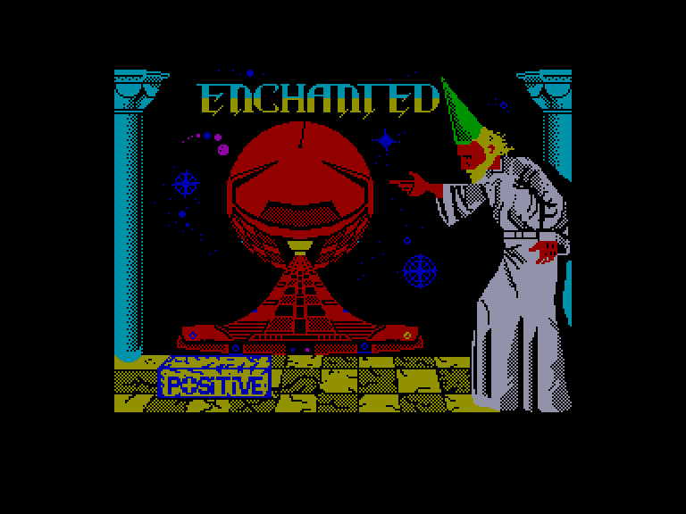
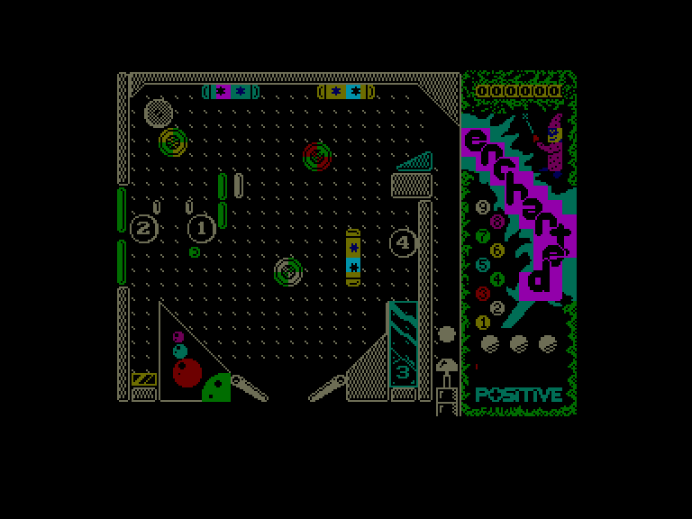
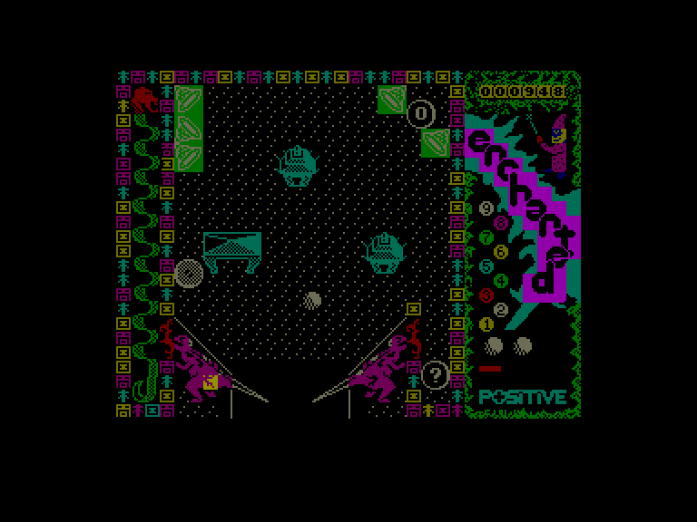

[0-9](../0/games-0.md) - [A](../a/games-a.md) - [B](../b/games-b.md) - [C](../c/games-c.md) - [D](../d/games-d.md) - [E](../e/games-e.md) - [F](../f/games-f.md) - [G](../g/games-g.md) - [H](../h/games-h.md) - [I](../i/games-i.md) - [J](../j/games-j.md) - [K](../k/games-k.md) - [L](../l/games-l.md) - [M](../m/games-m.md) - [N](../n/games-n.md) - [O](../o/games-o.md) - [P](../p/games-p.md) - [Q](../q/games-q.md) - [R](../r/games-r.md) - [S](../s/games-s.md) - [T](../t/games-t.md) - [U](../u/games-u.md) - [V](../v/games-v.md) - [W](../w/games-w.md) - [X](../x/games-x.md) - [Y](../y/games-y.md) - [Z](../z/games-z.md)

Ігри для [Enterprise 64k](../games-ep64.md) - [Enterprise 128k+RAMexp](../games-epramexp.md) - [2dfx](games-2dfx.md)

Ігри для систем [IS-DOS](../games-is-dos.md) - [SymbOS](../games-symbos.md) - [EDC Windows](../games-edcw.md)

Ігри для емуляторів [ZX Spectrum 48k/128k](../zxemu/games-zxemu.md) - [Amstrad CPC](../cpcemu/games-cpc.md) - [Sinclair ZX81](../zx81emu/games-zx81.md) - [Videoton TVC](../tvcemu/games-tvc.md) - [Commodore VIC-20](../vic20emu/games-vic20.md)

----------

# Enchanted

**ID:** enchanted-zx

## Скріншоти

## Опис

(temporary description generated by AI [ChatGPT])

**Опис гри: Enchanted**

Enchanted — це унікальна гра, розроблена компанією Positive Soft у 1989 році. Це не звичайний фліппер, а гра, в якій ви можете переміщатися між кількома різними ігровими таблицями за допомогою м'яча. На кожній таблиці ви знайдете численні дірки з питаннями, в які потрібно потрапити м'ячем. Коли ви влучаєте в одну з цих дірок, м'яч переноситься на іншу таблицю, де ви можете продовжити гру. Хоча в грі є кілька таблиць, їх реалізація є досить простою, а елементи фліппера представлені в обмеженій кількості та з простим дизайном.

**Правила гри:**

1. **Управління:**
   - Для управління грою вам знадобляться наступні клавіші:
     - **Q** - лівий фліппер
     - **P** - правий фліппер
     - **W** - удар по столу зліва
     - **O** - удар по столу справа
     - **SPACE** - запуск м'яча
     - **G** - вихід з гри

2. **Обережність з ударами:** 
   - Будьте обережні з ударами по столу, оскільки надмірне використання цієї функції може призвести до блокування програми. На правій стороні екрана, внизу, є червона смуга, яка показує стан столу: після кожного удару чекайте, поки червона смуга "зарядиться".

3. **Життя та очки:**
   - У правій частині екрану ви можете побачити м'ячі, які символізують ваші життя, а вгорі - ваш рахунок.

4. **Налаштування клавіатури:**
   - Ви можете переналаштувати клавіші управління через меню іспанською мовою:
     - **Mando Derecho** - правий фліппер
     - **Mando Izquierdo** - лівий фліппер
     - **Colpear Derecha** - удар по столу справа
     - **Colpear Izquierda** - удар по столу зліва
     - **Lanzar Bola** - запуск м'яча
     - **Interrumpir Juego** - вихід з гри

5. **Безкінечний м'яч:**
   - Для активації безкінечного м'яча введіть команду: **POKE 25859,0**.

Гра Enchanted пропонує новий погляд на класичний фліппер, додаючи елемент подорожі між таблицями, що робить її цікавою та захоплюючою.

## Основна інформація
- **Оригінальна платформа:** ZX Spectrum

## Посилання
- [Опис на ep128.hu (угорською)](http://www.ep128.hu/Games/Enchanted.htm)
- [Інформація про оригінальну версію](https://spectrumcomputing.co.uk/entry/1622/ZX-Spectrum/Enchanted)
- [Завантажити](http://www.ep128.hu/Ep_Games/Prg/Enchanted.rar)

