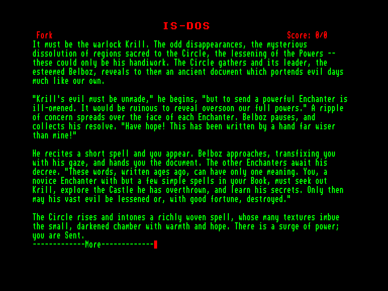
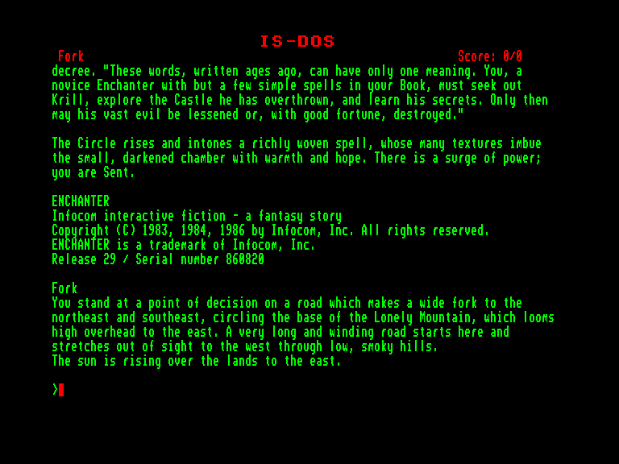
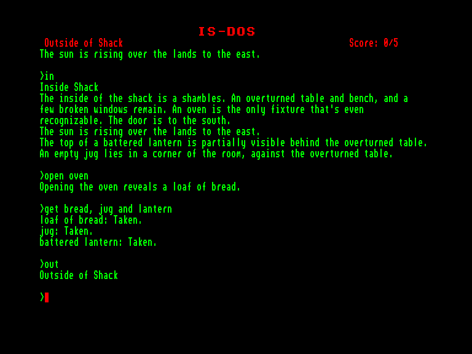
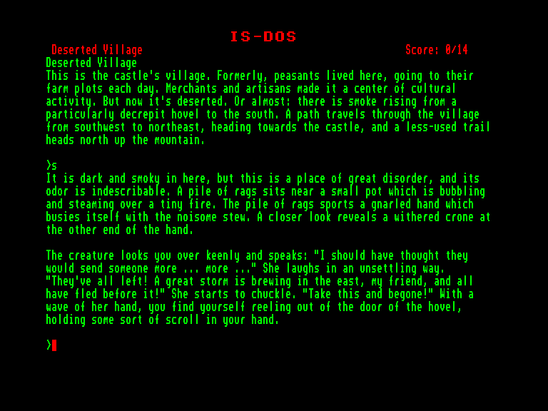

[0-9](../0/games-0.md) - [A](../a/games-a.md) - [B](../b/games-b.md) - [C](../c/games-c.md) - [D](../d/games-d.md) - [E](../e/games-e.md) - [F](../f/games-f.md) - [G](../g/games-g.md) - [H](../h/games-h.md) - [I](../i/games-i.md) - [J](../j/games-j.md) - [K](../k/games-k.md) - [L](../l/games-l.md) - [M](../m/games-m.md) - [N](../n/games-n.md) - [O](../o/games-o.md) - [P](../p/games-p.md) - [Q](../q/games-q.md) - [R](../r/games-r.md) - [S](../s/games-s.md) - [T](../t/games-t.md) - [U](../u/games-u.md) - [V](../v/games-v.md) - [W](../w/games-w.md) - [X](../x/games-x.md) - [Y](../y/games-y.md) - [Z](../z/games-z.md)

Ігри для [Enterprise 64k](../games-ep64.md) - [Enterprise 128k+RAMexp](../games-epramexp.md)

Ігри для систем [IS-DOS](../games-is-dos.md) - [SymbOS](../games-symbos.md) - [EDC Windows](../games-edcw.md)

Ігри для емуляторів [ZX Spectrum 48k/128k](../zxemu/games-zxemu.md) - [Amstrad CPC](../cpcemu/games-cpc.md) - [Sinclair ZX81](../zx81emu/games-zx81.md) - [Videoton TVC](../tvcemu/games-tvc.md) - [Commodore VIC-20](../vic20emu/games-vic20.md)

----------

# Enchanter

**ID:** enchanter-zcode

**Жанри:** Текстова пригода

## Скріншоти

## Опис

(temporary description generated by AI [Assistant])

**Опис гри: Enchanter**

**Жанр:** Магія, Пригоди  
**Автори:** Дейв Леблінг, Марк Бланк  
**Системи:** ZIL  
**Платформи:** Amiga, Amstrad CPC, Amstrad PCW, Apple II, Atari 400/800, Atari ST, C64/128, Einstein, Kaypro-II, Macintosh, Mainframe, Osborne, PC, TI-99/4A, TRS-80, TRS-80 CoCo

**Синопсис:**
У цій першій грі трилогії Enchanter ви починаєте як початківець некромант. Злий чаклун Крилл захопив землю, і Коло Чаклунів зібралося, щоб спробувати зупинити темну силу. Оскільки Крилл, безумовно, помітить і знищить будь-якого досвідченого заклинача, який прийде його перемогти, єдиним рішенням є відправити недосвідченого учня, щоб непомітно підкрастися до нього. Ви викликаєтеся перед Колом і відправляєтеся на свою місію. Якщо вам вдасться, ви отримаєте місце в Колі, але якщо ви зазнаєте невдачі...

**Правила гри:**
1. **Мета гри:** Ваше завдання полягає в тому, щоб перемогти злого чаклуна Крилла, використовуючи свої навички магії та розв'язуючи головоломки.
2. **Грайте як персонаж:** Ви починаєте як початківець некромант, що має обмежені можливості, але зможе навчитися нових заклинань і стратегій під час гри.
3. **Взаємодія з світом:** Використовуйте команди для взаємодії з об'єктами, персонажами та магічними елементами. Наприклад, ви можете використовувати заклинання, щоб вирішити головоломки або отримати доступ до нових областей.
4. **Дослідження:** Досліджуйте світ гри, шукайте предмети та підказки, які допоможуть вам у вашій місії. Будьте уважні до деталей, оскільки вони можуть містити важливу інформацію.
5. **Прогрес:** Гра має систему досягнень, яка дозволяє вам покращувати свої навички та отримувати нові можливості, якщо ви успішно проходите різні етапи гри.
6. **Вибір:** Ваші рішення можуть вплинути на хід гри, тому обирайте мудро, як діяти в різних ситуаціях.

**Примітки:**
- Гра спочатку планувалася як продовження Zork III, але стала початком власної трилогії, хоча події відбуваються у всесвіті Zork.
- Також доступна японською мовою.

**Ресурси:**
- Рішення від Gunness
- Підказки SLAG від Gunness
- Карти від impomatic та Exemptus

**Користувачі, які вирішили цю гру:**
- Alastair, Denk, df, drhg, dswxyz, dukdukgoos, Exemptus, FredrikR, Gunness, impomatic, m1337sxm-casa, nimusi, pippa, Richard Bos, shornet, Simon

**Користувачі, які зараз грають у цю гру:** — 

**Користувачі, яким це також сподобалося:**
- Deadline
- Count, The
- Mystery Fun House
- Colossal Cave Adventure
- Zork II: The Wizard of Frobozz

**Рейтинг:** Середній рейтинг користувачів: 7.3 (9 оцінок)

**Коментарі користувачів:**
- "Найслабша гра магічної трилогії Infocom, але все ж непогана." - Richard Bos
- "Це гарне введення в цей всесвіт." - Gunness

(C) CASA 1999 - 2025

## Основна інформація
- **Мови:** Англійська
### Загальні системні вимоги
- **Апаратні:** EXDOS
- **Програмні:** IS-DOS
### Геймплей
- **Керування:** Keyboard
- **Кількість гравців:** 1 player
- **Додаткові теги:** Z-code
### Розробка
- **Рік випуску:** 1983
- **Автор:** Dave Lebling, Marc Blank

## Посилання
- [Інформація про гру (SolutionArchive.com)](https://solutionarchive.com/game/id%2C177/Enchanter.html)
- [Завантажити гру](http://www.ep128.hu/Ep_Games/Prg/Enchanter.rar)

