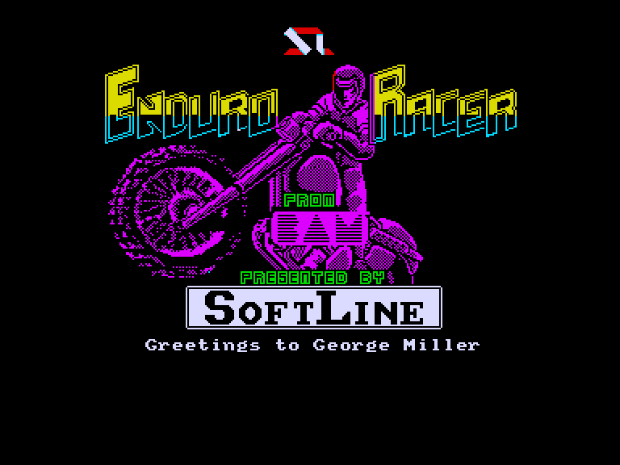
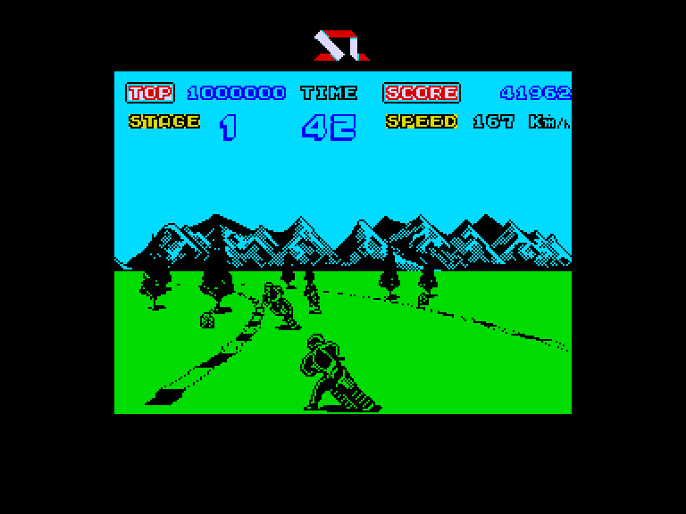
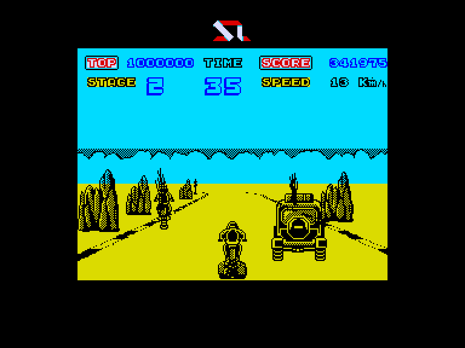
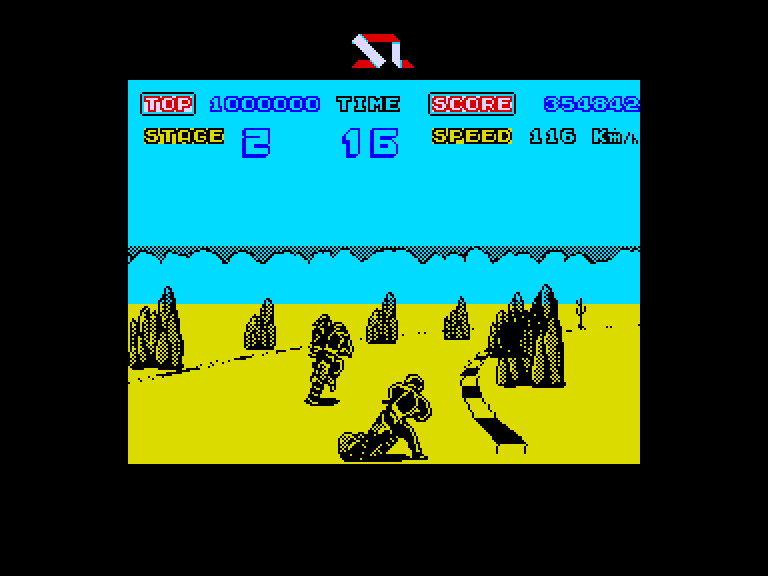

[0-9](../0/games-0.md) - [A](../a/games-a.md) - [B](../b/games-b.md) - [C](../c/games-c.md) - [D](../d/games-d.md) - [E](../e/games-e.md) - [F](../f/games-f.md) - [G](../g/games-g.md) - [H](../h/games-h.md) - [I](../i/games-i.md) - [J](../j/games-j.md) - [K](../k/games-k.md) - [L](../l/games-l.md) - [M](../m/games-m.md) - [N](../n/games-n.md) - [O](../o/games-o.md) - [P](../p/games-p.md) - [Q](../q/games-q.md) - [R](../r/games-r.md) - [S](../s/games-s.md) - [T](../t/games-t.md) - [U](../u/games-u.md) - [V](../v/games-v.md) - [W](../w/games-w.md) - [X](../x/games-x.md) - [Y](../y/games-y.md) - [Z](../z/games-z.md)

Ігри для [Enterprise 64k](../games-ep64.md) - [Enterprise 128k+RAMexp](../games-epramexp.md)

Ігри для систем [IS-DOS](../games-is-dos.md) - [SymbOS](../games-symbos.md) - [EDC Windows](../games-edcw.md)

Ігри для емуляторів [ZX Spectrum 48k/128k](../zxemu/games-zxemu.md) - [Amstrad CPC](../cpcemu/games-cpc.md) - [Sinclair ZX81](../zx81emu/games-zx81.md) - [Videoton TVC](../tvcemu/games-tvc.md) - [Commodore VIC-20](../vic20emu/games-vic20.md)

----------

# Enduro Racer

**ID:** enduro-racer-zx

## Скріншоти

## Опис

(temporary description generated by AI [ChatGPT])

**Опис гри: Enduro Racer**

Enduro Racer - це якісна програма для мотоциклетних гонок, яка найбільше нагадує гру Super Hang-on. Можна стверджувати, що це одна з найграйливіших мотоциклетних гонок на платформі Spectrum! У грі ви берете участь в ендуро гонках, які відбуваються не на ідеально гладких асфальтових трасах, а на складних ділянках, де іноді відсутні навіть елементарні умови для їзди.

**Правила гри:**

1. **Управління**:
   - У меню ви можете переміщатися за допомогою клавіші ENTER, а для вибору пункту меню натискайте SPACE. Якщо ви використовуєте джойстик, ви також можете переміщатися в меню за допомогою джойстика.
   - Управління може бути трохи незвичним: при першому повороті, ймовірно, ви впадете, оскільки коли ви тягнете джойстик до себе, ви не гальмуєте, а піднімаєте заднє колесо мотоцикла. Гальмувати можна, натискаючи кнопку вогню.

2. **Траса**:
   - Траса поділена на секції, які потрібно проходити за часом, інакше ви вибуваєте з гонки.
   - Будьте обережні з суперниками на трасі: якщо ви в них в’їдете, це сповільнить вас.
   - Якщо ви з'їдете з траси, це призведе до падіння і втрати часу.

3. **Перешкоди**:
   - Якщо на дорозі ви бачите колоду, не лякайтесь! Прискорюйтесь і в останній момент підніміть мотоцикл на одне колесо, щоб стрибнути через перешкоду (під час приземлення тримайте кнопку заднього колеса).
   - Стрибати потрібно з максимальною швидкістю, адже за стрибком можуть бути скелі, на які ви можете приземлитися і впасти.
   - Якщо ви не піднімете мотоцикл перед перешкодою, ви все ще стрибнете, але сповільнитесь і приземлитесь "незвично".

4. **Складнощі**:
   - З другого рівня ви також зустрінете великі скелі посеред дороги, на які ви можете наїхати.
   - Іноді повз вас пролетить автомобіль з досить незвичним стилем водіння.

5. **Безкінечний час**:
   - Для активації безкінечного часу введіть: POKE 43647,0; POKE 43648,0.

Гра обіцяє бути складною, особливо для тих, хто хоче пройти її без обмеження часу. На екрані відображаються всі необхідні дані, тому ви не загубитесь у грі.

## Основна інформація
- **Оригінальна платформа:** ZX Spectrum

## Посилання
- [Опис гри на ep128.hu (угорською)](http://www.ep128.hu/Games/Enduro_Racer.htm)
- [Інформація про оригінальну версію](https://spectrumcomputing.co.uk/entry/1628/ZX-Spectrum/Enduro_Racer)
- [Завантажити гру](http://www.ep128.hu/Ep_Games/Prg/Enduro_Racer.rar)

