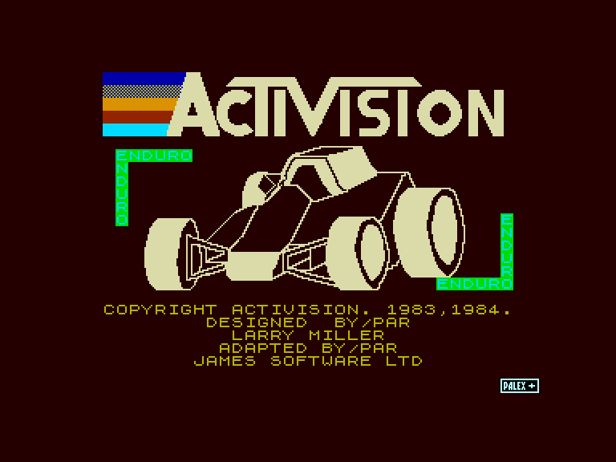
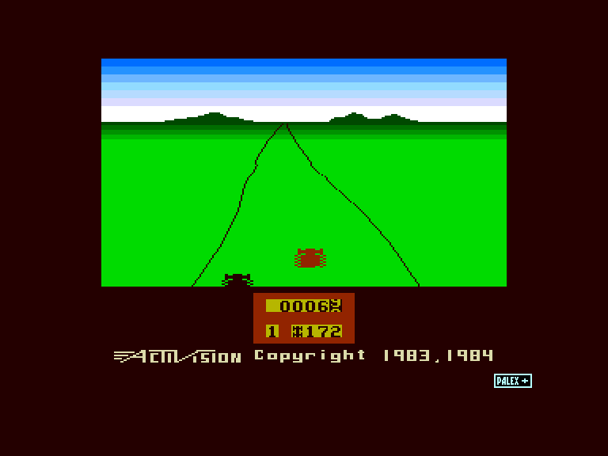
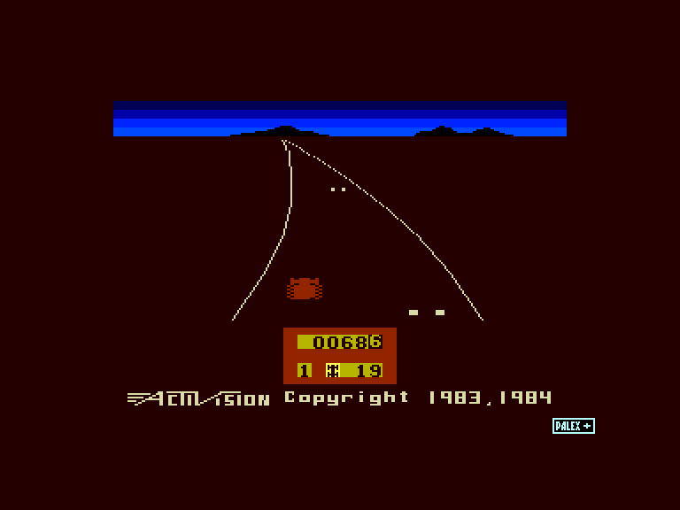
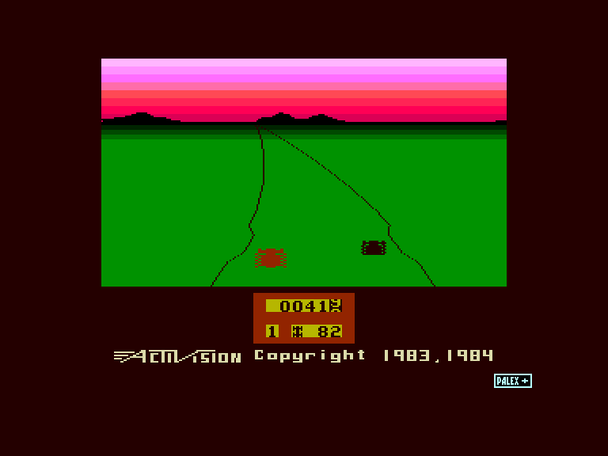

[0-9](../0/games-0.md) - [A](../a/games-a.md) - [B](../b/games-b.md) - [C](../c/games-c.md) - [D](../d/games-d.md) - [E](../e/games-e.md) - [F](../f/games-f.md) - [G](../g/games-g.md) - [H](../h/games-h.md) - [I](../i/games-i.md) - [J](../j/games-j.md) - [K](../k/games-k.md) - [L](../l/games-l.md) - [M](../m/games-m.md) - [N](../n/games-n.md) - [O](../o/games-o.md) - [P](../p/games-p.md) - [Q](../q/games-q.md) - [R](../r/games-r.md) - [S](../s/games-s.md) - [T](../t/games-t.md) - [U](../u/games-u.md) - [V](../v/games-v.md) - [W](../w/games-w.md) - [X](../x/games-x.md) - [Y](../y/games-y.md) - [Z](../z/games-z.md)

Ігри для [Enterprise 64k](../games-ep64.md) - [Enterprise 128k+RAMexp](../games-epramexp.md) - [2dfx](games-2dfx.md)

Ігри для систем [IS-DOS](../games-is-dos.md) - [SymbOS](../games-symbos.md) - [EDC Windows](../games-edcw.md)

Ігри для емуляторів [ZX Spectrum 48k/128k](../zxemu/games-zxemu.md) - [Amstrad CPC](../cpcemu/games-cpc.md) - [Sinclair ZX81](../zx81emu/games-zx81.md) - [Videoton TVC](../tvcemu/games-tvc.md) - [Commodore VIC-20](../vic20emu/games-vic20.md)

----------

# Enduro

**ID:** enduro-zx

**Жанри:** Аркада, Перегони

## Примітка

Game from Spectrum Digest cartridge by Palex+

## Скріншоти

## Опис

(temporary description generated by AI [Assistant])

**Опис гри: Enduro**

Enduro — це екшн-гонка, схожа на Pole Position. Ваша мета — протриматися якомога довше в гонці на витривалість; щодня ви повинні обігнати певну кількість автомобілів. Якщо вам це вдається, ви продовжуєте гру, якщо ні — ви вибуваєте з гонки. Умови водіння змінюються з кожним днем; вам доведеться їздити в різний час доби з різною кількістю світла, а також сезони можуть змінюватися. Сніг, лід і туман можуть з'явитися, ускладнюючи водіння. З кожним днем інші автомобілі стають швидшими та агресивнішими. У нижній частині екрану розташований одометр, тож коли гонка закінчується, ви можете побачити, на яку відстань ви проїхали.

**Правила гри:**

1. **Мета гри:** Протриматися в гонці якомога довше, обганяючи необхідну кількість автомобілів кожен день.
   
2. **Гонка:** Гонка складається з декількох днів, і кожен день вам потрібно обігнати певну кількість автомобілів, щоб продовжити гру.

3. **Умови водіння:** З кожним днем змінюються умови водіння. Ви будете стикатися з різними погодними умовами, такими як сніг, лід і туман, які ускладнять управління автомобілем.

4. **Агресивність суперників:** Інші автомобілі стають швидшими та агресивнішими з кожним днем, тому вам потрібно бути обережними та уважними на трасі.

5. **Огляд:** Гра ведеться з заднього виду, що дозволяє вам краще бачити трасу та суперників.

6. **Оцінка прогресу:** Внизу екрана ви можете бачити одометр, який показує, на яку відстань ви проїхали під час гонки.

7. **Вибуття з гри:** Якщо ви не зможете обігнати необхідну кількість автомобілів за день, ви вибуваєте з гонки.

Enduro — це захоплююча гонка, яка перевіряє вашу витривалість і навички водіння в умовах, що постійно змінюються.

## Основна інформація
- **Мови:** Англійська
- **Оригінальна платформа:** ZX Spectrum
### Загальні системні вимоги
- **Апаратні:** EP128
### Геймплей
- **Керування:** Keyboard, Internal Joy, External Joy 1, External Joy 2
- **Кількість гравців:** 1 player
- **Додаткові теги:** Enhanced graphics
### Розробка
- **Рік випуску:** 1984
- **Компанія:** James Software Ltd

## Посилання
- [Інформація про оригінальну версію](https://spectrumcomputing.co.uk/entry/1627/ZX-Spectrum/Enduro)

