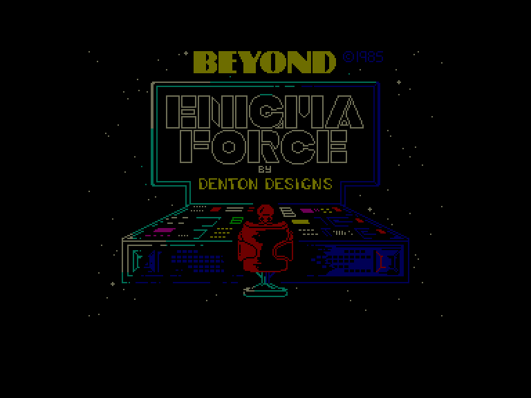
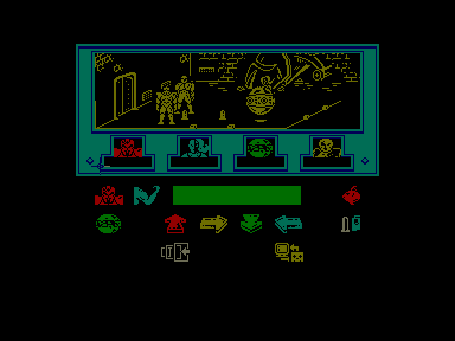
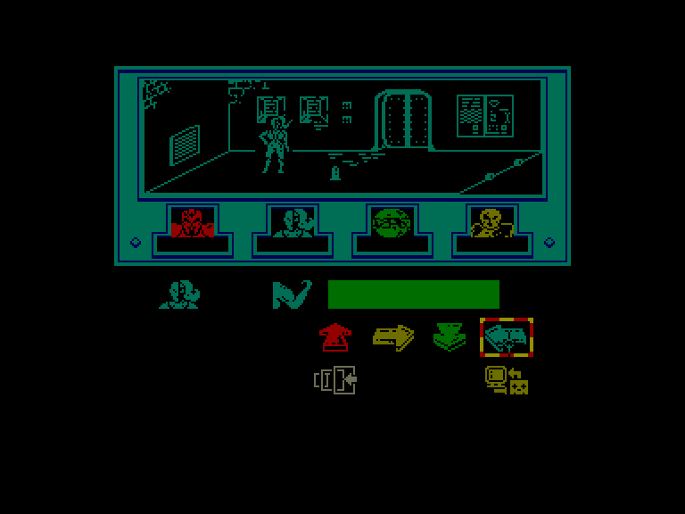
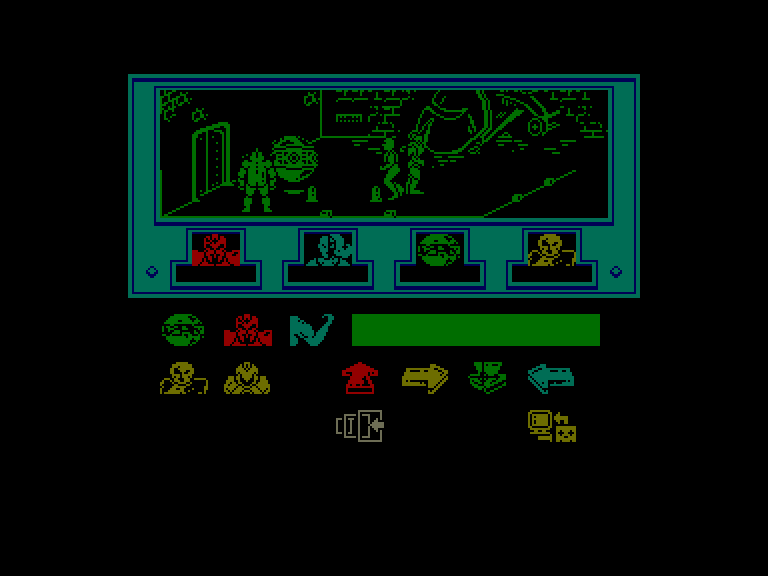

[0-9](../0/games-0.md) - [A](../a/games-a.md) - [B](../b/games-b.md) - [C](../c/games-c.md) - [D](../d/games-d.md) - [E](../e/games-e.md) - [F](../f/games-f.md) - [G](../g/games-g.md) - [H](../h/games-h.md) - [I](../i/games-i.md) - [J](../j/games-j.md) - [K](../k/games-k.md) - [L](../l/games-l.md) - [M](../m/games-m.md) - [N](../n/games-n.md) - [O](../o/games-o.md) - [P](../p/games-p.md) - [Q](../q/games-q.md) - [R](../r/games-r.md) - [S](../s/games-s.md) - [T](../t/games-t.md) - [U](../u/games-u.md) - [V](../v/games-v.md) - [W](../w/games-w.md) - [X](../x/games-x.md) - [Y](../y/games-y.md) - [Z](../z/games-z.md)

Ігри для [Enterprise 64k](../games-ep64.md) - [Enterprise 128k+RAMexp](../games-epramexp.md)

Ігри для систем [IS-DOS](../games-is-dos.md) - [SymbOS](../games-symbos.md) - [EDC Windows](../games-edcw.md)

Ігри для емуляторів [ZX Spectrum 48k/128k](../zxemu/games-zxemu.md) - [Amstrad CPC](../cpcemu/games-cpc.md) - [Sinclair ZX81](../zx81emu/games-zx81.md) - [Videoton TVC](../tvcemu/games-tvc.md) - [Commodore VIC-20](../vic20emu/games-vic20.md)

----------

# Enigma Force

**Альтернативні назви:**
 - Shadowfire 2

**ID:** enigma-force-zx

## Скріншоти

## Опис

(temporary description generated by AI [ChatGPT])

**Опис гри: Enigma Force**

**Жанр:** екшн, пригоди  
**Платформа:** Spectrum (48k)  
**Рік випуску:** 1985  

**Огляд:**
Enigma Force — це гра в жанрі екшн-пригод, розроблена компанією BEYOND Software. Гравці беруть на себе роль чотирьох персонажів, які повинні виконати важливу місію в небезпечному середовищі. Гра поєднує в собі елементи стратегії, бойових дій та дослідження.

**Сюжет:**
Дія гри відбувається в XXX столітті. Гравці керують командою, до складу якої входять:
- SYLK — капітан
- SEVRINA — навігатор
- ZARK — робот
- MAUL — офіцер з протиповітряної оборони

Команда отримує завдання перетнути галактику PSEUDO на своєму космічному кораблі, щоб зібрати бактерії, які можуть зупинити епідемію на їхній рідній планеті. Однак, корабель зазнає поломки і стає некерованим, приземляючись на ворожу космічну базу Enigma Force.

**Правила гри:**

1. **Управління:**
   - Гравець може вибрати управління клавіатурою:
     - CAPS SHIFT, X — вліво
     - Z, C — вправо
     - A, S, D — вниз
     - Q, W, E — вгору
     - 1, 2, 3 — вогонь

2. **Персонажі:**
   - Гравець може перемикатися між персонажами, але одночасно можна керувати лише одним.
   - Стан персонажів може бути:
     - FIT (в цілості)
     - TIRED (втомлений)
     - DEAD (мертвий)

3. **Мета гри:**
   - Зібрати необхідні предмети, такі як ключі, боєприпаси, та інші корисні речі для досягнення мети.
   - Знищити ворога ZOFF, щоб отримати магнітну картку для доступу до космічного корабля.

4. **Предмети:**
   - **Супер-патрони** — для ефективної боротьби з ворогами.
   - **Звичайні патрони** — менш ефективні, але можуть бути корисними.
   - **Риба** — відновлює енергію.
   - **Бомба** — може бути використана для знищення ворогів.
   - **Ключі** — відкривають зачинені двері.
   - **Магнітна картка** — необхідна для доступу до космічного корабля.
   - **Інструменти** — дозволяють відкривати двері без ключів.

5. **Стратегія:**
   - Гравцям слід працювати разом, щоб забезпечити безпечний доступ до ключових локацій.
   - Уважно плануйте маршрути, уникаючи ворогів, поки не зберете всі необхідні предмети.

6. **Завершення гри:**
   - Гра закінчується, коли команда успішно досягає космічного корабля з мінімум трьома живими персонажами.

**Поради:**
- Забирайте предмети тільки тоді, коли на локації немає ворогів.
- Використовуйте пряме управління для кращого контролю над персонажами.
- Завжди майте під рукою супер-патрони та бомби.
- Кожен гравець може знайти свій власний шлях до перемоги, досліджуючи різні стратегії.

Ця гра пропонує унікальний досвід, поєднуючи елементи тактики та дій, що робить її цікавою для всіх шанувальників жанру.

## Основна інформація
- **Оригінальна платформа:** ZX Spectrum

## Посилання
- [Опис гри на ep128.hu (угорською)](http://www.ep128.hu/Games/Enigma_Force.htm)
- [Інформація про оригінальну версію](https://spectrumcomputing.co.uk/entry/1634/ZX-Spectrum/Enigma_Force)
- [Завантажити гру](http://www.ep128.hu/Ep_Games/Prg/Enigma_Force.rar)

