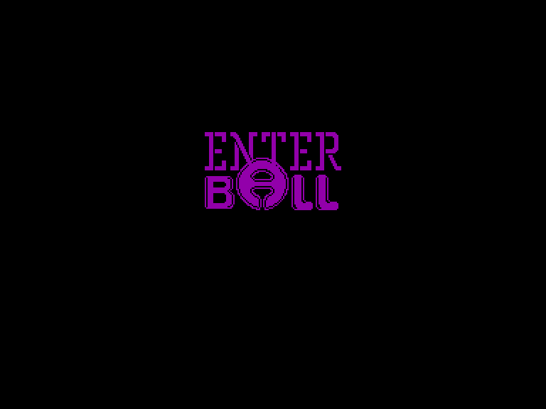
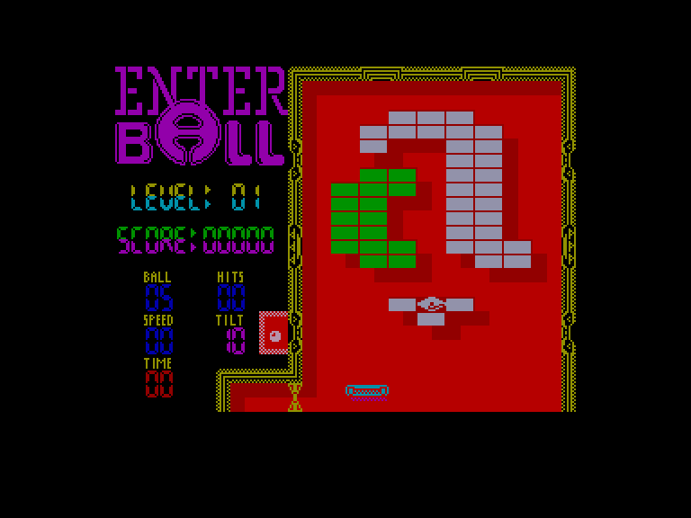
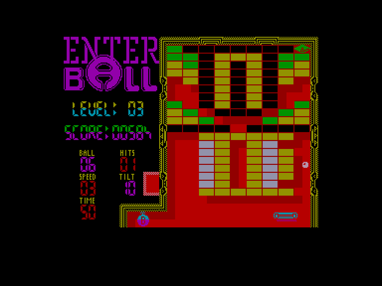
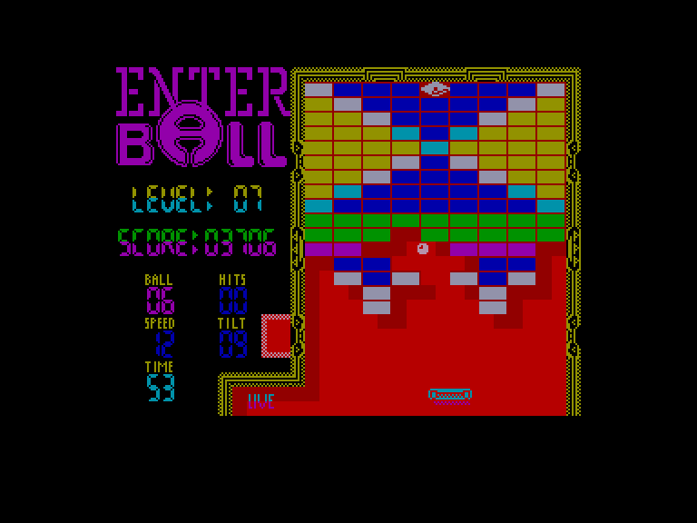

[0-9](../0/games-0.md) - [A](../a/games-a.md) - [B](../b/games-b.md) - [C](../c/games-c.md) - [D](../d/games-d.md) - [E](../e/games-e.md) - [F](../f/games-f.md) - [G](../g/games-g.md) - [H](../h/games-h.md) - [I](../i/games-i.md) - [J](../j/games-j.md) - [K](../k/games-k.md) - [L](../l/games-l.md) - [M](../m/games-m.md) - [N](../n/games-n.md) - [O](../o/games-o.md) - [P](../p/games-p.md) - [Q](../q/games-q.md) - [R](../r/games-r.md) - [S](../s/games-s.md) - [T](../t/games-t.md) - [U](../u/games-u.md) - [V](../v/games-v.md) - [W](../w/games-w.md) - [X](../x/games-x.md) - [Y](../y/games-y.md) - [Z](../z/games-z.md)

Ігри для [Enterprise 64k](../games-ep64.md) - [Enterprise 128k+RAMexp](../games-epramexp.md) - [2dfx](games-2dfx.md)

Ігри для систем [IS-DOS](../games-is-dos.md) - [SymbOS](../games-symbos.md) - [EDC Windows](../games-edcw.md)

Ігри для емуляторів [ZX Spectrum 48k/128k](../zxemu/games-zxemu.md) - [Amstrad CPC](../cpcemu/games-cpc.md) - [Sinclair ZX81](../zx81emu/games-zx81.md) - [Videoton TVC](../tvcemu/games-tvc.md) - [Commodore VIC-20](../vic20emu/games-vic20.md)

----------

# Enterball

**ID:** enterball

## Скріншоти

## Опис

(temporary description generated by AI [Assistant])

**Опис гри Enterball**

Enterball — це класична аркадна гра, випущена у 1988 році студією 'a' Studio для комп'ютера Enterprise. Гра стала дуже популярною, потрапивши до шістки найпродаваніших ігор свого часу. Хоча графіка гри є середньою, її успіх, безсумнівно, пов'язаний з оригінальністю та якісним виконанням жанру "ломалка", на той час єдиним гідним представником у своєму стилі.

**Сюжет гри:**
Дія відбувається у 2213 році. Злий маг, комп'ютерний чарівник МакКел Доглені, розгніваний тим, що останній англомовний Enterprise був вкрадений з-під його носа, наклав закляття на всі програми для Enterprise, зробивши їх незавантажуваними. Люди були в паніці, адже їх улюблені ігри стали недоступними. Однак маг вирішив дати шанс людству: він створив гру і надіслав її найвправнішим гравцям. Той, хто зможе пройти всі рівні, звільнить програми від закляття.

**Правила гри:**

1. **Початок гри:** 
   Після завантаження гри звучить приємна музика. Для початку гри натисніть клавішу SPACE. Гравці можуть переглянути таблицю рекордів, перш ніж почати гру.

2. **Управління:** 
   Гравець керує ракеткою за допомогою вбудованого джойстика або зовнішнього джойстика (EXT1). Ракетку також можна переміщати за допомогою клавіш SHIFT. Клавіша PAUSE зупиняє гру, а клавіша 'S' вимикає звукові ефекти.

3. **Геймплей:**
   - Гра починається з того, що м’яч випускається з маленької коробки зліва на екрані. Коробка відкривається натисканням клавіші "вниз".
   - Мета гри — не просто знищити всі блоки, а знайти білий діамант, який є на кожному рівні.
   - Гравець може "підштовхувати" ігрове поле, натискаючи SPACE, що дозволяє м'ячу підніматися вгору.
   - Якщо м'яч потрапляє в отвори на вертикальних стінах, він з'являється з іншого боку.

4. **Бонуси:**
   - **LIVE:** Додаткове життя.
   - **SLOW:** Сповільнює м'яч.
   - **FAST:** Прискорює м'яч.
   - **BOMB (з буквою B):** Знищує частину стіни.
   - **Доска:** Запобігає падінню м'яча.
   - **Знак питання:** Сюрприз (може бути один з бонусів або супер-ломалка, яка знищує всі чорні та/або білі блоки).

5. **Інформаційний екран:**
   - **LEVEL:** Номер рівня.
   - **SCORE:** Набрані очки.
   - **SPEED:** Швидкість м'яча.
   - **TIME:** Час, протягом якого "клітка" залишається відкритою.
   - **HITS:** Кількість ударів, необхідних для знищення останнього чорного блоку.
   - **TILT:** Кількість ударів, які можна завдати по ігровому полю, перш ніж гра заблокує рух ракетки.

6. **Кінець гри:** 
   Якщо гравець втрачає м'яч, всі отримані бонуси втрачаються. Гра продовжується, поки гравець не досягне кінцевого рівня.

7. **Чит-коди:**
   У грі є вбудовані чит-коди, які можна активувати, ввівши "NASAGUY" на таблиці рекордів.

Enterball — це гра, яка забезпечує тривалі години розваги завдяки своїм 50 рівням складності, які подаються в випадковому порядку. Хоча графіка не є її сильною стороною, гра залишається дуже захоплюючою і вартою уваги.

(temporary description generated by AI [Assistant])

## Основна інформація
### Загальні системні вимоги
- **Апаратні:** EP64, EP128

## Посилання
- [Опис на ep128.hu (угорською)](http://www.ep128.hu/Ep_Games/Leiras/Enter_Ball.htm)
- [Завантажити](http://www.ep128.hu/Ep_Games/Prg/Enterball.rar)
- [Easy Load&Play](https://t.me/EP128k_Load_n_Play/288) *(Telegram-канал Vibrant Waves)*

## Відео

<iframe src="https://www.youtube.com/embed/ylI0MVhBF4s"  
style="width:75%; aspect-ratio:16/9;" allowfullscreen></iframe>

