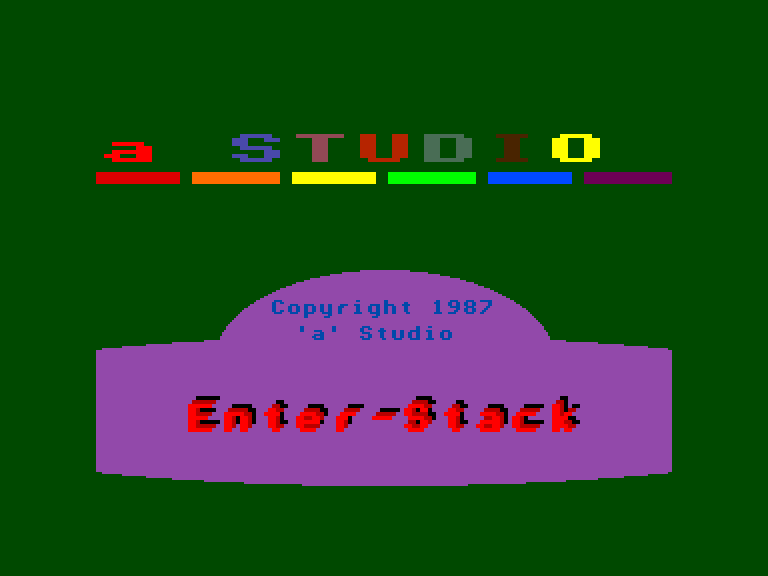
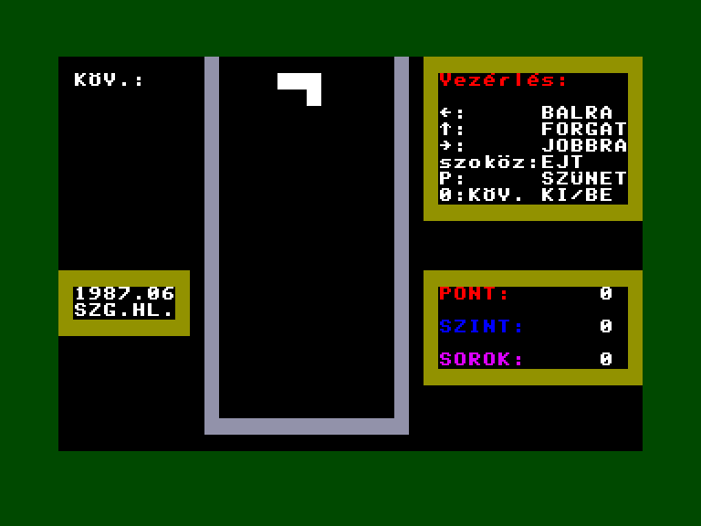
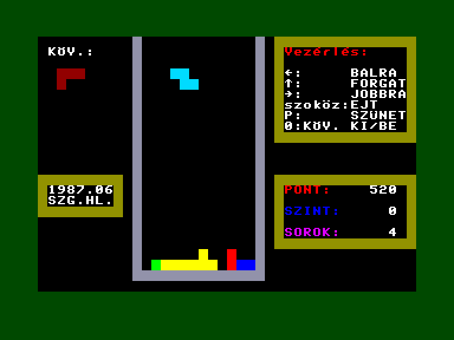
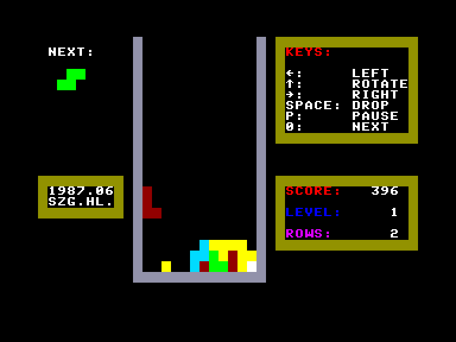

[0-9](../0/games-0.md) - [A](../a/games-a.md) - [B](../b/games-b.md) - [C](../c/games-c.md) - [D](../d/games-d.md) - [E](../e/games-e.md) - [F](../f/games-f.md) - [G](../g/games-g.md) - [H](../h/games-h.md) - [I](../i/games-i.md) - [J](../j/games-j.md) - [K](../k/games-k.md) - [L](../l/games-l.md) - [M](../m/games-m.md) - [N](../n/games-n.md) - [O](../o/games-o.md) - [P](../p/games-p.md) - [Q](../q/games-q.md) - [R](../r/games-r.md) - [S](../s/games-s.md) - [T](../t/games-t.md) - [U](../u/games-u.md) - [V](../v/games-v.md) - [W](../w/games-w.md) - [X](../x/games-x.md) - [Y](../y/games-y.md) - [Z](../z/games-z.md)

Ігри для [Enterprise 64k](../games-ep64.md) - [Enterprise 128k+RAMexp](../games-epramexp.md)

Ігри для систем [IS-DOS](../games-is-dos.md) - [SymbOS](../games-symbos.md) - [EDC Windows](../games-edcw.md)

Ігри для емуляторів [ZX Spectrum 48k/128k](../zxemu/games-zxemu.md) - [Amstrad CPC](../cpcemu/games-cpc.md) - [Sinclair ZX81](../zx81emu/games-zx81.md) - [Videoton TVC](../tvcemu/games-tvc.md) - [Commodore VIC-20](../vic20emu/games-vic20.md)

----------

# Enter-Stack

**ID:** enterstack

## Скріншоти

## Опис

(temporary description generated by AI [Assistant])

### Опис гри: Enter-Stack

**Вступ:**
Enter-Stack - це класичний клон гри Тетріс, розроблений у 1987 році студією 'a' Studio. Гравці повинні управляти падаючими фігурами, щоб заповнити ряди на ігровому полі, з метою видалення рядків та отримання високих балів.

**Мета гри:**
Гравець повинен розташувати різноманітні фігури, які падають у віртуальний "вертикальний ящик", так, щоб заповнити цілі ряди. Коли ряд заповнений, він зникає, а всі рядки, що знаходяться вище, опускаються вниз. Гра триває до тих пір, поки ящик не заповниться фігурами. Кожні десять знищених рядків гра стає складнішою.

### Правила гри:

1. **Початок гри:**
   - Після завантаження програми, вона не запускається автоматично. Перед початком гри необхідно ввести команду `SET KEY CLICK OFF`, щоб вимкнути звуки клавіатури під час гри.
   - Після цього програма оголосить свою назву. Гравець може вибрати початковий рівень складності.

2. **Управління:**
   - Гравець керує фігурами за допомогою вбудованого джойстика:
     - Переміщення фігур вліво та вправо.
     - Натискаючи клавішу SPACE, фігура швидко опускається вниз.
     - Клавіша '0' дозволяє увімкнути/вимкнути відображення наступної фігури.
     - Клавіша 'P' ставить гру на паузу.
   - На екрані відображається поточний рахунок, рівень складності та кількість знищених рядків.

3. **Кінець гри:**
   - Гра закінчується, коли фігури досягають верхньої частини ігрового поля, і більше немає місця для нових фігур.

4. **Додаткові можливості:**
   - Гравці, які шукають більший виклик, можуть спробувати просторову версію гри - Mozaik.

### Заключення:
Enter-Stack - це захоплююча ігрова пригода, яка перевіряє вашу реакцію та стратегічне мислення. Чи зможете ви досягти найвищого рахунку? Грайте та дізнайтеся!

## Основна інформація
- **Мови:** Угорська, Англійська

## Посилання
- [Опис гри на ep128.hu (угорською)](http://www.ep128.hu/Ep_Games/Leiras/Enter_Stack.htm)
- [Завантажити гру](http://www.ep128.hu/Ep_Games/Prg/EnterStack.rar)

**Дата генерації:** 29.07.2026

