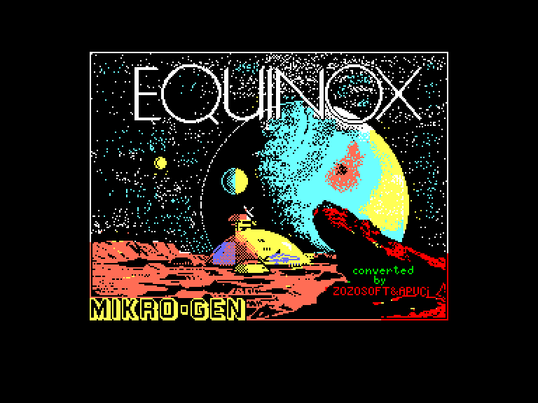
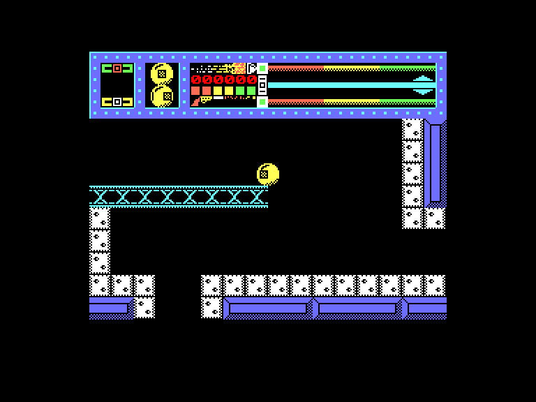
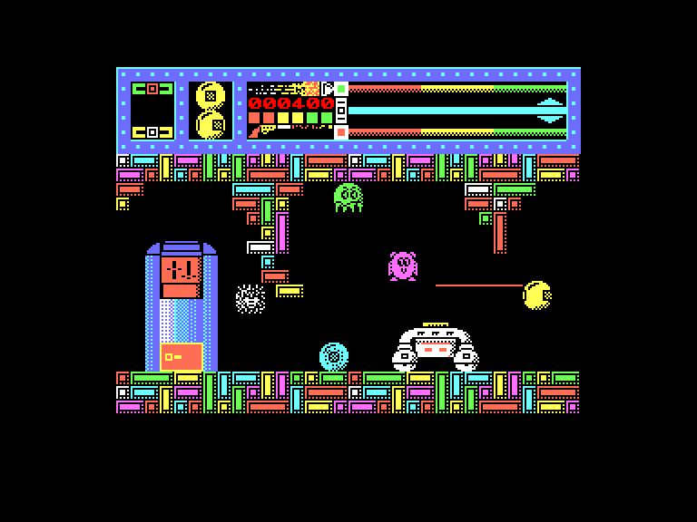
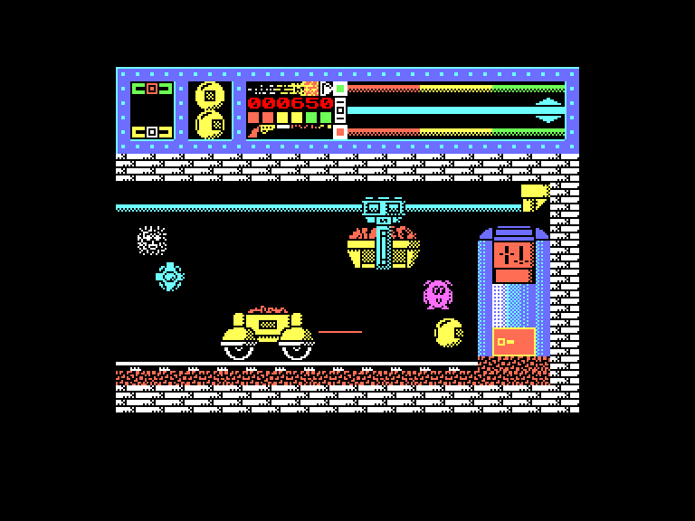

[0-9](../0/games-0.md) - [A](../a/games-a.md) - [B](../b/games-b.md) - [C](../c/games-c.md) - [D](../d/games-d.md) - [E](../e/games-e.md) - [F](../f/games-f.md) - [G](../g/games-g.md) - [H](../h/games-h.md) - [I](../i/games-i.md) - [J](../j/games-j.md) - [K](../k/games-k.md) - [L](../l/games-l.md) - [M](../m/games-m.md) - [N](../n/games-n.md) - [O](../o/games-o.md) - [P](../p/games-p.md) - [Q](../q/games-q.md) - [R](../r/games-r.md) - [S](../s/games-s.md) - [T](../t/games-t.md) - [U](../u/games-u.md) - [V](../v/games-v.md) - [W](../w/games-w.md) - [X](../x/games-x.md) - [Y](../y/games-y.md) - [Z](../z/games-z.md)

Ігри для [Enterprise 64k](../games-ep64.md) - [Enterprise 128k+RAMexp](../games-epramexp.md)

Ігри для систем [IS-DOS](../games-is-dos.md) - [SymbOS](../games-symbos.md) - [EDC Windows](../games-edcw.md)

Ігри для емуляторів [ZX Spectrum 48k/128k](../zxemu/games-zxemu.md) - [Amstrad CPC](../cpcemu/games-cpc.md) - [Sinclair ZX81](../zx81emu/games-zx81.md) - [Videoton TVC](../tvcemu/games-tvc.md) - [Commodore VIC-20](../vic20emu/games-vic20.md)

----------

# Equinox

**ID:** equinox-zx

## Скріншоти

## Опис

(temporary description generated by AI [ChatGPT])

**Опис гри Equinox**

**Жанр:** Акція, платформер  
**Розробник:** Micro-Gen  
**Рік випуску:** 1986  
**Платформа:** Spectrum (48k), Enterprise  

**Огляд гри:**
Equinox — це гра, яка, незважаючи на свою високу якість, залишалася в тіні популярніших проектів, таких як серія Wally. У грі вам потрібно подорожувати лабіринтами, збирати предмети та використовувати їх для досягнення цілей. Дія гри відбувається на віддаленій планеті в системі SURY-ANI, де ведеться видобуток радіоактивних матеріалів. Після метеоритного удару, що зруйнував шахти, вам, як супер-роботу, доведеться відновити порядок, збираючи розкидані контейнери з радіоактивними матеріалами, перш ніж вони перетворять планету на небезпечне місце.

**Правила гри:**
1. **Мета гри:** Зібрати всі контейнери з радіоактивними матеріалами та повернути їх на свої місця, використовуючи різні предмети та інструменти, які ви знайдете в шахтах.

2. **Ігровий процес:**
   - Гра складається з восьми рівнів, кожен з яких містить 16 кімнат.
   - На кожному рівні є один контейнер з радіоактивним матеріалом, який потрібно доставити в спеціальну кімнату через вакуумну трубу.
   - Для переміщення між рівнями використовуються телепортаційні картки.

3. **Вороги:** 
   - На планеті мешкають мутанти, які будуть атакувати вас. Якщо ви занадто довго перебуваєте в їхньому полі зору, ви втратите життя.
   - У вашому розпорядженні є лазерна гармата для знищення ворогів. Також можна знайти бомби, які можна активувати для знищення мутантів у кімнатах.

4. **Управління:** 
   - Після запуску гри ви можете налаштувати управління, переглянути інструкцію або розпочати гру.
   - У верхньому лівому куті екрана відображаються предмети, які ви маєте при собі, а в правому верхньому — показники тяги та заряду лазера.

5. **Збирання предметів:** 
   - Ви можете підбирати предмети, використовуючи визначену клавішу. Предмети не можна скинути, але їх можна використовувати або замінити новими.

6. **Стратегії:** 
   - Використовуйте телепортаційні картки для швидкого переміщення між кімнатами.
   - Збирайте енергію та заряд лазера, щоб уникнути загибелі від мутантів.
   - Розгляньте можливість використання бомб для знищення ворогів.

7. **Коди та чіти:**
   - Для безкінечної енергії використовуйте код: POKE 30836,0.
   - Знайдіть червоний квадрат з написом PETE, щоб активувати чіт.

Ця гра пропонує захоплюючий і динамічний ігровий процес, який вимагає стратегічного мислення та швидкості реакції. Успіх залежить від вашої здатності адаптуватися до небезпечних умов і ефективно використовувати наявні ресурси.

Приємної гри!

## Основна інформація
- **Оригінальна платформа:** ZX Spectrum

## Посилання
- [Опис гри на ep128.hu (угорською)](http://www.ep128.hu/Games/Equinox.htm)
- [Інформація про оригінальну версію](https://spectrumcomputing.co.uk/entry/1637/ZX-Spectrum/Equinox)
- [Завантажити гру](http://www.ep128.hu/Ep_Games/Prg/Equinox.rar)

**Дата генерації:** 29.07.2026

