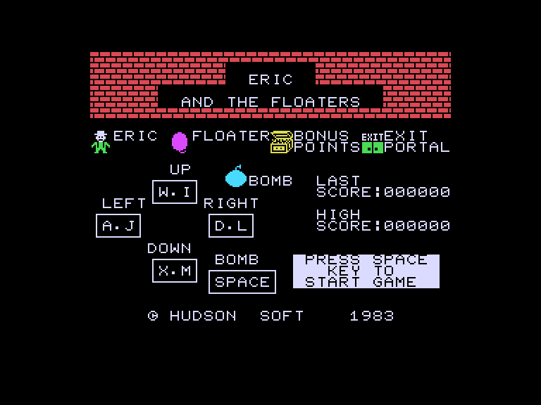
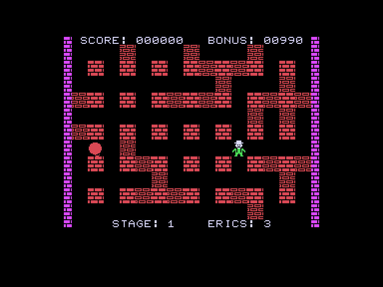
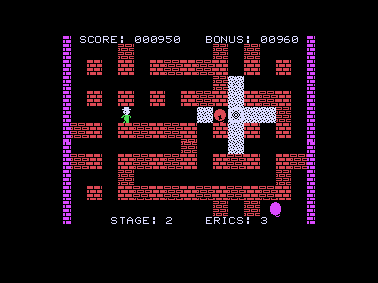
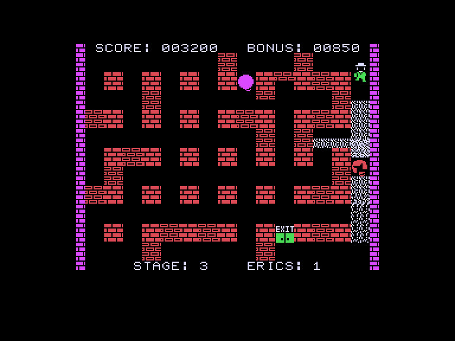

[0-9](../0/games-0.md) - [A](../a/games-a.md) - [B](../b/games-b.md) - [C](../c/games-c.md) - [D](../d/games-d.md) - [E](../e/games-e.md) - [F](../f/games-f.md) - [G](../g/games-g.md) - [H](../h/games-h.md) - [I](../i/games-i.md) - [J](../j/games-j.md) - [K](../k/games-k.md) - [L](../l/games-l.md) - [M](../m/games-m.md) - [N](../n/games-n.md) - [O](../o/games-o.md) - [P](../p/games-p.md) - [Q](../q/games-q.md) - [R](../r/games-r.md) - [S](../s/games-s.md) - [T](../t/games-t.md) - [U](../u/games-u.md) - [V](../v/games-v.md) - [W](../w/games-w.md) - [X](../x/games-x.md) - [Y](../y/games-y.md) - [Z](../z/games-z.md)

Ігри для [Enterprise 64k](../games-ep64.md) - [Enterprise 128k+RAMexp](../games-epramexp.md) - [2dfx](games-2dfx.md)

Ігри для систем [IS-DOS](../games-is-dos.md) - [SymbOS](../games-symbos.md) - [EDC Windows](../games-edcw.md)

Ігри для емуляторів [ZX Spectrum 48k/128k](../zxemu/games-zxemu.md) - [Amstrad CPC](../cpcemu/games-cpc.md) - [Sinclair ZX81](../zx81emu/games-zx81.md) - [Videoton TVC](../tvcemu/games-tvc.md) - [Commodore VIC-20](../vic20emu/games-vic20.md)

----------

# Eric & the Floaters

**Альтернативні назви:**
 - Eric and the Floaters

**ID:** eric-and-the-floaters-zx

## Скріншоти

## Опис

(temporary description generated by AI [your name])

**Опис гри: Eric and the Floaters**

"Eric and the Floaters" - це відеогра, випущена в 1983 році компанією Alternative Software для платформ Spectrum (48k) та Enterprise. Гра є адаптацією відомої японської гри "Bomber Man", розробленої компанією Hudson Soft. У цій версії гравці беруть на себе роль Еріка, який повинен подолати різноманітні перешкоди та ворогів, використовуючи свою винахідливість та навички.

**Правила гри:**

1. **Мета гри:** Гравець повинен проходити рівні, знищуючи ворогів та збираючи бонуси, щоб досягти фінішу.

2. **Управління:** Гра підтримує управління за допомогою Sinclair joystick або клавіатури. Гравець може переміщати Еріка по ігровому полю, використовуючи джойстик або клавіші.

3. **Вороги:** На кожному рівні гравець зустрічає різних ворогів, які намагаються завадити йому. Гравець повинен бути обережним і планувати свої дії, щоб уникнути зіткнень.

4. **Бонуси:** Протягом гри гравець може збирати різні бонуси, які допомагають у проходженні рівнів. Це можуть бути додаткові очки, життя або спеціальні здібності.

5. **Життя:** Гравець має обмежену кількість життів. Якщо Ерік зазнає поразки, він втрачає життя. Гравець може використовувати код "POKE 40296,0" для отримання безсмертя.

6. **Рівні:** Гра складається з кількох рівнів, кожен з яких має свої унікальні виклики та ворогів. Гравець повинен пройти всі рівні, щоб завершити гру.

7. **Перемога:** Гравець виграє, коли успішно проходить всі рівні та знищує всіх ворогів.

"Eric and the Floaters" - це захоплююча гра, яка вимагає стратегічного мислення та швидкості реакції. Вона пропонує гравцям можливість насолодитися класичним ігровим досвідом, що поєднує в собі елементи платформера та головоломки.

(temporary description generated by AI [your name])

## Основна інформація
- **Оригінальна платформа:** ZX Spectrum

## Посилання
- [Опис на ep128.hu (угорською)](http://www.ep128.hu/Games/Eric_and_the_Floaters.htm)
- [Інформація про оригінальну версію](https://spectrumcomputing.co.uk/entry/1639/ZX-Spectrum/Eric_the_Floaters)
- [Завантажити](http://www.ep128.hu/Ep_Games/Prg/Eric_and_the_Floaters.rar)

