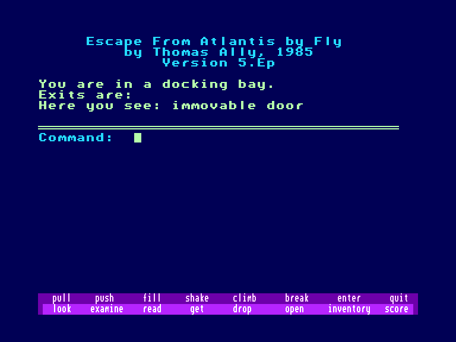
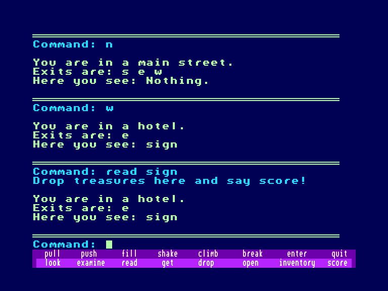
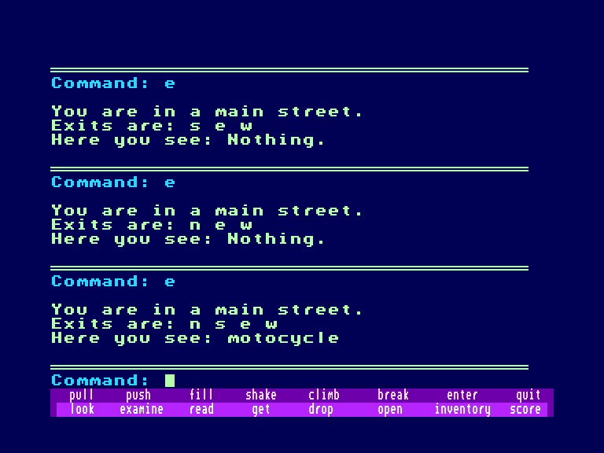

[0-9](../0/games-0.md) - [A](../a/games-a.md) - [B](../b/games-b.md) - [C](../c/games-c.md) - [D](../d/games-d.md) - [E](../e/games-e.md) - [F](../f/games-f.md) - [G](../g/games-g.md) - [H](../h/games-h.md) - [I](../i/games-i.md) - [J](../j/games-j.md) - [K](../k/games-k.md) - [L](../l/games-l.md) - [M](../m/games-m.md) - [N](../n/games-n.md) - [O](../o/games-o.md) - [P](../p/games-p.md) - [Q](../q/games-q.md) - [R](../r/games-r.md) - [S](../s/games-s.md) - [T](../t/games-t.md) - [U](../u/games-u.md) - [V](../v/games-v.md) - [W](../w/games-w.md) - [X](../x/games-x.md) - [Y](../y/games-y.md) - [Z](../z/games-z.md)

Ігри для [Enterprise 64k](../games-ep64.md) - [Enterprise 128k+RAMexp](../games-epramexp.md)

Ігри для систем [IS-DOS](../games-is-dos.md) - [SymbOS](../games-symbos.md) - [EDC Windows](../games-edcw.md)

Ігри для емуляторів [ZX Spectrum 48k/128k](../zxemu/games-zxemu.md) - [Amstrad CPC](../cpcemu/games-cpc.md) - [Sinclair ZX81](../zx81emu/games-zx81.md) - [Videoton TVC](../tvcemu/games-tvc.md) - [Commodore VIC-20](../vic20emu/games-vic20.md)

----------

# Escape from Atlantis

**ID:** escape-from-atlantis-bas

## Скріншоти

## Опис

(temporary description generated by AI [Assistant])

## Опис гри: Втеча з Атлантиди

### Загальна інформація
**Назва:** Втеча з Атлантиди  
**Автор:** Томас Еллі  
**Рік випуску:** 1985  
**Мови:** Англійська  
**Платформи:** C64/128, PC, TRS-80  
**Системи:** BASIC  

### Опис гри
"Втеча з Атлантиди" - це класична комп'ютерна гра, розроблена Томасом Еллі у 1985 році. Гравець опиняється в легендарному місті Атлантида, яке занурюється в хаос і руйнування. Ваше завдання - знайти спосіб втечі з цього міста, вирішуючи загадки та долаючи численні перешкоди на своєму шляху.

### Правила гри
1. **Введення:** Для початку гри вам потрібно ввести своє ім'я користувача та пароль, або зареєструватися, якщо ви ще не маєте облікового запису.
2. **Інтерфейс:** Гра має текстовий інтерфейс, де ви будете взаємодіяти з оточенням через введення команд.
3. **Команди:** Використовуйте команди для дослідження, взаємодії з предметами та вирішення головоломок.
4. **Оцінка:** Гравці можуть оцінювати гру, залишати коментарі та ділитися своїми враженнями.
5. **Рішення:** Якщо ви застрягли, можна скористатися рішеннями, наданими іншими гравцями.

### Додаткова інформація
- Гра була портована на Amstrad CPC Карстеном Достом (SRS).
- Для отримання додаткової інформації ви можете скористатися ресурсами, такими як Gamebase64 або Museum of Computer Adventure Game History.

### Оцінки та коментарі
Середня оцінка гри - 3 з 5 (2 оцінки). Гравці можуть залишати свої коментарі та ділитися досвідом.

### Примітки
- Деякі користувачі повідомляють про помилки в порту для C64, зокрема, про проблеми з командою "score", що призводить до зупинки гри.

**(C) CASA 1999 - 2025**

## Посилання
- [Опис гри на ep128.hu (угорською)](http://www.ep128.hu/Ep_Games/Leiras/Basic_Program_Pack.htm)
- [Інформація про гру (SolutionArchive.com)](https://solutionarchive.com/game/id%2C4865/Escape+From+Atlantis.html)
- [Завантажити гру](http://www.ep128.hu/Ep_Games/Prg/Basic_Program_Pack.rar)

