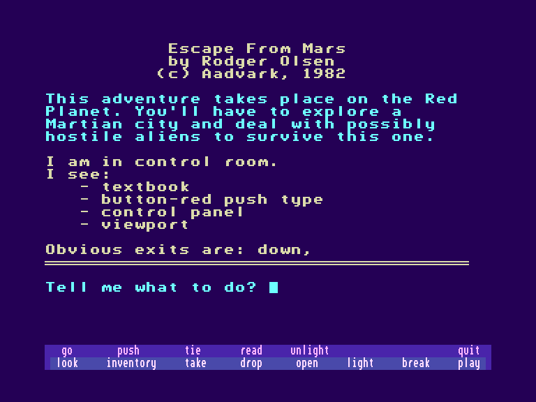
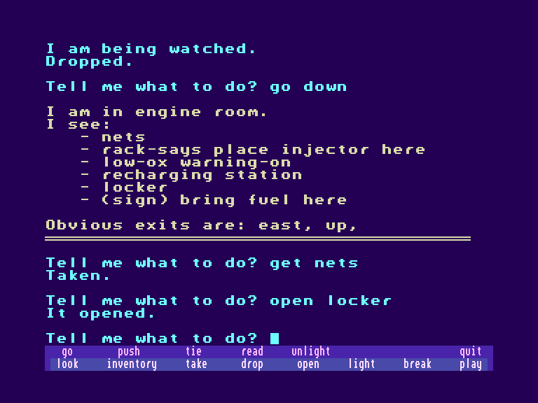

[0-9](../0/games-0.md) - [A](../a/games-a.md) - [B](../b/games-b.md) - [C](../c/games-c.md) - [D](../d/games-d.md) - [E](../e/games-e.md) - [F](../f/games-f.md) - [G](../g/games-g.md) - [H](../h/games-h.md) - [I](../i/games-i.md) - [J](../j/games-j.md) - [K](../k/games-k.md) - [L](../l/games-l.md) - [M](../m/games-m.md) - [N](../n/games-n.md) - [O](../o/games-o.md) - [P](../p/games-p.md) - [Q](../q/games-q.md) - [R](../r/games-r.md) - [S](../s/games-s.md) - [T](../t/games-t.md) - [U](../u/games-u.md) - [V](../v/games-v.md) - [W](../w/games-w.md) - [X](../x/games-x.md) - [Y](../y/games-y.md) - [Z](../z/games-z.md)

Ігри для [Enterprise 64k](../games-ep64.md) - [Enterprise 128k+RAMexp](../games-epramexp.md)

Ігри для систем [IS-DOS](../games-is-dos.md) - [SymbOS](../games-symbos.md) - [EDC Windows](../games-edcw.md)

Ігри для емуляторів [ZX Spectrum 48k/128k](../zxemu/games-zxemu.md) - [Amstrad CPC](../cpcemu/games-cpc.md) - [Sinclair ZX81](../zx81emu/games-zx81.md) - [Videoton TVC](../tvcemu/games-tvc.md) - [Commodore VIC-20](../vic20emu/games-vic20.md)

----------

# Escape from Mars

**ID:** escape-from-mars-bas

## Скріншоти

## Опис

(temporary description generated by AI [your name])

## Опис гри: Втеча з Марса

### Загальні відомості
**Назва:** Втеча з Марса  
**Інші назви:** Mars Adventure, Mars, Mars Adventurer, Graphics Mars  
**Мова:** Англійська  
**Автори:** Ед Стернберг, Родріг Сміт, Роджер Ольсен  
**Системи:** Assembler, BASIC  
**Платформи:** C64/128, OSI/Compukit, ПК, Sega SC-3000, TI-99/4A, Timex Sinclair, TRS-80, TRS-80 CoCo, VIC20  
**Жанри:** Наукова фантастика  
**Додано:** 10-05-2010  
**Оновлено:** 23-10-2021  

### Синопсис
Ця пригодницька гра відбувається на ЧЕРВОНОМУ ПЛАНЕТІ. Вам потрібно дослідити марсіанське місто та мати справу з ймовірно ворожими інопланетянами, щоб вижити. Це гарна перша пригода для новачків.

### Примітки
- Гра була рекламована в червневому випуску 1980 року бюлетеня Aardvark.
- Реклама в Sync Magazine, том 2, номер 4 (липень/серпень 1982 року) перераховує доступні платформи на той час: Timex Sinclair, TRS-80, TRS-80 Coco, OSI та Vic-20; авторство гри приписується лише Роджеру Ольсену.
- У каталозі Aardvark (British Intelligence) за листопад 1984 року також зазначені IBM PC & PCjr та C64 як платформи.
- Пізніші версії (1984) C64, TRS-80 Color Computer та ПК включали графіку. Версія CoCo називалася 'Graphic Mars' і була написана на асемблері Родріком Смітом.
- Версія для VIC-20 відома як Mars Adventure.
- Гра продавалася в Австралії як Mars Adventurer для комп'ютера SC-3000 компанії Grandstand Leisure. Оригінальний автор не був вказаний.
- Джим Джеррі створив версію оригінальної гри BASIC для TRS-80 MC-10.
- Гра також доступна шведською мовою.

### Ресурси
- **Рішення:** від Odd Magne Ogreid
- **Рішення (C64/128):** від Dorothy
- **Рішення:** від gamingafter40
- **Карта (TRS-80 CoCo):** від farique

### Додаткова інформація
- Пошук на сайті Curtis Boyle для CoCo
- Пошук на Gamebase64
- Пошук в Музеї комп'ютерних пригодницьких ігор
- Пошук на Sega Retro
- Пошук на TI-99/4A Game Shelf

### Користувачі
- **Користувачі, які розгадали цю гру:** Simon
- **Користувачі, які зараз грають у цю гру:** —
- **Я розгадав це**
- **Я граю в це**
- **Написати відгук**
- **Відправити оновлення**

### Зображення
(Дивіться всі зображення)

### Рейтинг
Середній рейтинг користувачів: — (0 рейтингів)  
Ваш рейтинг: —

### Коментарі користувачів
(Написати новий коментар)

**(C) CASA 1999 - 2025**

## Посилання
- [Опис гри на ep128.hu (угорською)](http://www.ep128.hu/Ep_Games/Leiras/Basic_Program_Pack.htm)
- [Інформація про гру (SolutionArchive.com)](https://solutionarchive.com/game/id%2C944/Escape+From+Mars.html)
- [Завантажити гру](http://www.ep128.hu/Ep_Games/Prg/Basic_Program_Pack.rar)

