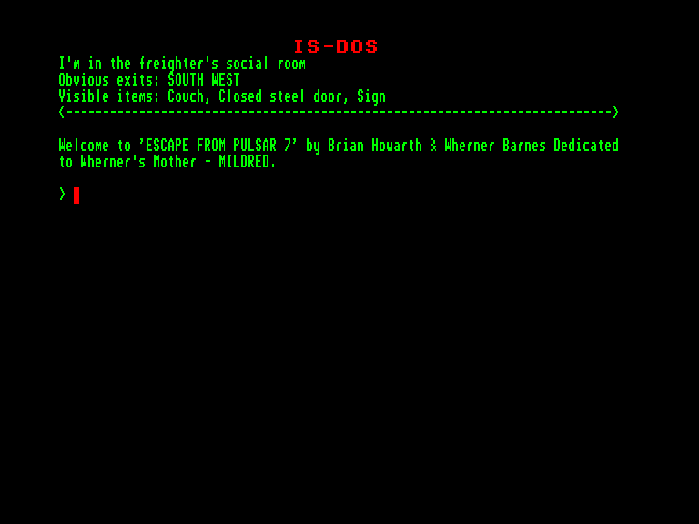
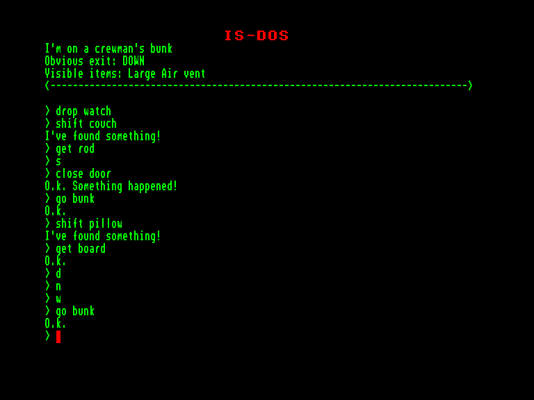
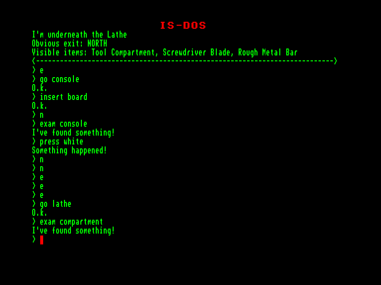

[0-9](../0/games-0.md) - [A](../a/games-a.md) - [B](../b/games-b.md) - [C](../c/games-c.md) - [D](../d/games-d.md) - [E](../e/games-e.md) - [F](../f/games-f.md) - [G](../g/games-g.md) - [H](../h/games-h.md) - [I](../i/games-i.md) - [J](../j/games-j.md) - [K](../k/games-k.md) - [L](../l/games-l.md) - [M](../m/games-m.md) - [N](../n/games-n.md) - [O](../o/games-o.md) - [P](../p/games-p.md) - [Q](../q/games-q.md) - [R](../r/games-r.md) - [S](../s/games-s.md) - [T](../t/games-t.md) - [U](../u/games-u.md) - [V](../v/games-v.md) - [W](../w/games-w.md) - [X](../x/games-x.md) - [Y](../y/games-y.md) - [Z](../z/games-z.md)

Ігри для [Enterprise 64k](../games-ep64.md) - [Enterprise 128k+RAMexp](../games-epramexp.md) - [2dfx](../games-2dfx.md)

Ігри для систем [IS-DOS](../games-is-dos.md) - [SymbOS](../games-symbos.md) - [EDC Windows](../games-edcw.md)

Ігри для емуляторів [ZX Spectrum 48k/128k](../zxemu/games-zxemu.md) - [Amstrad CPC](../cpcemu/games-cpc.md) - [Sinclair ZX81](../zx81emu/games-zx81.md) - [Videoton TVC](../tvcemu/games-tvc.md) - [Commodore VIC-20](../vic20emu/games-vic20.md)

----------

# Escape from Pulsar 7

**Альтернативні назви:**
 - Mysterious Adventures 5 - Escape from Pulsar 7

**ID:** escape-from-pulsar7-zcode

**Жанри:** Текстова пригода

## Примітка

ℹ Мультиплатформенна гра на рушії Z-machine від Infocom.

## Скріншоти

## Опис

Ви на самоті... майже на самоті... на космічному вантажному кораблі «Пульсар-7». Поки ви сидите у відносній безпеці кают-компанії, ваші думки мимоволі повертаються до дня двотижневої давнини, коли розпочався цей кошмар.  

Усе починалося як буденна місія — дослідницький політ до зовнішніх регіонів системи Ксанотар. Метою місії, як і завжди, було доставлення цінної руди реденіум на малі планетоїди, чиї цивілізації вже виросли з примітивної ядерної енергетики й шукали нові методи передачі енергії зі звичайних елементів, знайдених на їхніх рідних планетах. Реденіум був рідкістю в цих далеких куточках системи Ксанотар, тож більшість урядів цих планетоїдів із великим охоче приймали зразки нових елементів — особливо реденіуму, чиї характеристики передачі енергії не мали собі рівних.  

Успішно обмінявши поточний вантаж реденіуму та отримавши як частину оплати за партію дивовижну й цікаву істоту з міжгалактичного зоопарку вашої рідної планети, ви разом із екіпажем узяли курс додому.  

Спершу подорож була спокійною, якщо не вважати дрібної пригоди, коли істота вирвалася з клітки й заповзялася грайливо качатися в залишках реденіумової руди у вантажному трюмі.  

Знову спіймавши істоту й повернувши її до клітки, «Пульсар-7» відновив свій монотонний курс додому. Однак у наступні дні істота стала неспокійною й почала рости з приголомшливою швидкістю. Тоді було вирішено, що істота, ймовірно, стане небезпечною для екіпажу, а отже, її слід приспати та помістити в анабіоз на решту шляху додому.  

Це рішення було прийняте занадто пізно... Істота, яка тепер досягла розмірів невеликого коня, роздерла свою клітку, жорстоко вбила й зжерла двох членів екіпажу. Після цього вона сховалася десь на борту гігантського вантажного судна. Відтоді істота розправилася з усіма рештою членів екіпажу, крім вас. Тепер ваш єдиний вихід — залишити вантажне судно й спробувати втекти на тендітному рятувальному човнику... якщо вам удасться уникнути смертоносного чудовиська!

## Основна інформація
- **Мови:** Англійська
### Загальні системні вимоги
- **Апаратні:** EXDOS
- **Програмні:** IS-DOS
### Геймплей
- **Керування:** Keyboard
- **Кількість гравців:** 1 player
- **Додаткові теги:** Z-code
### Розробка
- **Рік випуску:** 1982
- **Автор:** Brian Howarth, Wherner Barnes

## Посилання
- [Інформація про гру (SolutionArchive.com)](https://solutionarchive.com/game/id%2C184/Escape+From+Pulsar+7.html)
- [Завантажити](https://www.ifarchive.org/if-archive/games/inform/mysterious_inform.zip)

## [Керування](../controllers.md)

`Keyboard`

## Детальна інформація

### Історія розробки  

П'ята гра у серії «Mysterious Adventures»  

Браян Гаварт написав свої одинадцять текстових пригод «Mysterious Adventures» у 1981–1983 роках, початково як суто текстові ігри (саме так вони представлені тут). Пізніші версії (Spectrum, C64) мали контурну графіку. Усі файли даних є конверсіями з версій для Spectrum/C64 (але без графіки). Браян Гаварт дав свій дозвіл на завантаження ігор до IF Archive.