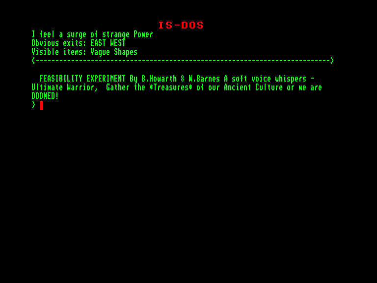
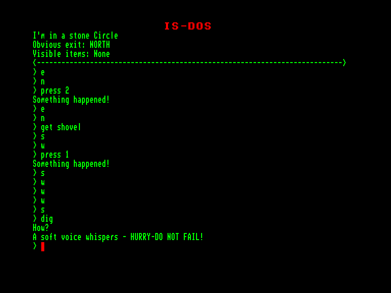
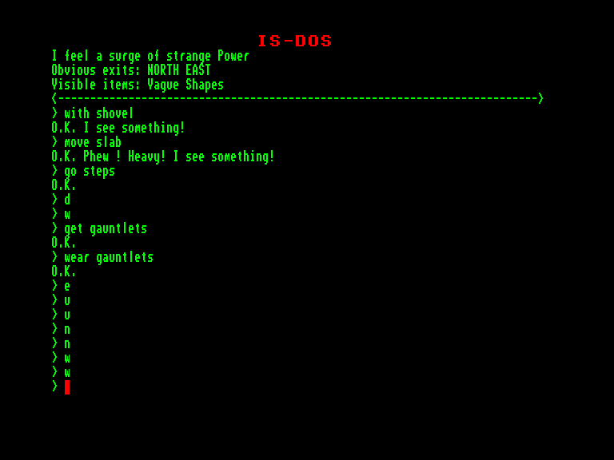

[0-9](../0/games-0.md) - [A](../a/games-a.md) - [B](../b/games-b.md) - [C](../c/games-c.md) - [D](../d/games-d.md) - [E](../e/games-e.md) - [F](../f/games-f.md) - [G](../g/games-g.md) - [H](../h/games-h.md) - [I](../i/games-i.md) - [J](../j/games-j.md) - [K](../k/games-k.md) - [L](../l/games-l.md) - [M](../m/games-m.md) - [N](../n/games-n.md) - [O](../o/games-o.md) - [P](../p/games-p.md) - [Q](../q/games-q.md) - [R](../r/games-r.md) - [S](../s/games-s.md) - [T](../t/games-t.md) - [U](../u/games-u.md) - [V](../v/games-v.md) - [W](../w/games-w.md) - [X](../x/games-x.md) - [Y](../y/games-y.md) - [Z](../z/games-z.md)

Ігри для [Enterprise 64k](../games-ep64.md) - [Enterprise 128k+RAMexp](../games-epramexp.md) - [2dfx](../games-2dfx.md)

Ігри для систем [IS-DOS](../games-is-dos.md) - [SymbOS](../games-symbos.md) - [EDC Windows](../games-edcw.md)

Ігри для емуляторів [ZX Spectrum 48k/128k](../zxemu/games-zxemu.md) - [Amstrad CPC](../cpcemu/games-cpc.md) - [Sinclair ZX81](../zx81emu/games-zx81.md) - [Videoton TVC](../tvcemu/games-tvc.md) - [Commodore VIC-20](../vic20emu/games-vic20.md)

----------

# Feasibility Experiment

**Альтернативні назви:**
 - Mysterious Adventures 7 - Feasibility Experiment

**ID:** feasibility-experiment-zcode

**Жанри:** Текстова пригода

## Примітка

ℹ Мультиплатформенна гра на рушії Z-machine від Infocom.

## Скріншоти

## Опис

Далеко за найвіддаленішою галактикою нашого всесвіту, поза межами найсміливіших фантазій смертної людини, лежить новонароджений світ. Світ, штучно створений із сировини всесвіту. Ретельно виплеканий чистими розумовими процесами істот, чий інтелект незмірно перевершує наш власний. Істот, які не мають фізичної форми, а існують лише як хмари чистої ментальної енергії, здатні проектувати свою волю на безкінечні відстані.  

У геометричному центрі цього штучного світу розташована величезна печера, створена цими істотами як місце поклоніння. Єдиним самітнім об'єктом поклоніння в цьому святилищі є статуя, висічена за образом смертної людини. На постаменті цієї статуї викарбувано три слова: ОЛЕКСАНДР МАКЕДОНСЬКИЙ.  

За мільйони наших років після того, як ці істоти відкинули свої фізичні оболонки як нестерпний тягар, їхнє сприйняття затьмарило катастрофічне видіння власної безпорадності. Після еонів блукань всесвітом, захоплені власною здатністю створювати чи знищувати цілі галактики за найменшою забаганкою, вони повільно усвідомили свою згубну ваду... цілковиту нездатність відтворити єдине, що могло б забезпечити їхнє вічне існування — самих себе.  

Коли їхні сили почали згасати, а енергія — повільно розсіюватися безкраїми просторами космосу, вони розпочали відчайдушні пошуки підтримки життєвої сили. Згодом їхні думки полинули до нашого світу, і тут вони побачили видовище великого Воїна. Вони сповнилися наснаги від цього видовища, черпаючи силу з життєвої енергії цієї харизматичної постаті. Відтак вони усамітнилися в регіоні, недосяжному для будь-кого, і створили для себе місце поклоніння, вірячи, що це поклоніння зможе гарантувати виживання їхньої раси.  

Зрештою вони зрозуміли, що цього замало: самий лише образ героя не міг їх підтримувати. Їм доведеться знайти справжнього, живого героя і черпати свою життєву силу з нього. З цією метою вони побудували на цьому штучному світі сценарій, який могли б використати для перевірки героїзму своїх піддослідних, адже їхній герой мав бути справді безстрашним, щоб задовольнити їхній голод до життєвої сили. Їхні думки знову звертаються до нашої планети...  

Коли ви спите цієї ночі, ваші сни тривожить примарний голос. Спочатку здається, що голос лагідно просить вас іти за ним. Але після вашої невиразної відмови він стає наполегливішим, зрештою переростаючи в громоподібне вимогливе закликання. Коли ваші останні залишки опору розбиваються вщент, ви різко прокидаєтеся й виявляєте, що лежите на підлозі всередині чогось, схожого на старий маєток. Підводячись і намагаючись осягнути те, що вас оточує, ви навіть не здогадуєтеся, що тепер стали об'єктом «експерименту на життєздатність».

## Основна інформація
- **Мови:** Англійська
### Загальні системні вимоги
- **Апаратні:** EXDOS
- **Програмні:** IS-DOS
### Геймплей
- **Керування:** Keyboard
- **Кількість гравців:** 1 player
- **Додаткові теги:** Z-code
### Розробка
- **Рік випуску:** 1983
- **Автор:** Brian Howarth, Wherner Barnes

## Посилання
- [Інформація про гру (SolutionArchive.com)](https://solutionarchive.com/game/id%2C201/Feasibility+Experiment.html)
- [Завантажити](https://www.ifarchive.org/if-archive/games/inform/mysterious_inform.zip)

## [Керування](../controllers.md)

`Keyboard`

## Детальна інформація

### Історія розробки  

Сьома гра у серії «Mysterious Adventures»  

Браян Гаварт написав свої одинадцять текстових пригод «Mysterious Adventures» у 1981–1983 роках, початково як суто текстові ігри (саме так вони представлені тут). Пізніші версії (Spectrum, C64) мали контурну графіку. Усі файли даних є конверсіями з версій для Spectrum/C64 (але без графіки). Браян Гаварт дав свій дозвіл на завантаження ігор до IF Archive.