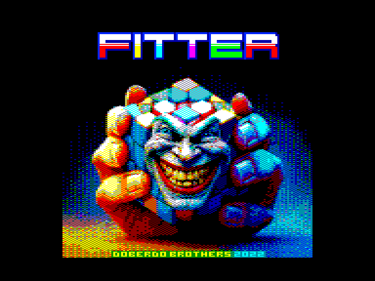
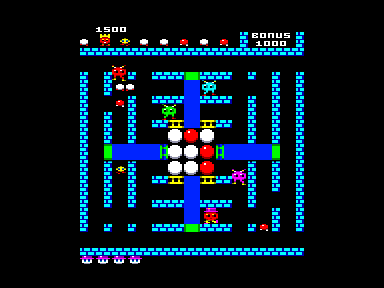
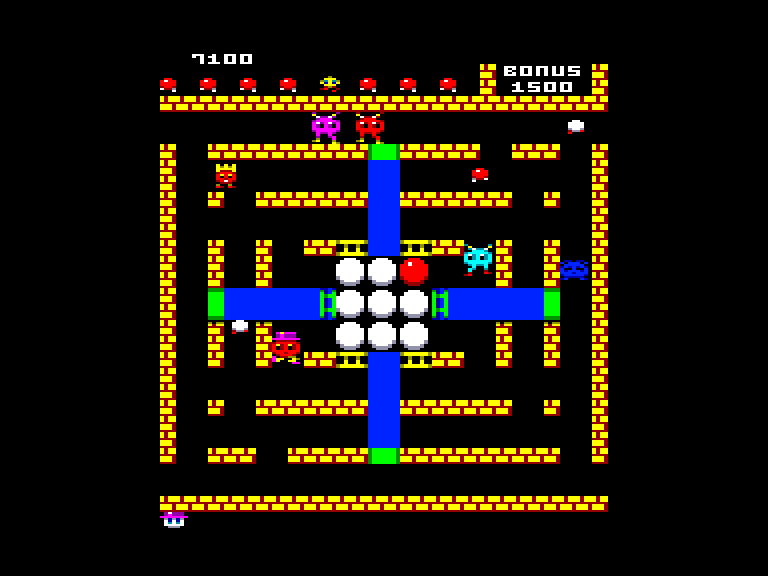
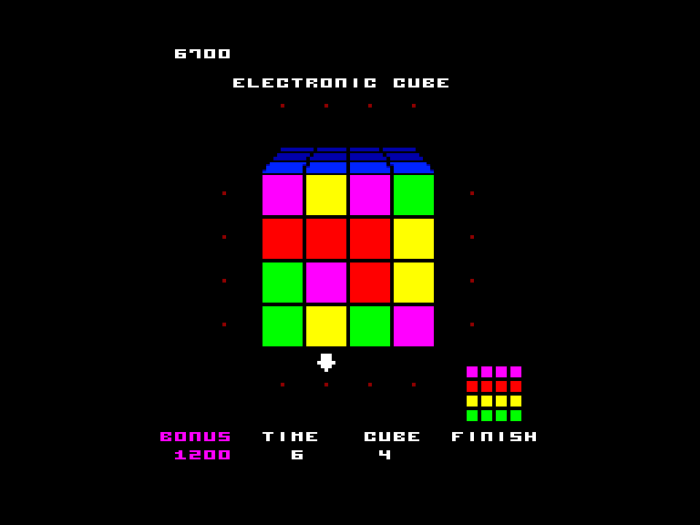

[0-9](../0/games-0.md) - [A](../a/games-a.md) - [B](../b/games-b.md) - [C](../c/games-c.md) - [D](../d/games-d.md) - [E](../e/games-e.md) - [F](../f/games-f.md) - [G](../g/games-g.md) - [H](../h/games-h.md) - [I](../i/games-i.md) - [J](../j/games-j.md) - [K](../k/games-k.md) - [L](../l/games-l.md) - [M](../m/games-m.md) - [N](../n/games-n.md) - [O](../o/games-o.md) - [P](../p/games-p.md) - [Q](../q/games-q.md) - [R](../r/games-r.md) - [S](../s/games-s.md) - [T](../t/games-t.md) - [U](../u/games-u.md) - [V](../v/games-v.md) - [W](../w/games-w.md) - [X](../x/games-x.md) - [Y](../y/games-y.md) - [Z](../z/games-z.md)

Ігри для [Enterprise 64k](../games-ep64.md) - [Enterprise 128k+RAMexp](../games-epramexp.md)

Ігри для систем [IS-DOS](../games-is-dos.md) - [SymbOS](../games-symbos.md) - [EDC Windows](../games-edcw.md)

Ігри для емуляторів [ZX Spectrum 48k/128k](../zxemu/games-zxemu.md) - [Amstrad CPC](../cpcemu/games-cpc.md) - [Sinclair ZX81](../zx81emu/games-zx81.md) - [Videoton TVC](../tvcemu/games-tvc.md) - [Commodore VIC-20](../vic20emu/games-vic20.md)

----------

# Fitter

**ID:** fitter-tvc

**Жанри:** Аркада, Логічна

## Примітка

ℹ Гра створена на основі версії для платформи Videoton TVC.  
Є неофіційною версією гри Fitter з аркадних автоматів від компанії Taito.

## Скріншоти

## Опис

Fitter - це гра на кмітливість та логіку. Мета гри - зібрати викрадений тролями кубик Рубіка якомога більше разів.

## Основна інформація
- **Мови:** Англійська
- **Оригінальна платформа:** Videoton TVC
### Загальні системні вимоги
- **Апаратні:** EP128
### Геймплей
- **Керування:** Internal Joy
- **Кількість гравців:** 1 player
- **Додаткові теги:** 16-color mode
### Розробка
- **Рік випуску:** 2022
- **Компанія:** Doberdo Brothers

## Посилання
- [Домашня сторінка гри](https://www.doberdobrothers.hu/?page_id=2854)
- [Опис гри на ep128.hu (угорською)](http://www.ep128.hu/Ep_Games/Leiras/Fitter.htm)
- [Завантажити гру](http://www.ep128.hu/Ep_Games/Prg/Fitter.rar)
- [Завантажити гру](http://doberdobrothers.hu/ep128_files/fitter_ep128.rar)
- [Easy Load&Play](https://t.me/EP128k_Load_n_Play/761) *(Telegram-канал Vibrant Waves)*

## Відео

<iframe src="https://www.youtube.com/embed/WCpbbhbd62A"  
style="width:75%; aspect-ratio:16/9;" allowfullscreen></iframe>

## Керування

### Елементи керування меню:  

`S`: Почати нову гру  

### Основні елементи керування:  

`Internal Joystick`

## Детальна інформація

## Системні вимоги  

### Мінімальні системні вимоги  

Оперативна пам'ять: **128 КБ**  

### Геймплей  

Безпосередній доступ до кубика можна отримати, замінивши 9 білих кульок, розташованих у центрі екрану, на червоні. До кульок є три входи з кожного боку, які по черзі можуть бути закритими. Нова сфера, створена в точці входу, буде того ж кольору що і ви, при цьому стани відкритих/закритих воріт камери змінюються на протилежні, а ви, вийшовши з протилежної сторони, стаєте білого кольору.  

Крім вас та колобків, у лабіринті будуть гуляти страшні тролі (які просинаються один за одним). Ось до них у лапи краще не попадати.  

Щоб поміняти свій колір на червоний необхідно спіймати колобка того ж кольору, але якщо схопити білого колобка, то ви знову станете білого кольору. Час від часу на екрані буде з'являтись жовтий ліліпут і якщо піймати його, то усі червоні колобки перетворяться у білі (тому його краще оминати стороною). А якщо вам пощастить наздогнати королівського колобка, то крім бонусних балів ви перетворите усіх колобків на червоних, тролі засинають на деякий час. Колобки виходять на прогулянку по черзі (яку ви зможете побачити у верхній частині екрану), тому якщо ви не бачите червоних колобків, то буде достатньо спіймати декількох білих.  

Коли, нарешті, усі кульки стануть червоними, перед вами постане інше завдання. Внизу екрана з'явиться триколірний візерунок 3×3 або 4×4, а в центрі екрана відобразиться дещо інший триколірний куб відповідного розміру. Ви можете пересувати плитки кубика в напрямку стрілки, яка рухається по краю. Якщо до закінчення часу ви розташуєте плитки в потрібному порядку, то отримаєте бонусні очки і ще один перемішаний куб (спочатку розміром 3×3, а потім і 4×4). Коли час закінчується, ви повертаєтеся до ігрового екрану, щоб знову почати розфарбовувати сфери в червоний колір.  

### Нарахування балів  

- Королівський колобок — 500 балів  
- Червоний колобок — 200 балів  
- Білий колобок — 100 балів