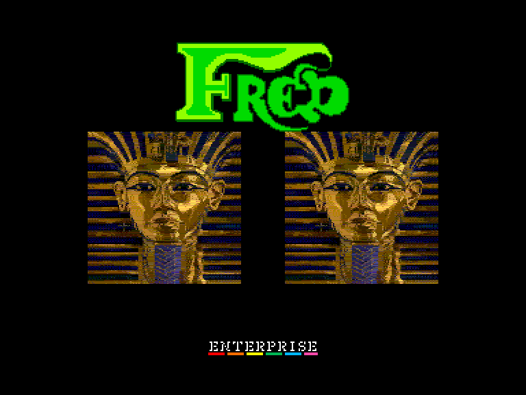
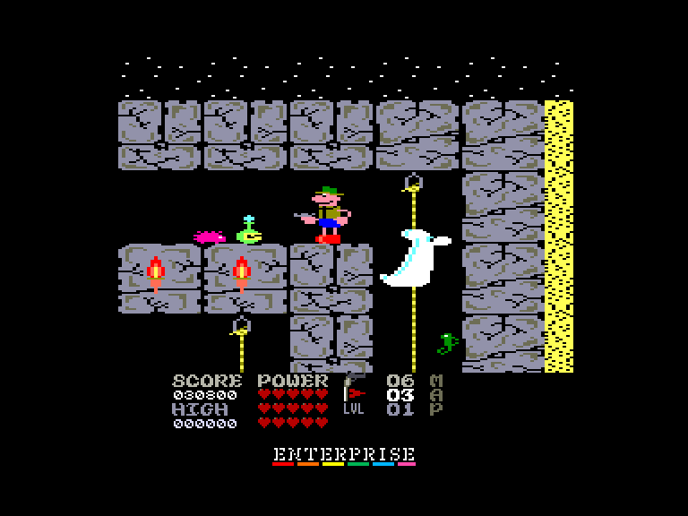
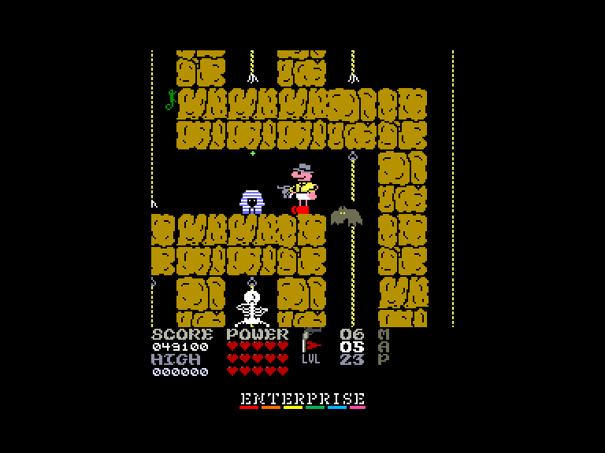
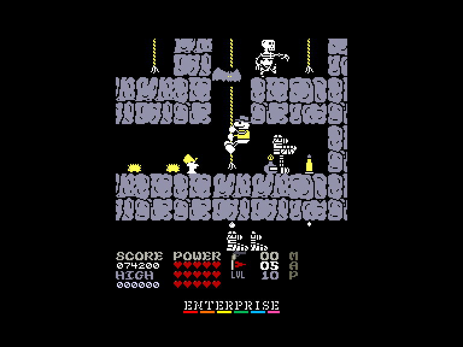

[0-9](../0/games-0.md) - [A](../a/games-a.md) - [B](../b/games-b.md) - [C](../c/games-c.md) - [D](../d/games-d.md) - [E](../e/games-e.md) - [F](../f/games-f.md) - [G](../g/games-g.md) - [H](../h/games-h.md) - [I](../i/games-i.md) - [J](../j/games-j.md) - [K](../k/games-k.md) - [L](../l/games-l.md) - [M](../m/games-m.md) - [N](../n/games-n.md) - [O](../o/games-o.md) - [P](../p/games-p.md) - [Q](../q/games-q.md) - [R](../r/games-r.md) - [S](../s/games-s.md) - [T](../t/games-t.md) - [U](../u/games-u.md) - [V](../v/games-v.md) - [W](../w/games-w.md) - [X](../x/games-x.md) - [Y](../y/games-y.md) - [Z](../z/games-z.md)

Ігри для [Enterprise 64k](../games-ep64.md) - [Enterprise 128k+RAMexp](../games-epramexp.md) - [2dfx](../games-2dfx.md)

Ігри для систем [IS-DOS](../games-is-dos.md) - [SymbOS](../games-symbos.md) - [EDC Windows](../games-edcw.md)

Ігри для емуляторів [ZX Spectrum 48k/128k](../zxemu/games-zxemu.md) - [Amstrad CPC](../cpcemu/games-cpc.md) - [Sinclair ZX81](../zx81emu/games-zx81.md) - [Videoton TVC](../tvcemu/games-tvc.md) - [Commodore VIC-20](../vic20emu/games-vic20.md)

----------

# Fred: Reloaded

**ID:** fred-reloaded

## Скріншоти

## Опис

(temporary description generated by AI [ChatGPT])

**Опис гри:**
У грі "Fred" ви берете на себе роль археолога, який опинився в пастці під пірамідою, блукаючи в підземному лабіринті між привидами та муміями. Ваша мета — вибратися з темних коридорів, збираючи при цьому скарби. Гра має яскраву графіку та атмосферний звук, що робить її захоплюючою.

**Правила гри:**
1. Використовуйте клавіші Q, A, O, P та SPACE для управління персонажем. Ви також можете налаштувати управління для джойстика.
2. Гра має кілька графічних режимів на вибір: 4 кольори, 16 кольорів, а також варіанти з атрибутами.
3. Ви можете змінювати швидкість гри за допомогою функціональних клавіш (F1-F4).
4. Додаткові можливості: безмежна енергія (F4), максимальна кількість боєприпасів (F6), вмикання/вимикання звуку та музики (F7, F8).
5. Гра зберігає ваші досягнення та підходить для комп'ютерів з мінімум 112 КБ пам'яті. 

Готові до пригод? Вперед у лабіринт!

## Основна інформація
- **Оригінальна платформа:** ZX Spectrum
Amstrad CPC

## Посилання
- [Опис на ep128.hu (угорською)](http://www.ep128.hu/Ep_Games/Leiras/Fred.htm)
- [Завантажити](http://www.ep128.hu/Ep_Games/Prg/Fred_Reloaded.rar)
- [Easy Load&Play](https://t.me/EP128k_Load_n_Play/342) *(Telegram-канал Vibrant Waves)*

