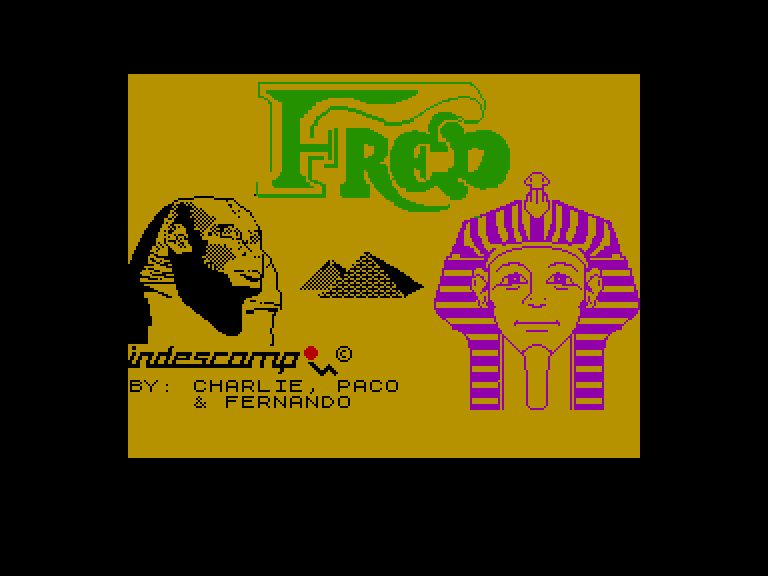
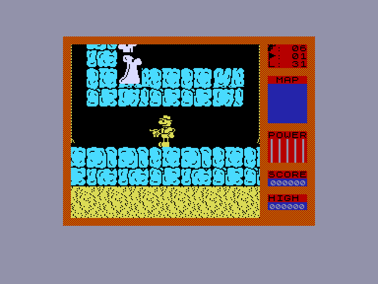
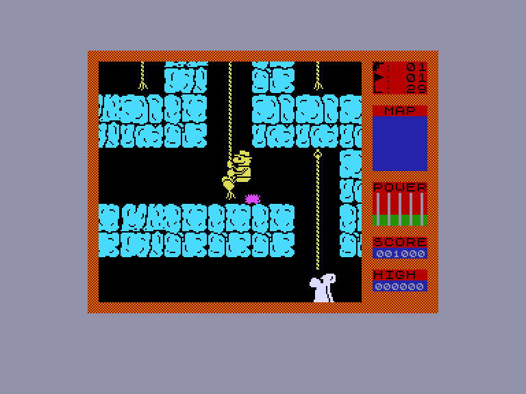
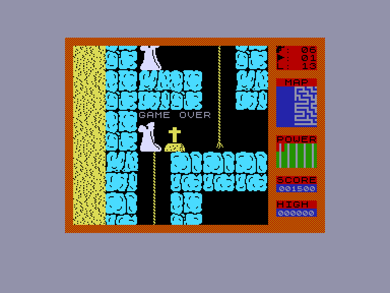

[0-9](../0/games-0.md) - [A](../a/games-a.md) - [B](../b/games-b.md) - [C](../c/games-c.md) - [D](../d/games-d.md) - [E](../e/games-e.md) - [F](../f/games-f.md) - [G](../g/games-g.md) - [H](../h/games-h.md) - [I](../i/games-i.md) - [J](../j/games-j.md) - [K](../k/games-k.md) - [L](../l/games-l.md) - [M](../m/games-m.md) - [N](../n/games-n.md) - [O](../o/games-o.md) - [P](../p/games-p.md) - [Q](../q/games-q.md) - [R](../r/games-r.md) - [S](../s/games-s.md) - [T](../t/games-t.md) - [U](../u/games-u.md) - [V](../v/games-v.md) - [W](../w/games-w.md) - [X](../x/games-x.md) - [Y](../y/games-y.md) - [Z](../z/games-z.md)

Ігри для [Enterprise 64k](../games-ep64.md) - [Enterprise 128k+RAMexp](../games-epramexp.md)

Ігри для систем [IS-DOS](../games-is-dos.md) - [SymbOS](../games-symbos.md) - [EDC Windows](../games-edcw.md)

Ігри для емуляторів [ZX Spectrum 48k/128k](../zxemu/games-zxemu.md) - [Amstrad CPC](../cpcemu/games-cpc.md) - [Sinclair ZX81](../zx81emu/games-zx81.md) - [Videoton TVC](../tvcemu/games-tvc.md) - [Commodore VIC-20](../vic20emu/games-vic20.md)

----------

# Fred

**ID:** fred-zx

## Скріншоти

## Опис

(temporary description generated by AI [ChatGPT])

**Опис гри:**
У грі ви виступаєте в ролі археолога, який блукає єгипетською гробницею, намагаючись вибратися з неї, зібравши якомога більше археологічних знахідок. Кожен вихід на новий рівень ускладнює лабіринт. Гра має унікальний механізм, де "камера" слідує за вашим персонажем, що створює динамічний ігровий процес. Ви можете пересуватися, стрибати та лазити по мотузяних драбинах, намагаючись уникнути небезпек, таких як привиди, щури, скорпіони, кажани та скелети.

**Правила гри:**
1. Вашою метою є підніматися вгору, до поверхні, уникаючи ворогів.
2. Вороги мають певний маршрут, але привиди можуть літати вільно.
3. Ви можете обійти або знищити ворогів, використовуючи обмежену кількість боєприпасів (6).
4. Якщо ви доторкнетеся до ворога, зменшиться ваша енергія (15 одиниць).
5. Відновити енергію можна, виходячи з лабіринту або знаходячи фляги з водою.
6. Гра має обмежене життя — 1.
7. Ви можете управляти грою за допомогою джойстика або клавіатури (Q - вліво, W - вправо, E - вниз, R - вгору, T - стріляти).
8. Не намагайтеся малювати карту, оскільки лабіринти генеруються випадковим чином.

Гра пропонує можливість зупинити гру натисканням клавіші "M" і вибрати подальші дії: продовжити гру, згенерувати новий рівень або використати медичний пакет.

## Основна інформація
- **Оригінальна платформа:** ZX Spectrum

## Посилання
- [Опис гри на ep128.hu (угорською)](http://www.ep128.hu/Games/Fred.htm)
- [Інформація про оригінальну версію](https://spectrumcomputing.co.uk/entry/1858/ZX-Spectrum/Fred)
- [Завантажити гру](http://www.ep128.hu/Ep_Games/Prg/Fred.rar)

**Дата генерації:** 29.07.2026

