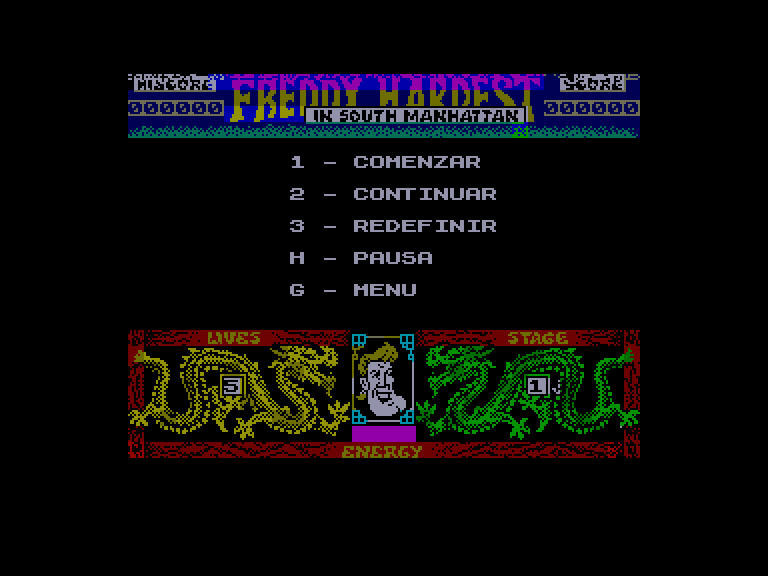
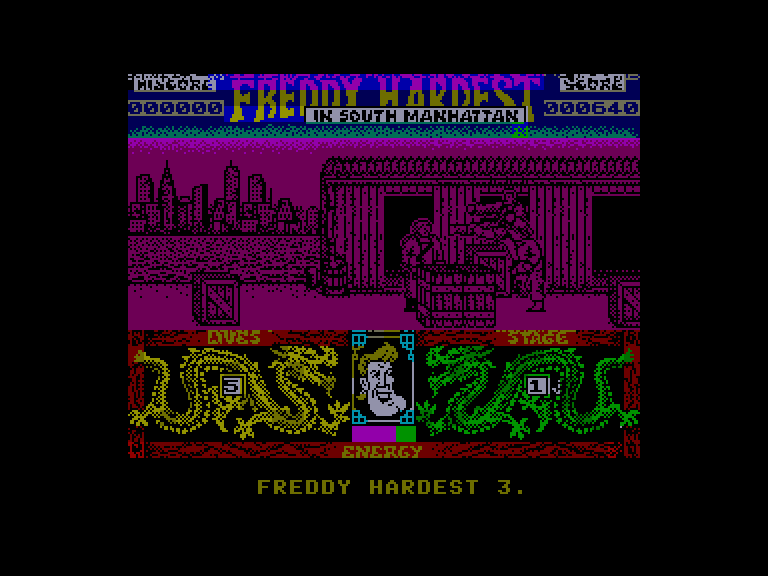
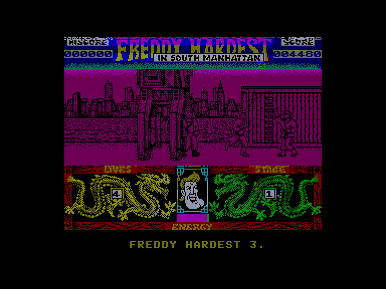
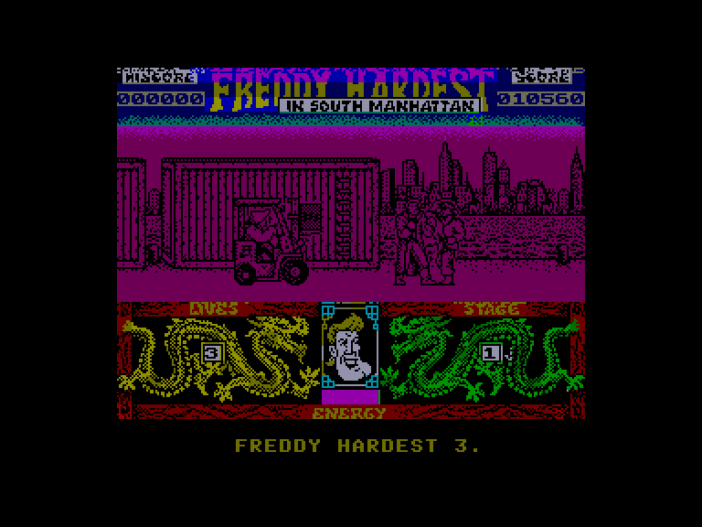

[0-9](../0/games-0.md) - [A](../a/games-a.md) - [B](../b/games-b.md) - [C](../c/games-c.md) - [D](../d/games-d.md) - [E](../e/games-e.md) - [F](../f/games-f.md) - [G](../g/games-g.md) - [H](../h/games-h.md) - [I](../i/games-i.md) - [J](../j/games-j.md) - [K](../k/games-k.md) - [L](../l/games-l.md) - [M](../m/games-m.md) - [N](../n/games-n.md) - [O](../o/games-o.md) - [P](../p/games-p.md) - [Q](../q/games-q.md) - [R](../r/games-r.md) - [S](../s/games-s.md) - [T](../t/games-t.md) - [U](../u/games-u.md) - [V](../v/games-v.md) - [W](../w/games-w.md) - [X](../x/games-x.md) - [Y](../y/games-y.md) - [Z](../z/games-z.md)

Ігри для [Enterprise 64k](../games-ep64.md) - [Enterprise 128k+RAMexp](../games-epramexp.md) - [2dfx](../games-2dfx.md)

Ігри для систем [IS-DOS](../games-is-dos.md) - [SymbOS](../games-symbos.md) - [EDC Windows](../games-edcw.md)

Ігри для емуляторів [ZX Spectrum 48k/128k](../zxemu/games-zxemu.md) - [Amstrad CPC](../cpcemu/games-cpc.md) - [Sinclair ZX81](../zx81emu/games-zx81.md) - [Videoton TVC](../tvcemu/games-tvc.md) - [Commodore VIC-20](../vic20emu/games-vic20.md)

----------

# Freddy Hardest in South Manhattan

**ID:** freddy-hardest2-zx

## Скріншоти

## Опис

(temporary description generated by AI [Assistant])

**Опис гри: Freddy Hardest 2**  
У грі "Freddy Hardest 2" наш друг Фредді повертається, щоб навести порядок у портовому районі Манхеттена, де на нього чекають численні вороги. Гравець має пройти п'ять рівнів, борючись з ворогами, які намагаються його зупинити. Використовуючи свої навички бою, Фредді повинен уникати атак і перемагати супротивників, щоб зберегти свою енергію та життя.

**Правила гри:**
1. **Керування:**  
   - Стрілки вліво/вправо — рухатися в відповідному напрямку.
   - Кнопка вогню — атакувати кулаком.
   - Кнопка вгору — стрибати і бити ворога ногою.
   - Кнопка вниз — виконувати підсічку (ефективно тільки проти щурів).

2. **Цілі:**  
   - Пройти всі п'ять рівнів, борючись з ворогами та збираючи очки.
   - Уникати атак ворогів, щоб не втратити енергію.
   - Відновлювати енергію, стоячи на місці, якщо це можливо.

3. **Елементи інтерфейсу:**  
   - Лівий нижній кут: кількість життів (Lives).
   - Правий нижній кут: рівень складності (Stage).
   - Верхня частина екрану: поточний рахунок (Score) та найвищий рахунок (Hiscore).

4. **Додаткові можливості:**  
   - Гравець може використовувати POKE команди для зміни кількості життів чи отримання безкінечних життів.

Готуйтеся до захоплюючих битв і цікавих пригод разом із Фредді!

## Основна інформація
- **Оригінальна платформа:** ZX Spectrum

## Посилання
- [Опис на ep128.hu (угорською)](http://www.ep128.hu/Games/Freddy_Hardest2.htm)
- [Інформація про оригінальну версію](https://spectrumcomputing.co.uk/entry/1863/ZX-Spectrum/Freddy_Hardest_en_Manhattan_Sur)
- [Завантажити](http://www.ep128.hu/Ep_Games/Prg/Freddy_Hardest2.rar)

