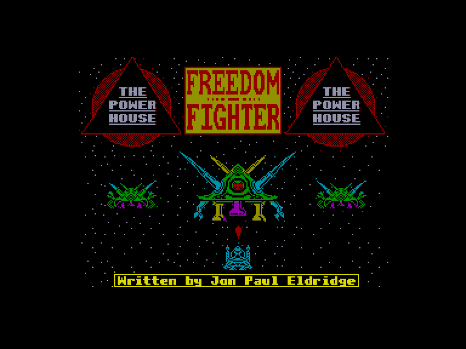
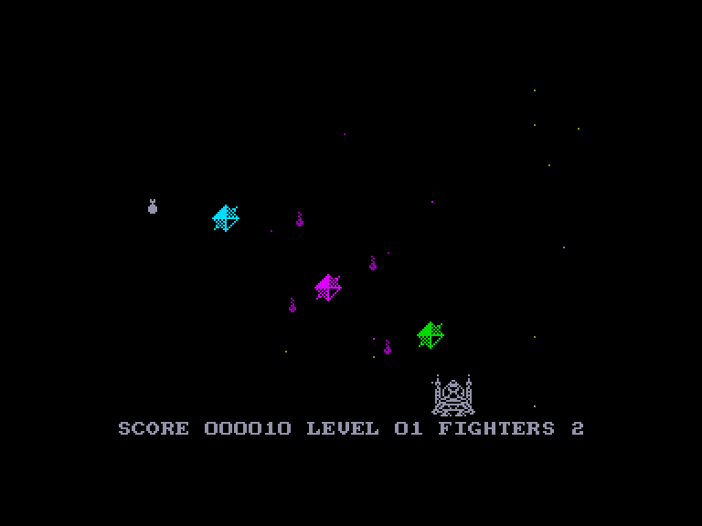
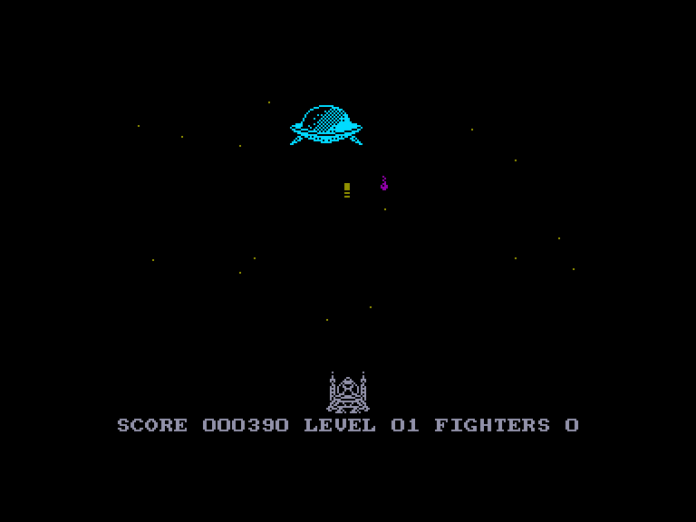
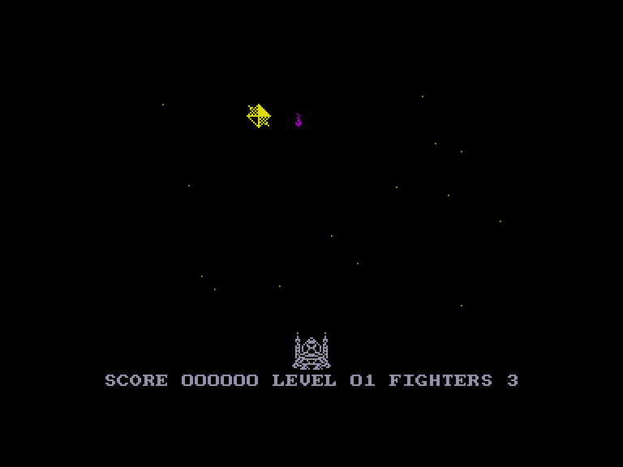

[0-9](../0/games-0.md) - [A](../a/games-a.md) - [B](../b/games-b.md) - [C](../c/games-c.md) - [D](../d/games-d.md) - [E](../e/games-e.md) - [F](../f/games-f.md) - [G](../g/games-g.md) - [H](../h/games-h.md) - [I](../i/games-i.md) - [J](../j/games-j.md) - [K](../k/games-k.md) - [L](../l/games-l.md) - [M](../m/games-m.md) - [N](../n/games-n.md) - [O](../o/games-o.md) - [P](../p/games-p.md) - [Q](../q/games-q.md) - [R](../r/games-r.md) - [S](../s/games-s.md) - [T](../t/games-t.md) - [U](../u/games-u.md) - [V](../v/games-v.md) - [W](../w/games-w.md) - [X](../x/games-x.md) - [Y](../y/games-y.md) - [Z](../z/games-z.md)

Ігри для [Enterprise 64k](../games-ep64.md) - [Enterprise 128k+RAMexp](../games-epramexp.md)

Ігри для систем [IS-DOS](../games-is-dos.md) - [SymbOS](../games-symbos.md) - [EDC Windows](../games-edcw.md)

Ігри для емуляторів [ZX Spectrum 48k/128k](../zxemu/games-zxemu.md) - [Amstrad CPC](../cpcemu/games-cpc.md) - [Sinclair ZX81](../zx81emu/games-zx81.md) - [Videoton TVC](../tvcemu/games-tvc.md) - [Commodore VIC-20](../vic20emu/games-vic20.md)

----------

# Freedom Fighter

**ID:** freedom-fighter-zx

## Скріншоти

## Опис

(temporary description generated by AI [ChatGPT])

**Опис гри: Freedom Fighter**

У грі "Freedom Fighter" вам належить взяти на себе роль пілота космічного корабля, щоб протистояти вторгненню зловмисних інопланетян. Ваше завдання полягає в знищенні ворожих кораблів та великого космічного судна, яке намагається вас атакувати. Гра складається з двох частин: у першій ви боретеся з ворожими ескадрами, а в другій - з величезним космічним кораблем. Під час гри вам потрібно не лише знищувати ворогів, а й ловити білі бомби, які падають з неба, щоб уникнути вибуху.

**Правила гри:**
1. Ваш космічний корабель можна переміщати горизонтально по нижній частині екрану та літати вперед до нижньої третини екрану.
2. Для управління використовуйте:
   - 'K' - вгору
   - 'M' - вниз
   - 'Z' - вліво
   - 'X' - вправо
   - 'L' - стріляти
   - 'Q' - вийти з гри
   - 'P' - призупинити гру (продовження: натисніть клавішу стрільби).
3. Якщо ви втратите життя, гра не почнеться спочатку, а зберігатиме ваші досягнення.
4. За проходження кожного рівня складності ви отримуєте додаткове життя.
5. Не забувайте ловити бомби, які падають, щоб уникнути вибуху.

Приготуйтеся до захоплюючої космічної битви!

## Основна інформація
- **Оригінальна платформа:** ZX Spectrum

## Посилання
- [Опис гри на ep128.hu (угорською)](http://www.ep128.hu/Games/Freedom_Fighter.htm)
- [Інформація про оригінальну версію](https://spectrumcomputing.co.uk/entry/1867/ZX-Spectrum/Freedom_Fighter)
- [Завантажити гру](http://www.ep128.hu/Ep_Games/Prg/Freedom_Fighter.rar)

