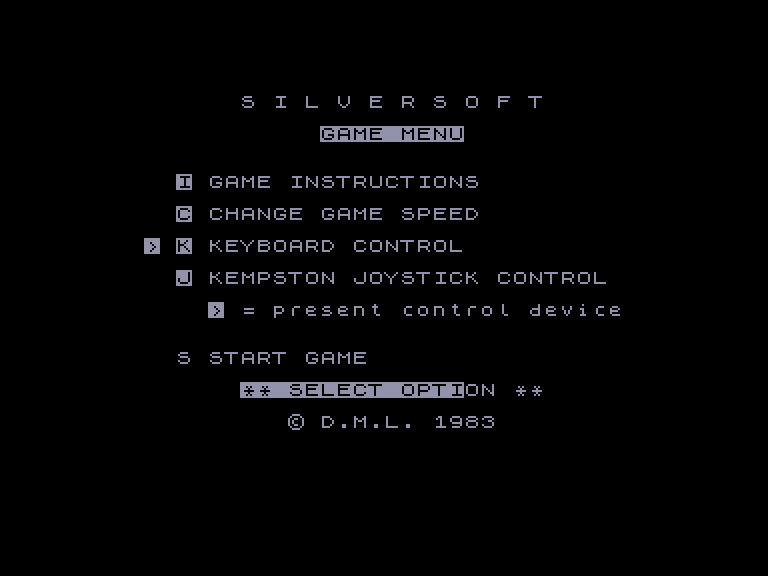
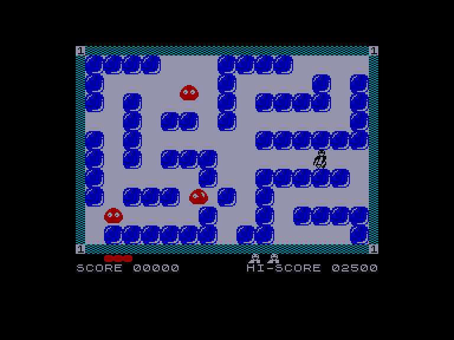
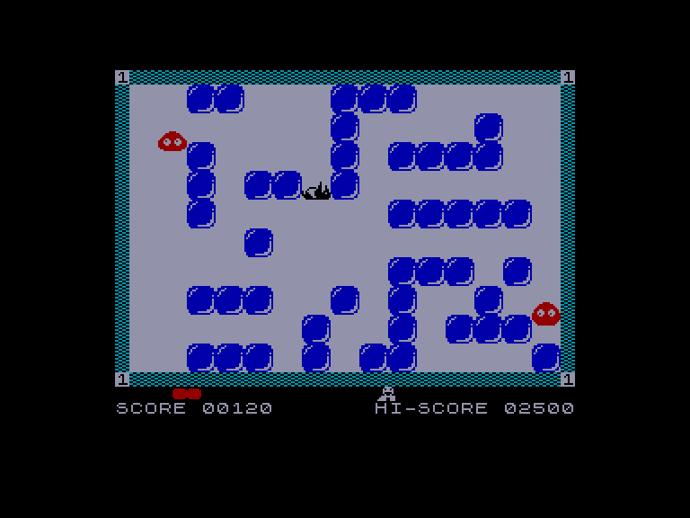

[0-9](../0/games-0.md) - [A](../a/games-a.md) - [B](../b/games-b.md) - [C](../c/games-c.md) - [D](../d/games-d.md) - [E](../e/games-e.md) - [F](../f/games-f.md) - [G](../g/games-g.md) - [H](../h/games-h.md) - [I](../i/games-i.md) - [J](../j/games-j.md) - [K](../k/games-k.md) - [L](../l/games-l.md) - [M](../m/games-m.md) - [N](../n/games-n.md) - [O](../o/games-o.md) - [P](../p/games-p.md) - [Q](../q/games-q.md) - [R](../r/games-r.md) - [S](../s/games-s.md) - [T](../t/games-t.md) - [U](../u/games-u.md) - [V](../v/games-v.md) - [W](../w/games-w.md) - [X](../x/games-x.md) - [Y](../y/games-y.md) - [Z](../z/games-z.md)

Ігри для [Enterprise 64k](../games-ep64.md) - [Enterprise 128k+RAMexp](../games-epramexp.md)

Ігри для систем [IS-DOS](../games-is-dos.md) - [SymbOS](../games-symbos.md) - [EDC Windows](../games-edcw.md)

Ігри для емуляторів [ZX Spectrum 48k/128k](../zxemu/games-zxemu.md) - [Amstrad CPC](../cpcemu/games-cpc.md) - [Sinclair ZX81](../zx81emu/games-zx81.md) - [Videoton TVC](../tvcemu/games-tvc.md) - [Commodore VIC-20](../vic20emu/games-vic20.md)

----------

# Freez'Bees

**ID:** freezbees-zx

## Скріншоти

## Опис

(temporary description generated by AI [ChatGPT])

**Опис гри: Freez' Bees**

Freez' Bees — це екшн-гра, в якій ви граєте за пінгвіна, що намагається знищити рій бджіл, штовхаючи блоки, щоб вдарити їх, поки вони рухаються. Гравець повинен уникати контакту з бджолами та використовувати блоки, щоб змінювати ландшафт рівня. Якщо ви зможете доторкнутися до червоних коконів бджіл до їх вилуплення, отримаєте бонусні очки та зменшите кількість бджіл. Гра містить 10 різних швидкостей гри та елементи головоломки.

**Правила гри:**
1. Гравець керує пінгвіном, який може штовхати блоки.
2. Мета гри — знищити бджіл, штовхаючи блоки так, щоб вони вдарили в них.
3. Уникайте контакту з бджолами, щоб не програти.
4. Доторкніться до червоних коконів, щоб отримати бонусні очки.
5. Завершуйте рівні швидко, щоб отримати додаткові бонуси.
6. Гра має 10 швидкостей, які ускладнюють гру.

## Основна інформація
- **Оригінальна платформа:** ZX Spectrum

## Посилання
- [Інформація про оригінальну версію](https://spectrumcomputing.co.uk/entry/1870/ZX-Spectrum/FreezBees)

