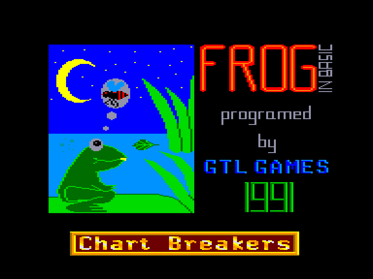
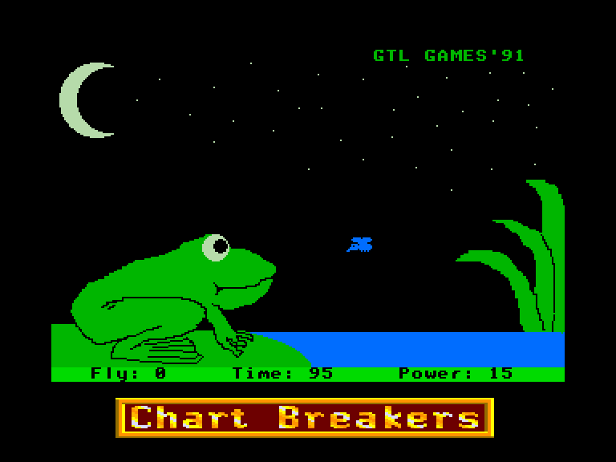
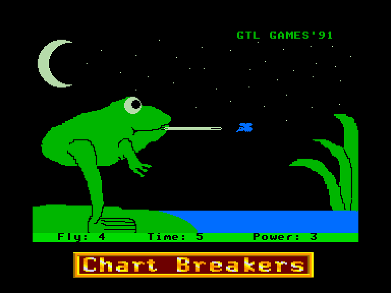
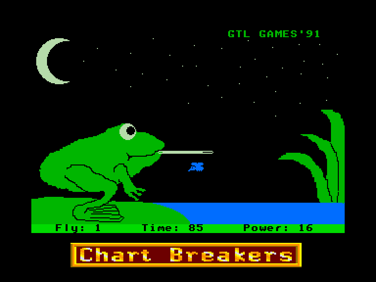

[0-9](../0/games-0.md) - [A](../a/games-a.md) - [B](../b/games-b.md) - [C](../c/games-c.md) - [D](../d/games-d.md) - [E](../e/games-e.md) - [F](../f/games-f.md) - [G](../g/games-g.md) - [H](../h/games-h.md) - [I](../i/games-i.md) - [J](../j/games-j.md) - [K](../k/games-k.md) - [L](../l/games-l.md) - [M](../m/games-m.md) - [N](../n/games-n.md) - [O](../o/games-o.md) - [P](../p/games-p.md) - [Q](../q/games-q.md) - [R](../r/games-r.md) - [S](../s/games-s.md) - [T](../t/games-t.md) - [U](../u/games-u.md) - [V](../v/games-v.md) - [W](../w/games-w.md) - [X](../x/games-x.md) - [Y](../y/games-y.md) - [Z](../z/games-z.md)

Ігри для [Enterprise 64k](../games-ep64.md) - [Enterprise 128k+RAMexp](../games-epramexp.md)

Ігри для систем [IS-DOS](../games-is-dos.md) - [SymbOS](../games-symbos.md) - [EDC Windows](../games-edcw.md)

Ігри для емуляторів [ZX Spectrum 48k/128k](../zxemu/games-zxemu.md) - [Amstrad CPC](../cpcemu/games-cpc.md) - [Sinclair ZX81](../zx81emu/games-zx81.md) - [Videoton TVC](../tvcemu/games-tvc.md) - [Commodore VIC-20](../vic20emu/games-vic20.md)

----------

# Frog

**ID:** frog-bas

## Скріншоти

## Опис

(temporary description generated by AI Assistant)

**Опис гри:**

"Frog" - це проста гра на спритність, розроблена компанією GTL Games у 1991 році. У цій грі гравець керує жабою, яка повинна зловити якомога більше мух за 99 одиниць часу. Мухи рухаються хаотично, і гравець може "націлюватися" на них, переміщуючи жабу вгору і вниз за допомогою джойстика, а натискаючи кнопку "вогонь" (SPACE), витягує язик, щоб зловити муху. Гравці можуть також налаштувати своє ім'я та отримати детальну допомогу в меню.

**Правила гри:**
1. Гравець має 99 одиниць часу для ловлі мух.
2. Для націлювання на мух використовуйте джойстик для переміщення жаби вгору та вниз.
3. Натискайте кнопку "вогонь" (SPACE), щоб витягнути язик і зловити муху.
4. Для входу в меню натисніть "вниз" + "вогонь" (SPACE).
5. Якщо гравець зловить більше 25 мух, він отримує титул "супер жаби".
6. Гра закінчується, коли закінчується час, після чого програма оцінює результати гравця.

## Основна інформація
- **Мови:** Англійська
### Загальні системні вимоги
- **Програмні:** IS-Basic
### Геймплей
- **Керування:** Internal Joy, External Joy 1
- **Додаткові теги:** PaintBox images

## Посилання
- [Опис гри на ep128.hu (угорською)](http://www.ep128.hu/Ep_Games/Leiras/Frog.htm)
- [Завантажити гру](http://www.ep128.hu/Ep_Games/Prg/Frog.rar)

