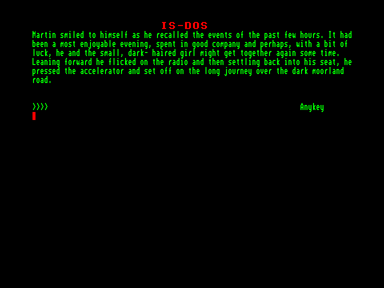
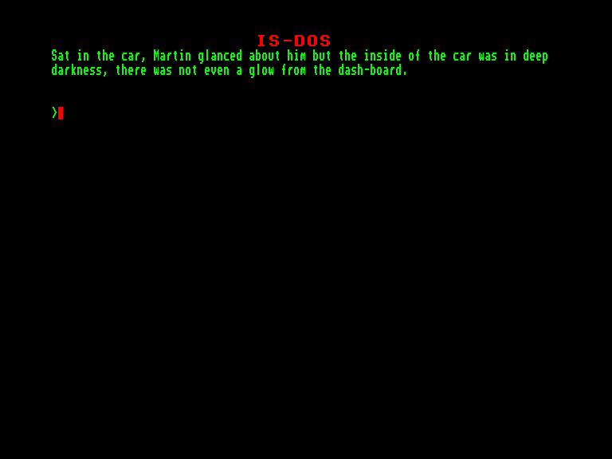

[0-9](../0/games-0.md) - [A](../a/games-a.md) - [B](../b/games-b.md) - [C](../c/games-c.md) - [D](../d/games-d.md) - [E](../e/games-e.md) - [F](../f/games-f.md) - [G](../g/games-g.md) - [H](../h/games-h.md) - [I](../i/games-i.md) - [J](../j/games-j.md) - [K](../k/games-k.md) - [L](../l/games-l.md) - [M](../m/games-m.md) - [N](../n/games-n.md) - [O](../o/games-o.md) - [P](../p/games-p.md) - [Q](../q/games-q.md) - [R](../r/games-r.md) - [S](../s/games-s.md) - [T](../t/games-t.md) - [U](../u/games-u.md) - [V](../v/games-v.md) - [W](../w/games-w.md) - [X](../x/games-x.md) - [Y](../y/games-y.md) - [Z](../z/games-z.md)

Ігри для [Enterprise 64k](../games-ep64.md) - [Enterprise 128k+RAMexp](../games-epramexp.md) - [2dfx](games-2dfx.md)

Ігри для систем [IS-DOS](../games-is-dos.md) - [SymbOS](../games-symbos.md) - [EDC Windows](../games-edcw.md)

Ігри для емуляторів [ZX Spectrum 48k/128k](../zxemu/games-zxemu.md) - [Amstrad CPC](../cpcemu/games-cpc.md) - [Sinclair ZX81](../zx81emu/games-zx81.md) - [Videoton TVC](../tvcemu/games-tvc.md) - [Commodore VIC-20](../vic20emu/games-vic20.md)

----------

# From Out of a Dark Night Sky

**ID:** from-out-of-a-dark-night-sky-isdos

**Жанри:** Текстова пригода

## Скріншоти

## Опис

(temporary description generated by AI [ChatGPT])

**Опис гри: "З темної ночі"**

У грі "З темної ночі" вам потрібно знайти та знищити всі інопланетні капсули, щоб врятувати людство від захоплення! Гра має науково-фантастичну тематику і була спочатку розроблена для платформи Spectrum. Пізніше Джон Вілсон оновив гру, створивши версії для Amstrad, C64 та Atari ST, а також браузерну версію.

**Правила гри:**
1. Використовуйте командний інтерфейс для взаємодії з ігровим світом.
2. Досліджуйте різні локації, щоб знайти інопланетні капсули.
3. Знищуйте капсули, використовуючи доступні вам засоби.
4. Будьте обережні, оскільки на вас можуть чекати небезпеки під час пошуків.
5. Завершення гри відбувається, коли всі капсули знищені, і людство врятовано.

Гра доступна на різних платформах, включаючи Amstrad CPC, Atari ST, C64/128 та Spectrum.

## Основна інформація
- **Мови:** Англійська
- **Оригінальна платформа:** Amstrad CPC
### Загальні системні вимоги
- **Апаратні:** EXDOS
- **Програмні:** IS-DOS
### Геймплей
- **Керування:** Keyboard
- **Кількість гравців:** 1 player
- **Додаткові теги:** Text80 mode, PAW
### Розробка
- **Рік випуску:** 1989
- **Автор:** John Wilson

## Посилання
- [Інформація про оригінальну версію](https://www.cpc-power.com/index.php?page=detail&num=16018)
- [Інформація про гру (SolutionArchive.com)](https://solutionarchive.com/game/id%2C219/From+out+of+a+Dark+Night+Sky.html)

