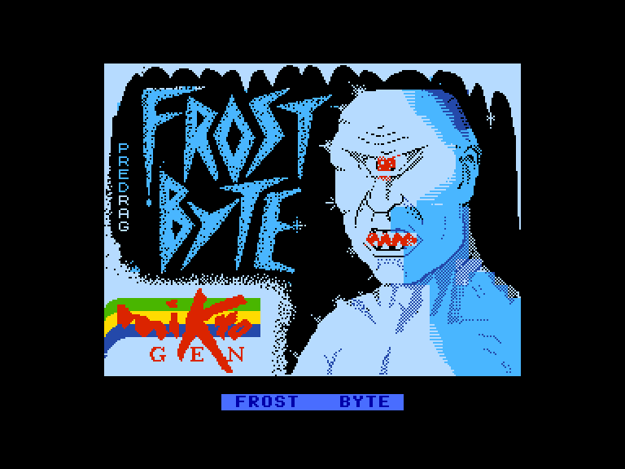
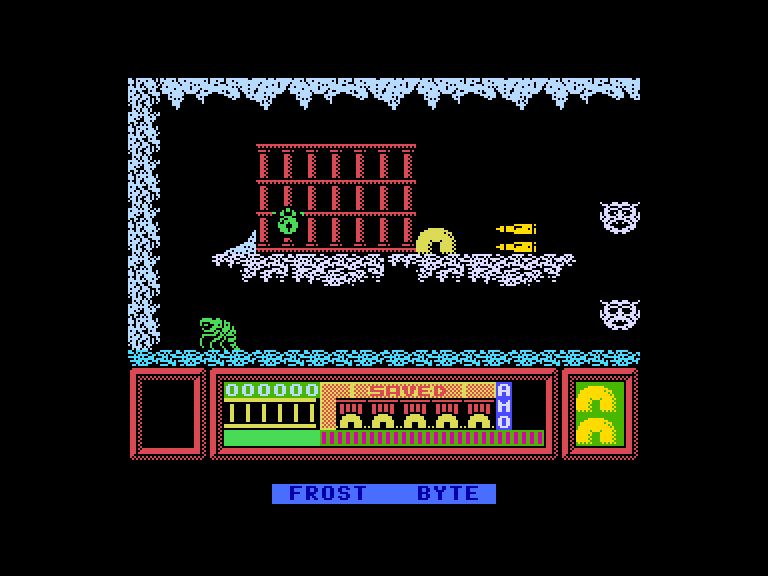
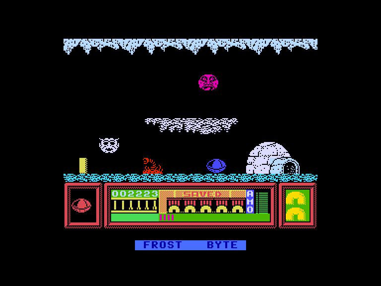
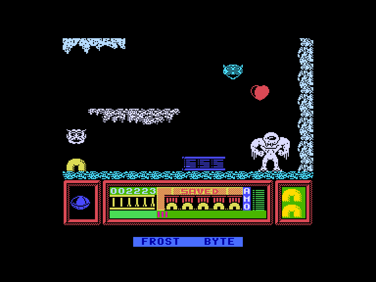

[0-9](../0/games-0.md) - [A](../a/games-a.md) - [B](../b/games-b.md) - [C](../c/games-c.md) - [D](../d/games-d.md) - [E](../e/games-e.md) - [F](../f/games-f.md) - [G](../g/games-g.md) - [H](../h/games-h.md) - [I](../i/games-i.md) - [J](../j/games-j.md) - [K](../k/games-k.md) - [L](../l/games-l.md) - [M](../m/games-m.md) - [N](../n/games-n.md) - [O](../o/games-o.md) - [P](../p/games-p.md) - [Q](../q/games-q.md) - [R](../r/games-r.md) - [S](../s/games-s.md) - [T](../t/games-t.md) - [U](../u/games-u.md) - [V](../v/games-v.md) - [W](../w/games-w.md) - [X](../x/games-x.md) - [Y](../y/games-y.md) - [Z](../z/games-z.md)

Ігри для [Enterprise 64k](../games-ep64.md) - [Enterprise 128k+RAMexp](../games-epramexp.md)

Ігри для систем [IS-DOS](../games-is-dos.md) - [SymbOS](../games-symbos.md) - [EDC Windows](../games-edcw.md)

Ігри для емуляторів [ZX Spectrum 48k/128k](../zxemu/games-zxemu.md) - [Amstrad CPC](../cpcemu/games-cpc.md) - [Sinclair ZX81](../zx81emu/games-zx81.md) - [Videoton TVC](../tvcemu/games-tvc.md) - [Commodore VIC-20](../vic20emu/games-vic20.md)

----------

# Frost Byte

**ID:** frost-byte-zx

## Скріншоти

## Опис

(temporary description generated by AI [Assistant])

**Опис гри: Frost Byte**

Frost Byte — це складна гра, в якій ви керуєте жовтим персонажем, який намагається звільнити своїх друзів, захоплених ворожою силою. Гравець повинен подолати різні рівні, збираючи предмети та уникати ворогів, щоб завершити місії у відведений час. Гра пропонує унікальну механіку управління, включаючи можливість стрибати та атакувати.

**Правила гри:**
1. Виберіть метод управління (джойстик або клавіатура).
2. Почніть гру, натиснувши кнопку "вогонь".
3. Переміщайтеся вправо та вліво, стрибайте, щоб уникати ворогів, і збирайте патрони.
4. Використовуйте зібрані предмети для атаки ворогів.
5. Завершуйте рівні, рятуючи своїх друзів та знаходячи вихід.
6. Будьте уважні до обмеженого часу та кількості патронів.
7. Використовуйте різнокольорові кристали для отримання додаткових здібностей.

Удачі у вашій подорожі!

## Основна інформація
- **Оригінальна платформа:** ZX Spectrum

## Посилання
- [Опис гри на ep128.hu (угорською)](http://www.ep128.hu/Games/Frost_Byte.htm)
- [Інформація про оригінальну версію](https://spectrumcomputing.co.uk/entry/1894/ZX-Spectrum/Frost_Byte)
- [Завантажити гру](http://www.ep128.hu/Ep_Games/Prg/Frost_Byte.rar)

**Дата генерації:** 29.07.2026

