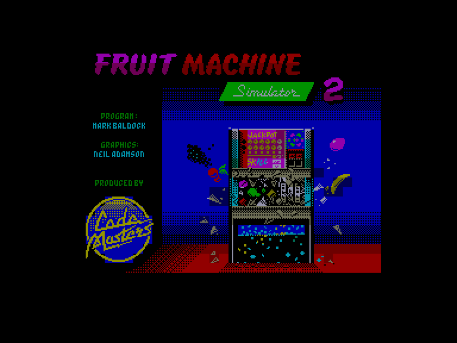
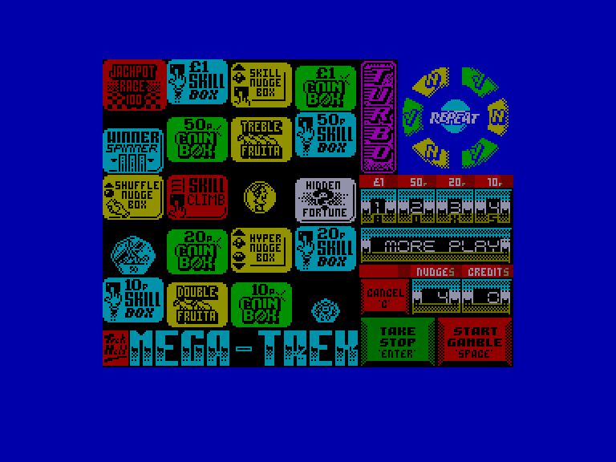
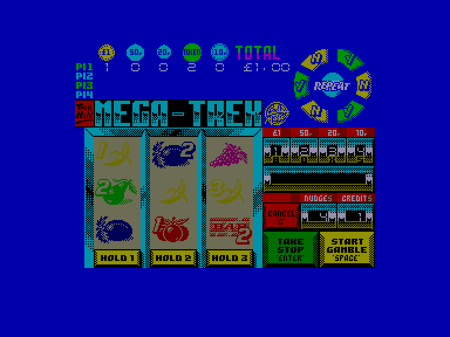
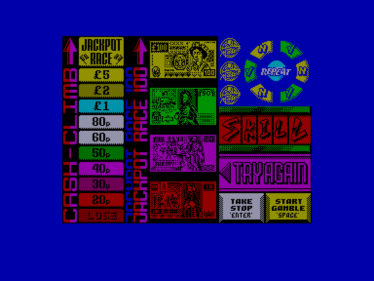

[0-9](../0/games-0.md) - [A](../a/games-a.md) - [B](../b/games-b.md) - [C](../c/games-c.md) - [D](../d/games-d.md) - [E](../e/games-e.md) - [F](../f/games-f.md) - [G](../g/games-g.md) - [H](../h/games-h.md) - [I](../i/games-i.md) - [J](../j/games-j.md) - [K](../k/games-k.md) - [L](../l/games-l.md) - [M](../m/games-m.md) - [N](../n/games-n.md) - [O](../o/games-o.md) - [P](../p/games-p.md) - [Q](../q/games-q.md) - [R](../r/games-r.md) - [S](../s/games-s.md) - [T](../t/games-t.md) - [U](../u/games-u.md) - [V](../v/games-v.md) - [W](../w/games-w.md) - [X](../x/games-x.md) - [Y](../y/games-y.md) - [Z](../z/games-z.md)

Ігри для [Enterprise 64k](../games-ep64.md) - [Enterprise 128k+RAMexp](../games-epramexp.md)

Ігри для систем [IS-DOS](../games-is-dos.md) - [SymbOS](../games-symbos.md) - [EDC Windows](../games-edcw.md)

Ігри для емуляторів [ZX Spectrum 48k/128k](../zxemu/games-zxemu.md) - [Amstrad CPC](../cpcemu/games-cpc.md) - [Sinclair ZX81](../zx81emu/games-zx81.md) - [Videoton TVC](../tvcemu/games-tvc.md) - [Commodore VIC-20](../vic20emu/games-vic20.md)

----------

# Fruit Machine Simulator 2

**ID:** fruit-machine-sim2-zx

## Скріншоти

## Опис

(temporary description generated by AI [ChatGPT])

**Опис гри:**

Fruit Machine Simulator 2 — це продовження гри Codemasters Fruit Machine Simulator, розроблене тією ж командою. Гра призначена для 1-4 гравців, кожен з яких отримує £1.50, представлені у вигляді монет. Гравці вставляють монети у автомат, обираючи відповідну клавішу дії, і обертають барабани, щоб дізнатися, чи виграли вони. При виграшній комбінації гра пропонує можливість подвоїти виграш, а також активує особливі функції, такі як MEGA-TREK, Shuffle-Nudge та Winner-Spinner.

**Правила гри:**

1. Кожен гравець починає з £1.50, які представлені монетами.
2. Гравець вставляє монети у автомат, натискаючи відповідну клавішу дії.
3. Обертаючи барабани, гравець чекає на виграшну комбінацію.
4. При виграші гравець може ризикнути і спробувати подвоїти свій виграш.
5. Якщо на виграшній лінії з'являються символи з номерами, активується функція MEGA-TREK.
6. Гравець може використовувати спеціальні функції, такі як Shuffle-Nudge та Winner-Spinner, для покращення своїх шансів на виграш.

Гра включає стандартні функції автоматів, а також унікальні елементи, які роблять її цікавою та захоплюючою.

## Основна інформація
- **Оригінальна платформа:** ZX Spectrum

## Посилання
- [Інформація про оригінальну версію](https://spectrumcomputing.co.uk/entry/9349/ZX-Spectrum/Fruit_Machine_Simulator_2)
- [Завантажити гру](http://www.ep128.hu/Ep_Games/Prg/Fruit_Machine2.rar)

