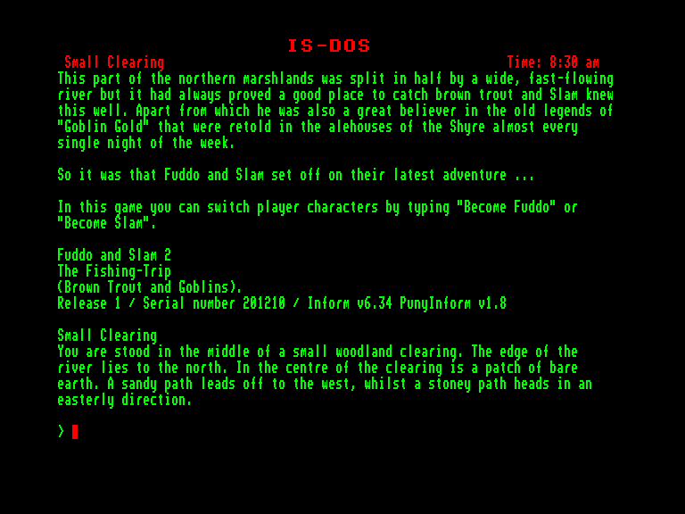
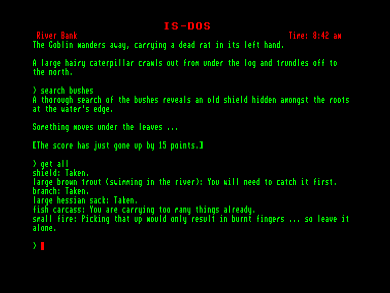

[0-9](../0/games-0.md) - [A](../a/games-a.md) - [B](../b/games-b.md) - [C](../c/games-c.md) - [D](../d/games-d.md) - [E](../e/games-e.md) - [F](../f/games-f.md) - [G](../g/games-g.md) - [H](../h/games-h.md) - [I](../i/games-i.md) - [J](../j/games-j.md) - [K](../k/games-k.md) - [L](../l/games-l.md) - [M](../m/games-m.md) - [N](../n/games-n.md) - [O](../o/games-o.md) - [P](../p/games-p.md) - [Q](../q/games-q.md) - [R](../r/games-r.md) - [S](../s/games-s.md) - [T](../t/games-t.md) - [U](../u/games-u.md) - [V](../v/games-v.md) - [W](../w/games-w.md) - [X](../x/games-x.md) - [Y](../y/games-y.md) - [Z](../z/games-z.md)

Ігри для [Enterprise 64k](../games-ep64.md) - [Enterprise 128k+RAMexp](../games-epramexp.md)

Ігри для систем [IS-DOS](../games-is-dos.md) - [SymbOS](../games-symbos.md) - [EDC Windows](../games-edcw.md)

Ігри для емуляторів [ZX Spectrum 48k/128k](../zxemu/games-zxemu.md) - [Amstrad CPC](../cpcemu/games-cpc.md) - [Sinclair ZX81](../zx81emu/games-zx81.md) - [Videoton TVC](../tvcemu/games-tvc.md) - [Commodore VIC-20](../vic20emu/games-vic20.md)

----------

# Fuddo and Slam 2: The Fishing-Trip

**ID:** fuddo-and-slam2-zcode

**Жанри:** Текстова пригода

## Скріншоти

## Опис

(temporary description generated by AI Assistant)

**Опис гри: "Риболовля"**

"Риболовля" — це пригодницька гра, в якій гравці беруть на себе ролі Фуддо та Сламу, які вирушають у захопливу подорож через північні болота, щоб ловити коричневу форель і шукати легендарне "Золото Гобліна". Гра наповнена елементами фентезі та гумору, а також має можливість переключатися між персонажами для використання їхніх унікальних вмінь.

**Правила гри:**
1. Гравець може перемикатися між Фуддо та Сламом, використовуючи їхні особливі здібності для подолання перешкод.
2. Гравець повинен досліджувати навколишній світ, щоб знайти рибу та виконувати різні завдання.
3. Використовуйте підказки та легенди, що розповідаються в пивних закладах, щоб відкрити нові можливості та секрети.
4. Гра закінчується, коли гравець досягає певних цілей або виконує основні завдання.

Зануртеся у світ пригод, де риболовля переплітається з магією та гумором!

## Основна інформація
- **Мови:** Англійська
- **Оригінальна платформа:** Amstrad CPC
### Загальні системні вимоги
- **Апаратні:** EXDOS
- **Програмні:** IS-DOS
### Геймплей
- **Керування:** Keyboard
- **Кількість гравців:** 1 player
- **Додаткові теги:** Z-code
### Розробка
- **Рік випуску:** 2020
- **Автор:** John Wilson

## Посилання
- [Інформація про оригінальну версію](https://www.cpc-power.com/index.php?page=detail&num=17821)
- [Інформація про гру (SolutionArchive.com)](https://solutionarchive.com/game/id%2C9007/Fishing-Trip%2C+The.html)

