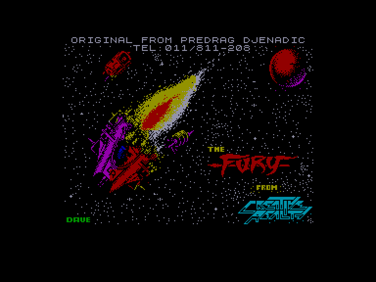
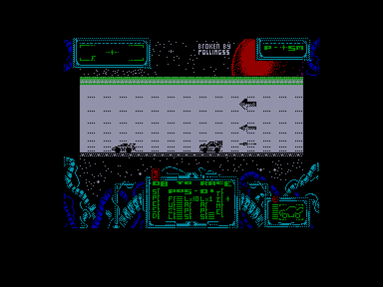
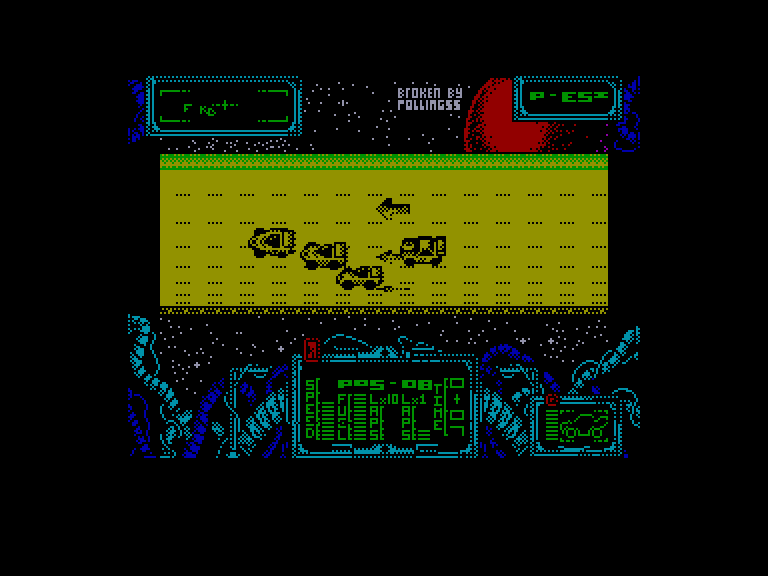
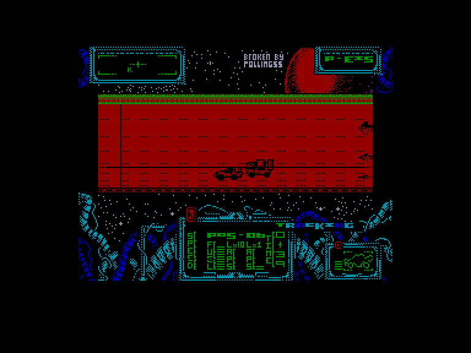

[0-9](../0/games-0.md) - [A](../a/games-a.md) - [B](../b/games-b.md) - [C](../c/games-c.md) - [D](../d/games-d.md) - [E](../e/games-e.md) - [F](../f/games-f.md) - [G](../g/games-g.md) - [H](../h/games-h.md) - [I](../i/games-i.md) - [J](../j/games-j.md) - [K](../k/games-k.md) - [L](../l/games-l.md) - [M](../m/games-m.md) - [N](../n/games-n.md) - [O](../o/games-o.md) - [P](../p/games-p.md) - [Q](../q/games-q.md) - [R](../r/games-r.md) - [S](../s/games-s.md) - [T](../t/games-t.md) - [U](../u/games-u.md) - [V](../v/games-v.md) - [W](../w/games-w.md) - [X](../x/games-x.md) - [Y](../y/games-y.md) - [Z](../z/games-z.md)

Ігри для [Enterprise 64k](../games-ep64.md) - [Enterprise 128k+RAMexp](../games-epramexp.md)

Ігри для систем [IS-DOS](../games-is-dos.md) - [SymbOS](../games-symbos.md) - [EDC Windows](../games-edcw.md)

Ігри для емуляторів [ZX Spectrum 48k/128k](../zxemu/games-zxemu.md) - [Amstrad CPC](../cpcemu/games-cpc.md) - [Sinclair ZX81](../zx81emu/games-zx81.md) - [Videoton TVC](../tvcemu/games-tvc.md) - [Commodore VIC-20](../vic20emu/games-vic20.md)

----------

# The Fury

**ID:** fury-zx

## Скріншоти

## Опис

(temporary description generated by AI Assistant)

**Опис гри: "The Fury"**

"The Fury" - це аркадна гонка, що відбувається в футуристичному світі, де гравці беруть на себе роль водіїв, які змагаються на небезпечних трасах. Гра пропонує три типи гонок: "Часова гонка", де ви повинні встигнути досягти кваліфікаційного часу; "Гонка на знищення", де ваша мета - знищити певну кількість новачків; і "Гонка в теге", де один автомобіль стає мішенню. Гравці повинні керувати своїми автомобілями, знищувати інших водіїв, уникати небезпек на трасі та стежити за паливом і пошкодженнями.

**Правила гри:**
1. Гравець може вибрати один з трьох типів гонок.
2. У "Часовій гонці" ви повинні встигнути досягти кваліфікаційного часу.
3. У "Гонці на знищення" ваша мета - знищити новачків, щоб досягти квоти.
4. У "Гонці в теге" один автомобіль стає мішенню, і його потрібно знищити.
5. Завжди підтримуйте агресивний стиль водіння, щоб уникнути знищення.
6. Слідкуйте за паливом і пошкодженнями вашого автомобіля, щоб не втратити шанси на перемогу.
7. Мета - досягти "The Fury" на трасі, що відкриває нові можливості.

Готові до небезпечних гонок? Тоді вперед до "The Fury"!

## Основна інформація
- **Оригінальна платформа:** ZX Spectrum

## Посилання
- [Інформація про оригінальну версію](https://spectrumcomputing.co.uk/entry/1911/ZX-Spectrum/The_Fury)
- [Завантажити гру](http://www.ep128.hu/Ep_Games/Prg/Fury.rar)

**Дата генерації:** 29.07.2026

