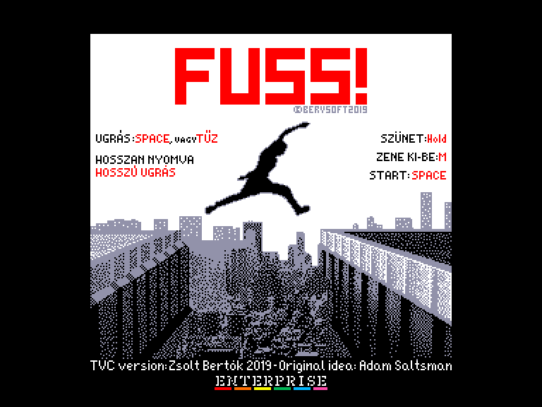
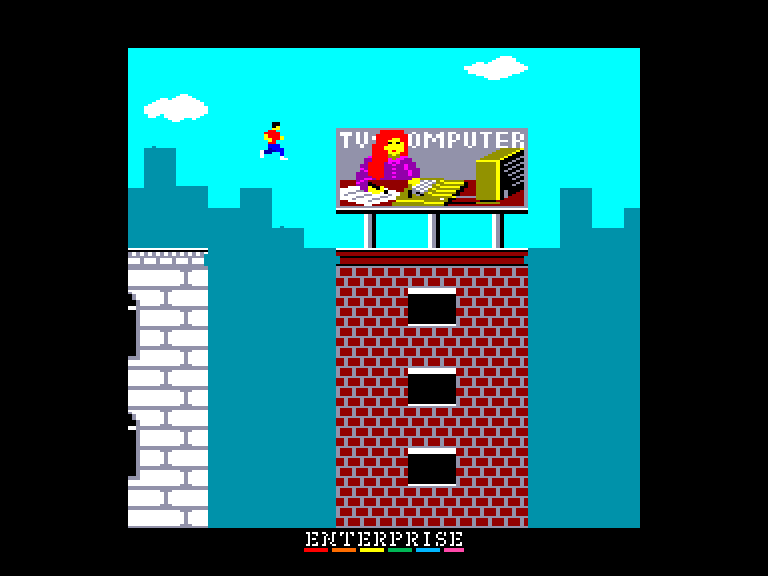
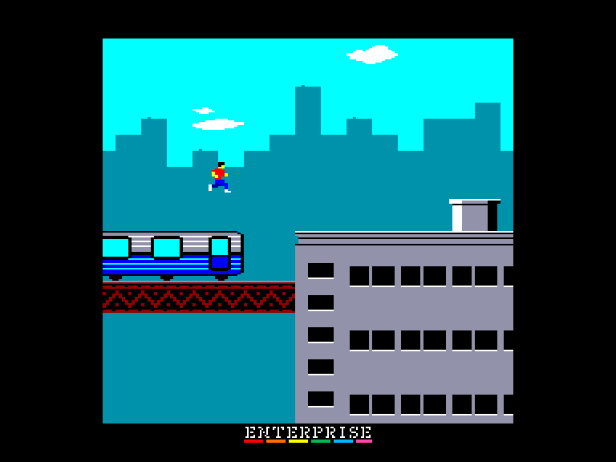
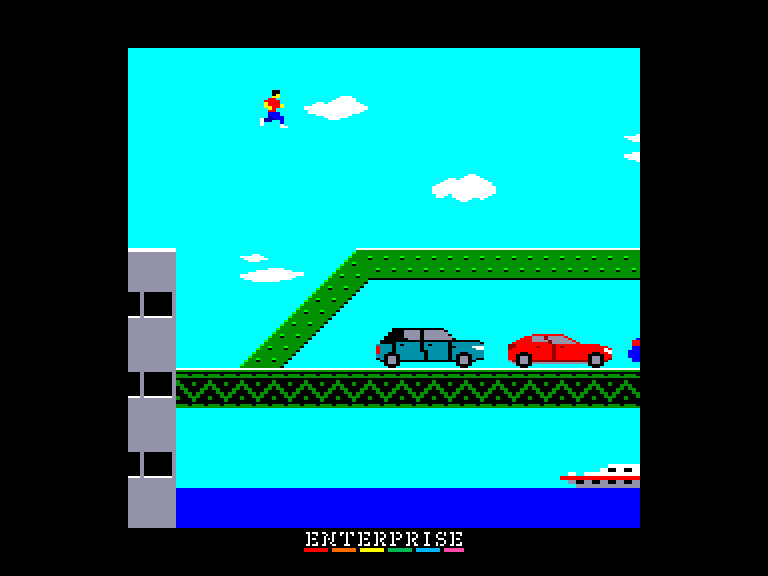

[0-9](../0/games-0.md) - [A](../a/games-a.md) - [B](../b/games-b.md) - [C](../c/games-c.md) - [D](../d/games-d.md) - [E](../e/games-e.md) - [F](../f/games-f.md) - [G](../g/games-g.md) - [H](../h/games-h.md) - [I](../i/games-i.md) - [J](../j/games-j.md) - [K](../k/games-k.md) - [L](../l/games-l.md) - [M](../m/games-m.md) - [N](../n/games-n.md) - [O](../o/games-o.md) - [P](../p/games-p.md) - [Q](../q/games-q.md) - [R](../r/games-r.md) - [S](../s/games-s.md) - [T](../t/games-t.md) - [U](../u/games-u.md) - [V](../v/games-v.md) - [W](../w/games-w.md) - [X](../x/games-x.md) - [Y](../y/games-y.md) - [Z](../z/games-z.md)

Ігри для [Enterprise 64k](../games-ep64.md) - [Enterprise 128k+RAMexp](../games-epramexp.md)

Ігри для систем [IS-DOS](../games-is-dos.md) - [SymbOS](../games-symbos.md) - [EDC Windows](../games-edcw.md)

Ігри для емуляторів [ZX Spectrum 48k/128k](../zxemu/games-zxemu.md) - [Amstrad CPC](../cpcemu/games-cpc.md) - [Sinclair ZX81](../zx81emu/games-zx81.md) - [Videoton TVC](../tvcemu/games-tvc.md) - [Commodore VIC-20](../vic20emu/games-vic20.md)

----------

# Fuss!

**ID:** fuss-tvc

## Скріншоти

## Опис

(temporary description generated by AI Assistant)

**Опис гри:**
Fuss! - це захоплююча гра в жанрі "runner", де ви керуєте персонажем, використовуючи лише одну кнопку для стрибків. Гра є адаптацією популярної гри Canabalt 2009 року, з красивою графікою та унікальним боковим скролом. Ваша мета - втекти з міста, яке охоплене панікою і зараженими людьми, стрибаючи з даху на дах.

**Правила гри:**
1. **Управління:** 
   - Стрибок: натискайте SPACE або кнопку в джойстику.
   - Утримуйте кнопку, щоб стрибнути вище.
   
2. **Життя:** 
   - У вас є лише одне життя. Якщо ви впадете, гра закінчується, і буде показано відстань, яку ви пройшли в метрах.
   
3. **Мета:** 
   - Дійти до межі міста, яка знаходиться на відстані 1888 метрів від вашого старту.

4. **Додаткові функції:**
   - Звук: натискайте 'M' для вмикання/вимикання музики.
   - Вибір каналу: натискайте '1' для одноканальної музики або '2' для двоканальної.
   - Регулювання гучності: використовуйте джойстик для збільшення або зменшення гучності.

Гра доступна на EXOS і сумісна з EP64, з оптимізованою швидкістю для кращого ігрового досвіду.

## Основна інформація
- **Оригінальна платформа:** Videoton TVC
### Системні вимоги
- **Апаратні:** EP64, EP128

## Посилання
- [Опис гри на ep128.hu (угорською)](http://www.ep128.hu/Ep_Games/Leiras/Fuss.htm)
- [Завантажити гру](http://www.ep128.hu/Ep_Games/Prg/Fuss.rar)
- [Easy Load&Play](https://t.me/EP128k_Load_n_Play/349) *(Telegram-канал Vibrant Waves)*

**Дата генерації:** 28.07.2026

## Відео

<iframe src="https://www.youtube.com/embed/r2PqC2U0Djg"  
style="width:75%; aspect-ratio:16/9;" allowfullscreen></iframe>

- [Відео](https://www.youtube.com/watch?v=Bs6KTZTwuaE)
- [Відео](https://youtu.be/hzEbJAvZFVY)
- [Відео](https://www.youtube.com/watch?v=J_OZETYqgdA)