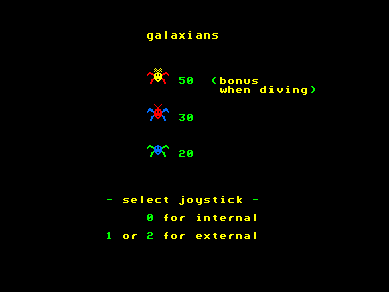
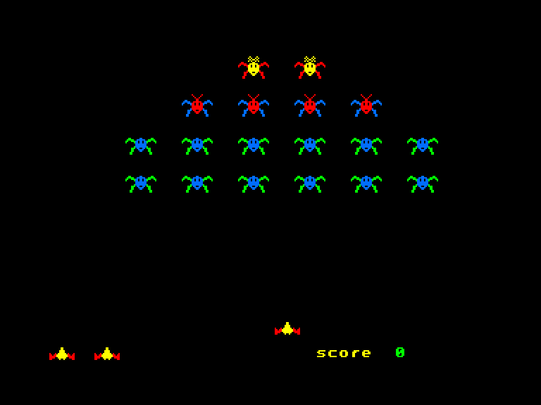
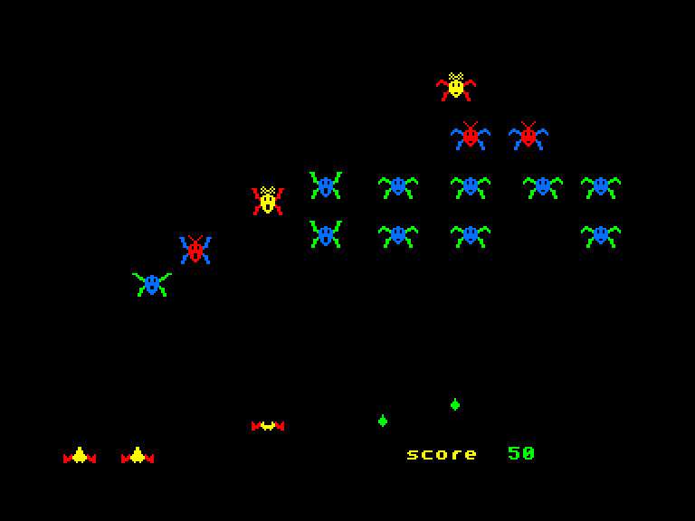
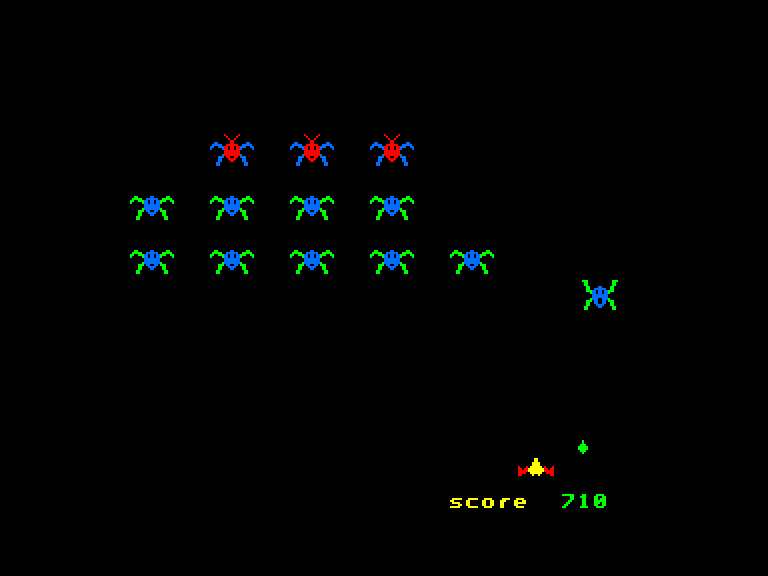

[0-9](../0/games-0.md) - [A](../a/games-a.md) - [B](../b/games-b.md) - [C](../c/games-c.md) - [D](../d/games-d.md) - [E](../e/games-e.md) - [F](../f/games-f.md) - [G](../g/games-g.md) - [H](../h/games-h.md) - [I](../i/games-i.md) - [J](../j/games-j.md) - [K](../k/games-k.md) - [L](../l/games-l.md) - [M](../m/games-m.md) - [N](../n/games-n.md) - [O](../o/games-o.md) - [P](../p/games-p.md) - [Q](../q/games-q.md) - [R](../r/games-r.md) - [S](../s/games-s.md) - [T](../t/games-t.md) - [U](../u/games-u.md) - [V](../v/games-v.md) - [W](../w/games-w.md) - [X](../x/games-x.md) - [Y](../y/games-y.md) - [Z](../z/games-z.md)

Ігри для [Enterprise 64k](../games-ep64.md) - [Enterprise 128k+RAMexp](../games-epramexp.md)

Ігри для систем [IS-DOS](../games-is-dos.md) - [SymbOS](../games-symbos.md) - [EDC Windows](../games-edcw.md)

Ігри для емуляторів [ZX Spectrum 48k/128k](../zxemu/games-zxemu.md) - [Amstrad CPC](../cpcemu/games-cpc.md) - [Sinclair ZX81](../zx81emu/games-zx81.md) - [Videoton TVC](../tvcemu/games-tvc.md) - [Commodore VIC-20](../vic20emu/games-vic20.md)

----------

# Galaxians

**ID:** galaxians-bas

## Скріншоти

## Опис

(temporary description generated by AI [Assistant])

**Опис гри: Galaxians**

У грі "Galaxians" ви стаєте командиром оборонних сил, які захищають імперію від ворожих нападників з сусідніх галактик. Ваше завдання — керувати військами, приймати важливі рішення та захищати території від хвиль атакуючих інопланетян. Гра відзначається простим управлінням, можливістю налаштування звуку та веселими анімаціями ворогів.

**Правила гри:**
1. Керування здійснюється за допомогою джойстика.
2. За кожні 1000 очок ви отримуєте додаткове життя.
3. Перед початком гри ви можете налаштувати гучність звуку.
4. Кнопка "PAUSE" призупиняє гру, але не натискайте кнопку "STOP", оскільки це зупинить програму.
5. Після закінчення гри вам буде запропоновано розпочати нову гру або вийти з програми.

Бажаємо успіху в захисті вашої імперії!

## Основна інформація
### Загальні системні вимоги
- **Апаратні:** EP64, EP128
- **Програмні:** IS-Basic

## Посилання
- [Опис гри на ep128.hu (угорською)](http://www.ep128.hu/Ep_Games/Leiras/Galaxians.htm)
- [Завантажити гру](http://www.ep128.hu/Ep_Games/Prg/Galaxians.rar)

## Відео

<iframe src="https://www.youtube.com/embed/pIbznDL3Jw0"  
style="width:75%; aspect-ratio:16/9;" allowfullscreen></iframe>

