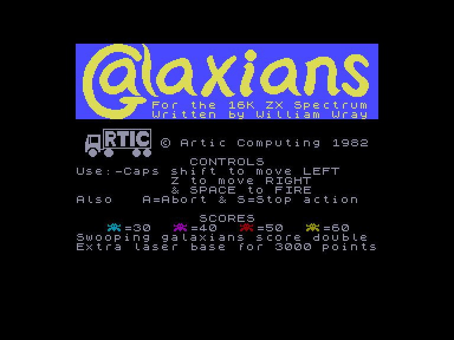
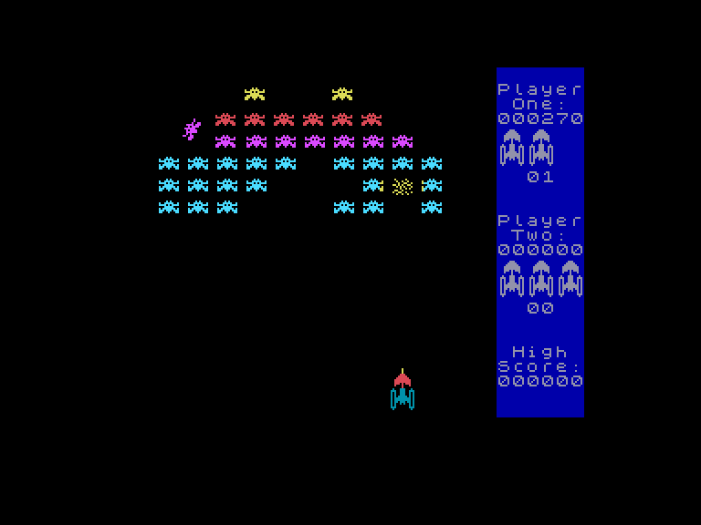
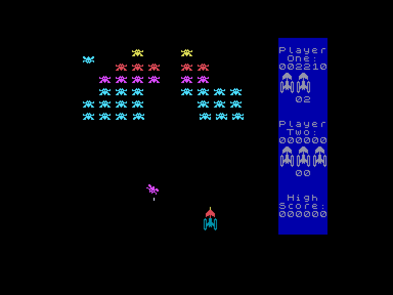
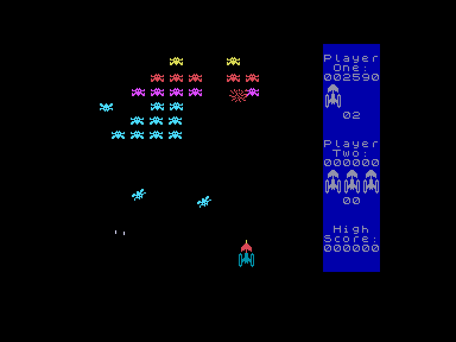

[0-9](../0/games-0.md) - [A](../a/games-a.md) - [B](../b/games-b.md) - [C](../c/games-c.md) - [D](../d/games-d.md) - [E](../e/games-e.md) - [F](../f/games-f.md) - [G](../g/games-g.md) - [H](../h/games-h.md) - [I](../i/games-i.md) - [J](../j/games-j.md) - [K](../k/games-k.md) - [L](../l/games-l.md) - [M](../m/games-m.md) - [N](../n/games-n.md) - [O](../o/games-o.md) - [P](../p/games-p.md) - [Q](../q/games-q.md) - [R](../r/games-r.md) - [S](../s/games-s.md) - [T](../t/games-t.md) - [U](../u/games-u.md) - [V](../v/games-v.md) - [W](../w/games-w.md) - [X](../x/games-x.md) - [Y](../y/games-y.md) - [Z](../z/games-z.md)

Ігри для [Enterprise 64k](../games-ep64.md) - [Enterprise 128k+RAMexp](../games-epramexp.md) - [2dfx](../games-2dfx.md)

Ігри для систем [IS-DOS](../games-is-dos.md) - [SymbOS](../games-symbos.md) - [EDC Windows](../games-edcw.md)

Ігри для емуляторів [ZX Spectrum 48k/128k](../zxemu/games-zxemu.md) - [Amstrad CPC](../cpcemu/games-cpc.md) - [Sinclair ZX81](../zx81emu/games-zx81.md) - [Videoton TVC](../tvcemu/games-tvc.md) - [Commodore VIC-20](../vic20emu/games-vic20.md)

----------

# Galaxians

**ID:** galaxians-zx

## Скріншоти

## Опис

(temporary description generated by AI [ChatGPT])

**Опис гри: Galaxians**

Galaxians - це класична аркадна гра, яка є розвитком стилю гри Space Invaders. У цій грі вороги не лише рухаються з боку в бік, а й формуються в різні формації, атакуючи гравця. Мета гри - знищити якомога більше ворожих космічних кораблів, які атакують з верхньої частини екрану. Гравець може рухатися лише горизонтально і стріляти в ворогів, які періодично "облітають" екран. За знищення ворожого загону гравець отримує бали, але з кожним новим загоном рівень складності зростає, а вороги стають агресивнішими. 

**Правила гри:**
1. Гравець може стріляти лише один раз за раз.
2. Вороги мають різні кольори та приносять різну кількість балів (синій: 30, фіолетовий: 40, червоний: 50, жовтий: 60).
3. Гру можна грати на клавіатурі або з джойстиком Kempston.
4. Клавіші управління:
   - SPACE - стріляти
   - CAPS SHIFT - рух вліво
   - Z - рух вправо
   - A - вийти з гри
   - S - призупинити гру (продовження будь-якою іншою клавішею)
5. Гра може бути одноосібною або для двох гравців по черзі.
6. Перед початком гри потрібно вибрати рівень складності (1-9).
7. За кожні 3000 очок гравець отримує додаткове життя.

Гра пропонує захоплюючий виклик та можливість покращити свої навички в стрільбі та стратегічному плануванні.

## Основна інформація
- **Оригінальна платформа:** ZX Spectrum

## Посилання
- [Опис на ep128.hu (угорською)](http://www.ep128.hu/Games/Galaxian2.htm)
- [Інформація про оригінальну версію](https://spectrumcomputing.co.uk/entry/1934/ZX-Spectrum/Galaxians)
- [Завантажити](http://www.ep128.hu/Ep_Games/Prg/Galaxians_Classic.rar)

