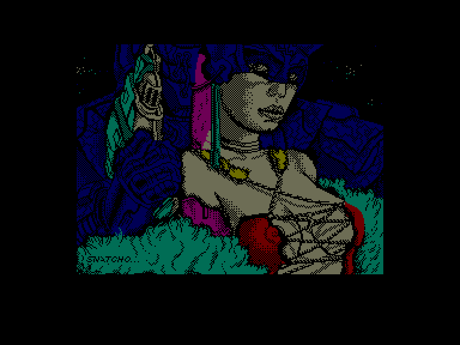
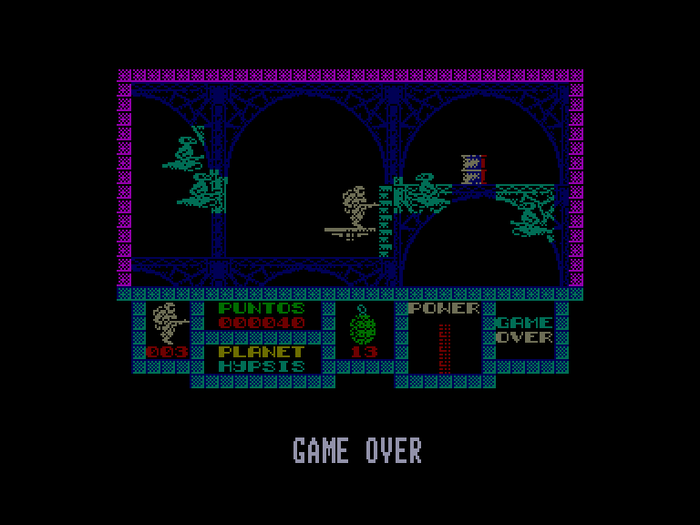
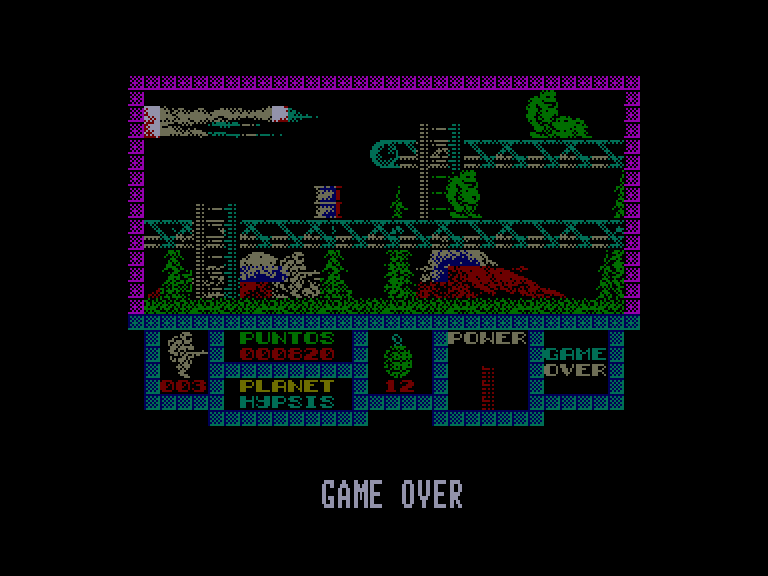
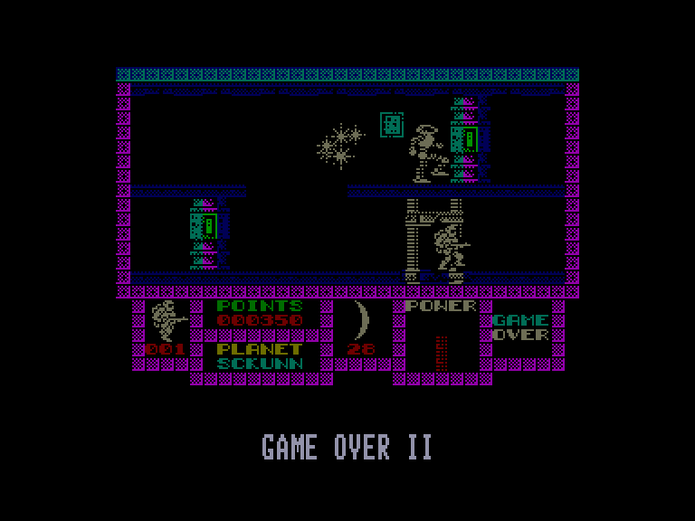

[0-9](../0/games-0.md) - [A](../a/games-a.md) - [B](../b/games-b.md) - [C](../c/games-c.md) - [D](../d/games-d.md) - [E](../e/games-e.md) - [F](../f/games-f.md) - [G](../g/games-g.md) - [H](../h/games-h.md) - [I](../i/games-i.md) - [J](../j/games-j.md) - [K](../k/games-k.md) - [L](../l/games-l.md) - [M](../m/games-m.md) - [N](../n/games-n.md) - [O](../o/games-o.md) - [P](../p/games-p.md) - [Q](../q/games-q.md) - [R](../r/games-r.md) - [S](../s/games-s.md) - [T](../t/games-t.md) - [U](../u/games-u.md) - [V](../v/games-v.md) - [W](../w/games-w.md) - [X](../x/games-x.md) - [Y](../y/games-y.md) - [Z](../z/games-z.md)

Ігри для [Enterprise 64k](../games-ep64.md) - [Enterprise 128k+RAMexp](../games-epramexp.md) - [2dfx](../games-2dfx.md)

Ігри для систем [IS-DOS](../games-is-dos.md) - [SymbOS](../games-symbos.md) - [EDC Windows](../games-edcw.md)

Ігри для емуляторів [ZX Spectrum 48k/128k](../zxemu/games-zxemu.md) - [Amstrad CPC](../cpcemu/games-cpc.md) - [Sinclair ZX81](../zx81emu/games-zx81.md) - [Videoton TVC](../tvcemu/games-tvc.md) - [Commodore VIC-20](../vic20emu/games-vic20.md)

----------

# Game Over

**ID:** game-over-zx

## Скріншоти

## Опис

(temporary description generated by AI [Assistant])

**Опис гри: Game Over**

Гра "Game Over" - це захоплююче пригодницьке дійство, що відбувається в далекій галактиці, де колись процвітала велика імперія під керівництвом жінки на ім'я Гремла. Гравець виступає в ролі лейтенанта Аркоса, який намагається втекти з в'язничної планети та знищити тиранію Гремли. Гра складається з двох частин, які можна проходити в будь-якому порядку.

**Правила гри:**
1. Гравець має пройти 20 екранів, переборюючи ворогів, використовуючи лазерну зброю та гранати.
2. Гравець може отримувати бонуси, знищуючи червоні бочки, які дають гранати, посилення зброї, енергетичні щити тощо.
3. Якщо гравець втрачає життя, він починає з початку рівня, і нові бочки не з'являються.
4. У другій частині гри гравець повинен знайти та знищити гігантського охоронного робота, використовуючи нові види зброї.
5. Гра має елементи, що не є лінійними, з ліфтами для пересування.
6. Гравець може призупинити гру натисканням клавіші 'H' та повернутися в меню натисканням '0'.

Змагання з ворогами та використання стратегій - ключові елементи цієї гри.

## Основна інформація
- **Оригінальна платформа:** ZX Spectrum

## Посилання
- [Опис на ep128.hu (угорською)](http://www.ep128.hu/Games/GameOver.htm)
- [Інформація про оригінальну версію](https://spectrumcomputing.co.uk/entry/1958/ZX-Spectrum/Game_Over)
- [Завантажити](http://www.ep128.hu/Ep_Games/Prg/GameOver.rar)

